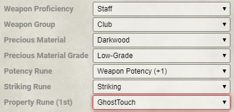
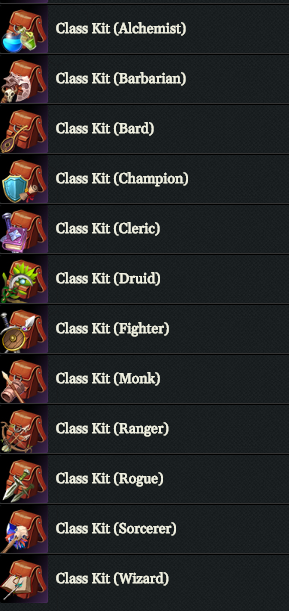

# Patch Notes:

## Version 2.8.0

This release features most of the new content from Lost Omens: Mwangi Expanse, Malevolence, and all three books of Fists of the Ruby Phoenix.

### Bug Fixes
* (Chup) Fix trait descriptions in player character strikes. Closes #1553
* (stwlam) Bring limited PC sheet up to date with passed sheet data
* (stwlam) Fix adjustment of perceived brightness from sourced lighting. Closes #1559
* (stwlam) Fix management of conditions from character sheet
* (Supe) Fix spell item summary width when there is no description

### Content Changes
* (SpartanCPA) Correct Kyra (Beginner Box) spellcasting stat from Cha to Wis. Closes #1555
* (SpartanCPA) Rename creatures from Age of Ashes that are re-printed in Mwangi Expanse
* (TMun) Add fulu as a consumable trait (Fists of the Ruby Phoenix book 2)
* (TMun) Add adjustment trait to equipment list for Mwangi expanse
* (TMun) Add reach-50 and versatile positive traits. Add virulent to feat traits. Add troop to actor traits
* (TMun) Add Fists of the Ruby Phoenix book 3 missing traits (Kaiju, Primal for Hazard, concentrate)
* (TMun) Add air as an immunity for Fists of the Ruby Phoenix book 3
* (TMun) Add area data to cataclysm. Closes #1563
* (TMun) Add splendid skull mask item. Link skull creeper feat to mask item. Closes #1564
* (TMun & SpartanCPA & Tikael) Content from Lost Omens: Mwangi Expanse, Malevolence, and all three books of Fists of the Ruby Phoenix, including traits, actions, deities, bestiary effects, equipment effects, feat effects, spell effects, spells, equipment, ancestry features, ancestries, sorcerer bloodlines, archetypes, and bestiary entries
  Completes build of LO:ME, FotRP 1-3 and Malevolence
* (rectulo) Remove extraneous styling from invoke the crimson oath focus spell description
* (rectulo) Remove extraneous styling from consecrate ritual description
* (rectulo) Remove extraneous styling from pillar of water spell description
* (rectulo) Remove extraneous styling from resurrect ritual description
* (rectulo) Remove extraneous styling from curse of death witch focus spell description
* (rectulo) Remove extraneous styling from stasis cleric focus spell description
* (rectulo) Remove extraneous line breaks from soul siphon oracle focus description
* (rectulo) Remove extraneous line breaks from life link oracle focus spell description
* (rectulo) Fix typo in abyssal wrath sorcerer focus spell description
* (rectulo) Add proper styling to the heightened heading for heal animal druid focus spell description
* (rectulo) Fix wording for dazzled duration in splash of art cleric focus spell description
* (Friz) Brush up rule elements for tanglefoot bombs

### Core System Improvements
* (stwlam) Add a client-side permission check for updating tokens
* (stwlam) Add compendium browser lookup. Closes #1550
* (stwlam) Track schema version of actors and items
* (stwlam) When necessary, migrate actors and items as they're created
* (stwlam) Do not show a skill feat slot if no such options are configured for the selected background
* (stwlam) Sort tag-selector options according to localized labels
* (stwlam) Load the Compendium Browser earlier in the ready hook
* (stwlam) Include item uuid and type in attack and damage roll messages. Closes #1283
* (Supe) Add getters to SpellcastingEntry/Spell. SpellcastingEntry now has a spells collection
* (Supe) Update Player and NPC Sheet spell list
* (In3luki) Sort class features created by the ABCManager by level and name

## Version 2.7.1
### Bug Fixes
* (stwlam) Add back Con-modifier to hit points

### Content Changes
* (stwlam & Tikael) Remove prices and descriptions from bandoliers, belt pouches, satchels, scroll cases, sheaths, and vials

## Version 2.7.0
### Bug Fixes
* (stwlam) Always show marked signature spells at their base level despite lack of slots. Closes #1545
* (stwlam) Restore ancestryhp and classhp properties to character attributes
* (Supe) Fix translation of currency label
* (nikolaj-a) Fix weapon toggle traits for strikes

### Content Changes
* (Drental) Add inline saving throw links to some of the equipment, like alchemical items
* (TMun) Add Mwangi Languages and updates OpenGameLicense.md
* (TMun) Add traits and languages from Mwangi Expanse and Fists of the Ruby Phoenix
* (TMun) Add cone size to cone of cold spell
* (TMun) Add explicit variants for assurance for all non-lore skills
* (TMun) Fix Android lore to use \n instead of /n for newline breaks
* (Supe) Old NPC innate spells are now re-orderable, for newly imported actors
* (rectulo) Correct description text for feeblemind spell
* (rectulo) Fix a typo in the pied piping spell description
* (rectulo) Remove extraneous newline in ancestral touch spell description
* (rectulo) Remove second linking of hidden condition from dim the light spell description
* (rectulo) Remove extraneous newlines in tempest touch spell description
* (rectulo) Remove extraneous styling from charged javelin spell description
* (SpartanCPA) Tweaks to morlocks

### Core System Improvements
* (stwlam) Fix token vision updates during movement
* (stwlam) Add damage-roll option to combine roll terms, enable for spellcasting
* (stwlam) Record the originating item uuid and item type on RuleElementPF2e instances
* (stwlam) Add strike damage formula tooltips to damage buttons on character sheets
* (stwlam) Removed unused browser-settings.html template file
* (stwlam) Migrate embedded spells on scrolls and wands
* (stwlam) Migrate precious material value of "sovereign steel"
* (Friz) Added text to shift-click damage/heal dialog to make it more obvious what sign modifier to use
* (Friz) Add button to misidentify/identify dialog that allows GM to send skill rolls to chat
* (Supe) Show casting time action glyph in the spell sheet sidebar

## Version 2.6.0

This release might break some of the action macros if you're using a language module due to a change in the structure of the translation data. The authors of all known language modules have been notified and should update the modules for the new structure very quickly.

### Bug Fixes
* (stwlam) Fix issue with the compendium browser where Bestiaries wouldn't properly load if Hazards had been opened first

### Content Changes
* (SpartanCPA) Tweak Ki Strike duration and token icon
* (Tikael) Add automation to Grievous Blow feat
* (Tikael) Add a default sneak attack rule element to the bestiary feature
* (Tikael) Correct size of Xotani
* (Bolt) Brush up morlocks
* (rectulo & Njini) Add heightening effect description to synesthesia
* (stwlam) Prune unused data from old NPC compendium entries

### Core System Improvements
* (stwlam) Adjust light emitted by other tokens according to rules-based vision. Closes #1547
* (stwlam) Move perceived-light management from tokens to the user
* (In3luki) Ensure all required fields are present when processing a compendium index
* (In3luki) Add null check to feat prerequisite preparation in the compendium browser
* (nikolaj-a) Add pick a lock action macro
* (nikolaj-a) Add outcome notes to create a distraction, seek and sense motive action macros

## Version 2.5.3
### Content Changes
* (SpartanCPA) Agents of Edgewatch Book 6 (Final)
* (SpartanCPA) Add Auditory as an attack trait
* (SLATE) Fix name and rule elements for Eye of the Night dhampir ancestry feat

### Core System Improvements
* (In3luki) Greatly improves the loading times of the compendium browser. Closes #1546
* (stwlam) Ensure each compendium browser tab can only load packs with the correct type of items or actors
* (stwlam) Sort packs in settings menu of compendium browser
* (stwlam) Refresh lights when a character's senses are updated

## Version 2.5.2
### Bug Fixes
* (stwlam) Remove risk of stack overflow during lighting refresh

### Content Changes
* (stwlam) Add Darkvision spell effects

### Core System Improvements
* (nikolaj-a) Add outcome notes to climb, disarm, force open, grapple, high jump, long jump, shove, and swim action macros

## Version 2.5.1
### Bug Fixes
* (In3luki) Fix sorting of class features not working on the first drop
* (stwlam) Fix cantrip filter in compendium browser, organize spell traits better
* (stwlam) Fix GM info for unidentified items
* (stwlam) Prevent rarer and higher-level weapons from reverting to common and zero
* (stwlam) Ensure ABC items take their features with them when deleted. Closes #1541
* (stwlam) Fix bug triggered by check against non-existent `invested` property
* (stwlam) Remove "text-transform: capitalize" styling from journal entry headers. Closes #1542
* (stwlam) Fix loading of compendium browser settings. Closes #1544
* (stwlam) Fill localization gaps for weapons with potency and property but no striking runes
* (stwlam) Fix newly-created items not appearing in the item directory until sheet is closed
* (stwlam) Make compendium browser's spell-category filtering mutually exclusive between "cantrip" and "spell"

### Content Changes
* (SpartanCPA) Add more deadly dice presets: 4d8, 4d10, 4d12
* (SpartanCPA) Correct levels of Bard cantrips
* (SpartanCPA & Peenicks) Agents of Edgewatch Book 6 - Items & Spells
* (SpartanCPA & Peenicks) Agents of Edgewatch Book 6 - Missing NPCs (Part 1 & 2)
* (stwlam) Add size active effect to Wisp Fetchling heritage. Closes #1515
* (Tikael) Add finesse trait to Dragon Claws spell effect strikes
* (Drental) Add bon mot, veil of dreams, and incredible improviser effects and rule elements
* (TMun) Brush up Treerazer for 0.8.8/2.5.0. Closes #1429
* (Bolt) Brush up Troll
* (Bolt) Fix note order for Aasimar Redeemer

### Core System Improvements
* (stwlam) Increase dim light on placed lighting to bright for tokens with low-light/darkvision
* (stwlam) Set token-source dimSight and brightSight to 0 if rules-based vision is enabled
* (nikolaj-a) Support capping spell auto-heighten level (mostly relevant for dealing with some NPC corner cases)
* (nikolaj-a) Make new effects have unlimited duration by default
* (nikolaj-a) Add outcome notes to balance, maneuver in flight, squeeze, and tumble through action macros

## Version 2.5.0
### Bug Fixes
* (stwlam) Fix bug causing derived traits on armor to be wiped. Closes #1521
* (stwlam) Fix tokens becoming unhidden when not in hidden-when-empty mode. Closes #1526
* (stwlam) Reduce memory consumption of compendium browser and add some features (resizeable window, choose sort direction, sorting by equipment price), ability to drop an actor or item directly beneath the compendium browser window. Closes #625, #1375, #1325
* (stwlam) Fix sortability of items within a container. Closes #1533
* (stwlam) Safely interpolate action names during macro creation. Closes #1536
* (stwlam) Fix the default permission of the Raise a Shield macro. Closes #1525
* (stwlam) Fix dropping conditions on tokenless actors
* (Drental) Fix +-4 modifier to spell dc/attack from elite/weak adjustment. Closes #1424
* (In3luki) Fix rollMode setting not working for rerolls
* (In3luki) Fix class feats being added multiple times when character level is decreased and then increased again

### Content Changes
* (rectulo) Delete page reference from legendary sneak general skill feat description
* (rectulo) Delete page reference from hidden condition description
* (rectulo) Remove extraneous HTML from steal the sky archetype feat description
* (rectulo) Clean up excessive line breaks in combat reading bard class feat description
* (rectulo) Add missing requirements to cross the final horizon archetype feat
* (rectulo & Njini) Fix guiding chisel description text to include missing sentences for Activate, Frequency, and Effect
* (rectulo & Njini) Correct link to _see invisibility_ in robe of eyes description
* (TMun) Update auldegrund grimcarver so he does fire, not fifire damage
* (TMun) Corrects dragon claws spell effect duration from 1 round to 1 minute. Closes #1534
* (TMun) Add Ganzi Skillful tail feat
* (Drental) Remove page references
* (SpartanCPA) Correct NPC lore descriptions
* (SpartanCPA) Split Cantrip Expansion into two feats for prepared vs. spontaneous
* (SpartanCPA) NPC Gallery Audit (Devotees, Downtrodden, Explorers, Healers, Laborers, Magistrates, Poacher)
* (SpartanCPA) Traits needed for Agents of Edgewatch Book 6
* (SpartanCPA) Add source to Bestiary 3, PFS NPCs, April Fool's Bestiary, Pathfinder Blog Bestiary, Beginner Box, Age of Ashes book 5, Extinction Curse book 3, The Fall of Plaguestone, Little Trouble in Big Absalom, Troubles in Otari, and The Slithering compendium entries, for proper filtering in the compendium browser
* (SpartanCPA) Add missing entries from Menace Under Otari, removed filth fever from giant rat in Beginner Box
* (Tikael) Fix Ancient White Dragon Ground Slam DC. Closes #1522
* (Tikael) Add new no-prep character Wendlyn
* (Tikael) Change familiar abilities to unlimited duration
* (Tikael) Add instructions for making specific scrolls and wands to the generic items
* (Tikael) Fix broken links in the alchemist class features preventing proper automation. Closes #1535
* (mathmanpi) Fix Piranha Swarm bludgeoning resistance
* (Shandyan) Add automation to aphorite versatile heritage and feats (axiomatic lore, intuitive crafting, lemma of vision)
* (Shandyan) Azarketi automation part 1

### Core System Improvements
* (Tikael) Stop striking and weapon potency from warning about values of zero
* (Friz) Add separate option to allow GM to control visibility of both DC and results
* (BoMbY) Make recovery DC/result always visible to players
* (In3luki) Create new conditions in a single database transaction, which should improve speed and reliability when applying conditions
* (In3luki) Add 'two-degrees-better' and 'two-degrees-worse' to DC modifiers
* (In3luki) Refactor ABC item creation for better reliability on character creation and level-up
* (stwlam) Finish cleaning up display of traits on item sheets
* (stwlam) Initial implementation of material and rune-base weapon names, prices, etc.
* (stwlam) Make item cards and summaries fancier
* (stwlam) Remove attack and damage buttons from weapon chat cards
* (Supe) Show final heightened spell level in chat card title
* (Supe) Spells with cantrip trait are always cantrips (unless ritual)
* (Supe) Cantrips can no longer be 0th level, and will now show the heightened level in the chat card
* (Supe) Updated spell editor arrangement
* (Tikael) Add skills and perception to the inline button options
* (nikolaj-a) Add weapon base item value to attack and damage selectors
* (nikolaj-a) Increase line height slightly for the compact roll notes
* (nikolaj-a) Add notes for outcome of the trip action

## Version 2.4.0
### Bug Fixes
* (Drental) Fix NPC damage rolls with non-dice values
* (Drental) Fix light bulk label for armor and treasure
* (stwlam) Fix consumption of wands
* (Chup) Fixed actions and inventory of vehicle sheet. Closes #1167 and #1494
* (nikolaj-a) Make rules tab in item sheet less temperamental on syntax error

### Content Changes
* (SpartanCPA) NPC Gallery Audit (Criminals)
* (SpartanCPA) Remove page references to the Core Rulebook
* (SpartanCPA) Add action category definitions where needed to NPCs in Extinction Curse
* (Shandyan) Ranger and Rogue Critical Specialisation, plus Ruffian Sneak Attack
* (Shandyan) Update Giant Instinct to use new `weapon:oversized` predicate
* (Shandyan) Add automation for aasimar heritage and ancestry feats (angelkin, blessed blood, call of elysium, celestial eyes, celestial lore, celestial strikes, celestial wings, divine countermeasures, emberkin, enforced order, eternal wings, garuda's squall, idyllkin, lawbringer, musetouched, plumekith, truespeech)
* (Shandyan) Add automation for android ancestry features (constructed, emotionally unaware), heritages (artisan, impersonator, laborer, and warrior android), and feats (android lore, emotionless, nanite surge, nightvision adaptation, offensive subroutine, protective subroutine, and proximity alert)
* (TMun) Convert impossible volley into three versions
* (TMun) Add 45, 75 and 90 foot options to support emanations with +15 foot per level heightening for NPCs
* (TMun) Correct spells for Quelaunt. Closes #1508
* (TMun) Lionlodge compendium additions
* (rectulo) Clean up reflecting riposte fighter class feat description text
* (rectulo) Clean up prescient planner general feat description text
* (rectulo) Clean up bargain hunter general skill feat description text
* (rectulo) Fix typo in terrified retreat feat prerequisite
* (rectulo) Remove page reference from foil senses general skill feat
* (rectulo) Correct level for eldritch researcher feat
* (Drental) Fix Take Cover macro to properly add the cover effect on NPC actors
* (Drental) Fix perception and stealth for selected tokens macros
* (Tikael) Add default weapon potency and striking rule elements to handwraps

### Core System Improvements
* (In3luki) Update AdjustDegreeOfSuccess rule element to support attack rolls
* (Drental) Clarify the text for the standard flatfooted toggle
* (stwlam) Make console error for multiple feats in same slot a debug message
* (stwlam) Move Rest for the Night macro to typescript, fix for 0.8. Closes #1510
* (Tikael) Add min and max properties to flat modifier
* (Tikael) Change WeaponPotency and Striking rule elements to use the values from the item

## Version 2.3.0
### Bug Fixes
* (stwlam) Prevent error during localization of custom attributes and other properties
* (stwlam) Prevent distortion of smaller loot actor icons. Closes #1504
* (stwlam) Fix decrementing consumable quantities
* (stwlam) Fix bug causing extra "0" entry to get added to item data
* (stwlam) Fix Raise a Shield macro
* (nikolaj-a) Fix PC strike options for damage rolls
* (nikolaj-a) Fix show target AC in strike chat card

### New Features
* (stwlam) Implement basic rules-based vision mechanics. This feature is still experimental and has been included for user feedback

### Content Changes
* (SpartanCPA) Add "Splash 10 ft" trait
* (SpartanCPA) Rename Wizard and Witch Spell Effects
* (SpartanCPA) Correct base item of Spiritsight Crossbow
* (SpartanCPA) Add Damage Dice override to Crossbow Ace. Closes #1509
* (SpartanCPA) Extinction Curse Book 5 - Adventure Toolbox Monsters
* (Drental) Fix skinsaw murderer weapon damage
* (rectulo) Clean up the verdant presence druid feat description text
* (rectulo) Clean up tenacious blood sorcerer class feat description text
* (rectulo) Correct formatting of Cloak of Immolation description
* (rectulo) Add prerequisites for denier of destruction cleric class feat
* (Friz) Add rule elements for persistent damage and other notes to alchemical bombs

### Core System Improvements
* (stwlam) Move automation settings to a menu
* (stwlam) Fix journal-entry styling with tables
* (stwlam) Call a `pf2e.systemReady` hook to help modules know when it is safe to access system-specific applications
* (stwlam) Add ability to hide a loot token when its inventory is empty
* (stwlam) Remove previously applied monkey patch for exporting a folder to compendium, since the fix was now included in core Foundry
* (stwlam) Allow drag and drop of folders with sub-folders of items to an actor
* (Drental) Add DC visibility to metagame settings
* (Supe) Capture spell level for drag data
* (nikolaj-a) Set level of effect when dragged from spell chat card
* (nikolaj-a) Add support for the Defy Death orc feat
* (nikolaj-a) Allow "none" as an option for check DC visibility in the chat cards
* (nikolaj-a) Add support for targeting and DC resolving for action macros
* (nikolaj-a) Add built-in action and associated macro for hide, sense motive, and sneak

## Version 2.2.0
### Bug Fixes
* (stwlam) Restore functionality of "Skip Defeated" in combat tracker. Closes #1493
* (stwlam) Fix version displayed in migration messages
* (stwlam) Fix application of active effects modifying properties set by ABC items
* (stwlam) Fix Tough familiar ability
* (stwlam) Fix bulk adjustments according to creature and item sizes
* (stwlam) Issue a warning about orphaned spells instead of blocking the data preparation
* (nikolaj-a) Fix NPC sidebar effect rendering

### Content Changes
* (rectulo) Change azaersis roads from class feat to hobgoblin ancestry feat
* (rectulo) Remove unused styling from the reckless abandon barbarian feat
* (rectulo) Remove page reference from auspicious mount champion feat
* (Friz) Add roll notes to the Burn It! feat to remind of the extra damage for alchemical items
* (Friz) Fix blight bomb damage so the persistent damage component is in a roll note. Closes #1479
* (Shandyan) Alchemist feature formatting
* (SpartanCPA) Fix Persistent Damage. Closes #1487

### Core System Improvements
* (stwlam) Work around Foundry 0.8.6 bug by overriding Folder#exportToCompendium
* (stwlam) Remove all deprecated objects attached to the global namespace
* (stwlam) Remove Calendar/Weather integration for World Clock
* (In3luki) Add special styling for elements that are only visible to the GM. Closes #1481
* (In3luki) Add even more checks to the crit card buttons
* (Drental) Add macro to open compendium browser
* (Supe) Maintain actor sheet scroll position and expanded item summaries
* (BoMbY) Convert recovery check to roll with DC and notes
* (nikolaj-a) Flag to disable ABP for individual actors
* (nikolaj-a) Add weapon category option to PC strikes
* (nikolaj-a) Add weapon size options to PC strikes

## Version 2.1.1
### Content Changes
* (SpartanCPA) Remove Rule Element from the Bestiary "Low-Light Vision" ability
* (nikolaj-a) Fix misspelled flat modifier rule elements for hamatula, hellcat, hezrou, and hound archon

## Version 2.1.0
### Bug Fixes
* (stwlam) Fix updating tokens from NPC attitudes
* (stwlam) Purge martial items, set any weapon with a martial item's ID as a category to "simple"
* (stwlam) Fix setting of non-default token image
* (stwlam) Fix updating spontaneous spell slot value on character sheet
* (stwlam) Get intended changes of numeric values on actor sheets despite modification via data preparation (fixes the broken animal companions)
* (stwlam) Ensure derived traits are not unintentionally saved
* (In3luki) Fix the degree of success for rerolled checks not applying the modifier
* (In3luki) Fix attack rolls not displaying the degree of success against targeted tokens for NPCs
* (In3luki) Fix derived data being saved for weak or elite NPCs
* (In3luki) Fix critical card drawing for spell attacks
* (In3luki) Remove the attack buttons from the chat card if the weapon is not on a creature
* (In3luki) Fix chat damage buttons not applying damage to shields
* (In3luki) Adjust the level of elite or weak NPCs by 1. Closes #1426
* (nikolaj-a) Fix available scroll and wand heightening levels

### Content Changes
* (TMun) Add cursebound trait to Brain Drain Oracle Focus Spell. Closes #1454
* (TMun) Add 15 foot cone to Cry of Destruction Spell. Closes #1464
* (TMun) Add rule element for Razor Claws lizardfolk feat. Closes #1449
* (TMun) Correct Gorilla Stance modifiers. Closes #1443
* (TMun) Correct bomb snare craft requirements. Closes #1440
* (TMun) Add ranger tag to the three masterful hunter class features. Closes #1437
* (TMun) Add text on focus points to Oracle Class. Closes #1428
* (TMun) Correct damage from 1d6 to 1d10 for taw launche, and change default from strength to dexterity for modifier. Closes #1422
* (TMun) Correct Gibtas Bounder from AV bestiary. Add missing passives. Correct attack traits and damage. Correct descriptions of attacks. Correct flags on attacks for range. Closes #1401
* (TMun) Corrects level of pearly white aeon stone from 35 to 3. Closes #1474
* (TMun) Add ringmaster's introduction from Extinction Curse book 6. Closes #1476
* (TMun) Add Pathfinder Society mentor boon automation. Closes #1458
* (TMun) Update to Lizardfolk Defender
* (TMun) Add hazards for both tiers of quest 9 of Pathfinder Society. Add Aeon Nexus, Automatic Fire Suppression, and Grasping Limbs. Closes #1448
* (TMun) Correct Level for Malarunk. Closes #1478
* (TMun) Add pregens from Lionlodge (One-Shot 2)
* (Shandyan) Formatting for alchemist feats to add links to conditions, pre-req feats, features, items etc. Add placeholder features for research field-specific features to add to alchemist class item
* (Shandyan) Rogue automation, including some formatting, effects, and feats. Analyze weakness, brutal beating, bullseye, deadly poison weapon, improved poison weapon, nimble dodge, nimble roll, poison weapon, predictable!, sly striker, you're next. Added duration tracker for debilitating strike and enduring debilitations
* (Shandyan) Sorcerer automation, including spell effects, feat formatting, and rule elements for bloodline resistance, diverting vortex, entreat with forebears
    * Feats: anoint ally, bloodline resistance, diverting vortex, entreat with forebears
    * Spells: angelic wings, arcane countermeasures, celestial brand, diabolic edict, dragon claws, dragon wings, elemental motion, glutton's jaw, nymph's token, unusual anatomy
* (Shandyan) Swashbuckler automation, including effects. Formatting of actions, features and feats. Rule elements and effect links for Charmed Life, Flamboyant Cruelty, Swaggering Initiative, and Vivacious Bravado
* (Shandyan) Witch automation, including effects
    * Feats: Eldritch Nails, Living Hair, and Witch's Cauldron
    * Spells: Blood Ward, Discern Secrets, Nudge Fate, and Stoke the Heart
* (Shandyan) Wizard automation, including effects
    * Spells: Augment Summoning, Physical Boost, and Shifting Form
* (Shandyan) Correct areas and other details for sorcerer focus spells
* (Shandya) Rules elements to upgrade saving throws from class features
* (stwlam) Add token size active effect to Spell Effect: Pest Form
* (stwlam) Several Abomination Vaults and a single Pathfinder Society NPC were missing their image
* (SpartanCPA) Add active effect support to Ancestral Weapon Familiarity feats
* (SpartanCPA) Add rollable button to Dragon's Rage Breath feat to properly roll dice based on character level
* (SpartanCPA) Add "Thrown 15 ft." weapon trait
* (SpartanCPA) NPC Gallery brush-up
* (SpartanCPA) Reformat tables in equipment descriptions
* (SpartanCPA) Correct typo in Grunka and change description for both Grunka and Pelmo from Agents of Edgewatch book 1
* (SpartanCPA) Brush-up of goblins, hobgoblins, and goblin dog from Bestiary 1
* (rectulo & In3luki) Update enforce oath with prerequisites
* (rectulo) Clarify reactive transformation prerequisites
* (rectulo) Clean up guiding finish description
* (rectulo) Add requirements to tangled forest rake description
* (rectulo) Update tourmaline sphere aeon stone description
* (bapacibl) Add positive trait to healing potions. Closes #1407
* (SLATE) Fix Sarenrae boons and curses to her properly spelled name

### Core System Improvements
* (stwlam) Re-arrange type declarations to speed up load times
* (stwlam) Propagate AEs modifying actors' prototype tokens to the corresponding tokens on the canvas
* (stwlam) Remove setting to treat coin stacks in different containers separately for bulk calculation, as this was deprecated by the bulk errata
* (stwlam) Prevent character importers from creating martial items, since these are no longer used
* (stwlam) Normalize sidebar view between armor and weapons
* (stwlam) Allow journal entry width to increase when resizing the window
* (stwlam) Allow the GM to drop a spell anywhere on a loot actor to create a scroll or wand, including on the token
* (mdizo) Isolate and improve journal entry styles
* (In3luki) Add a rule element to adjust the degree of success of checks with a DC
* (In3luki) Remove support for the old roll syntax for strikes and various other checks
* (In3luki) Support RollNote outcome field for checks using any adjusted outcome
* (In3luki) Always show RollNotes for checks without a DC
* (In3luki) Update RollNotes on rerolled checks with a DC
* (Supe) Expose RuleElementPF2e class as `game.pf2e.RuleElement` for use by modules
* (Supe) Maintain scroll position when item sheet is edited
* (nikolaj-a) Move strike targeting logic from the sheet to the actor, allowing easier usage from macros and modules (this also fixes Token Action HUD integration)

## Version 2.0.3
### Bug Fixes
* (stwlam) Fix UPGRADE Active Effect changes on non-existent data properties
* (stwlam) Prevent stack overflow on ammo items when looking up token attributes

### Core System Improvements
* (stwlam) Make invalid proficiency rank errors non-fatal, to prevent the actor from disappearing completely

## Version 2.0.2
### Core System Improvements
* (stwlam) Re-enable data migrations
* (stwlam) Add API to manually trigger data migrations

## Version 2.0.1
### Bug Fixes
* (nikolaj-a) Fix actor data preparation with unmatched martial proficiency category

## Version 2.0.0

This version brings support for the Foundry VTT version 0.8.x line, starting from 0.8.6.

### Bug Fixes
* (stwlam) Fix FlatModifier rule elements for crawling hand, aerial form bird spell effect, aerial form pterosaur spell effect, and aerial form wasp spell effect
* (stwlam) Restore editable actor description to loot sheet
* (mdizo) Fixed current hit points alignment in the PC sidebar
* (In3luki) Update the degree of success when a check is rerolled
* (Trollderim) Fix focus point reduction on cantrip cast. Closes #1442
* (nikolaj-a) Fix damage roll dice sound
* (nikolaj-a) Fix drag and drop of toggles to the hotbar

### Content Changes
* (Drental) Add Cunning Rune to weapon runes. Closes #1438
* (Friz) Fix damage type of Noxious Vapors. Closes #1405
* (Friz) Fix spelling error in description of Lifting Belt. Closes #1425
* (SpartanCPA) Favor sheet checkbox over a rule element for applying token icon of spell effects
* (kageru) Correct Fire Mephit spell DC
* (stwlam) Add fear trait to Demoralize action, remove skill trait. Closes #1444

### Core System Improvements
* (stwlam) Expose compendium browser for programmatic access at `game.pf2e.compendiumBrowser`
* (stwlam) Add support for weapon familiarity type of feats
* (stwlam) Base character dying/wounded/doomed status on the sheet on applied conditions. Closes #1450
* (mdizo) Replaced the spellcasting headers and minor design fixes for the spellcasting tab
* (mdizo) Improved default styling of journal entries
* (abrault) Only show signature spells at levels with slots
* (nikolaj-a) Add hooks for turn start and end

## Version 1.15.0
### Bug Fixes
* (stwlam) Fix invested toggle for real, uninvest on unequip
* (stwlam) Restore width of effect icons on the NPC sheet sidebar
* (stwlam) Make skill from the NPC legacy sheet roll more reliably when clicked
* (stwlam) Restore draggability of effects from the PC sheet
* (Supe) Fix effect description viewing in the character sheet by setting default chat data traits
* (nikolaj-a) Fix skill name translation in creature identification popup

### Content Changes
* (Shandyan) Ranger automation:
    * Added automation for following ranger feats: crossbow ace, deadly aim, favored terrain, hazard finder, legendary monster hunter, manifold edge, masterful companion, monster hunter, monster warden, scout's warning, shared prey, superior sight, triple threat, and warden's boon
    * Added automation for following ranger focus spells: _animal feature_, _gravity weapon_, and _magic hide_
    * Animal companion feat has been split into ranger and druid-specific versions. Manifold edge and superior sight have also been split into specific feats to allow for automation
* (GravenImageRD) Delete the misnamed Staff of _Ture_ Providence. Closes #1391
* (GravenImageRD) Fix Bracelets of Dashing to be the correct Bracelet of Dashing. Closes #1374
* (SpartanCPA) Pathfinder Society Season 1-01 bestiary brush-up
* (SpartanCPA) Aeons in Bestiary 1 brush-up
* (SpartanCPA) Add Murfeli and small brush-ups on Extinction Curse book 5 monsters
* (SpartanCPA) Ensure all actors in Bestiary 1, 2 & 3 have action category defined
* (Jaash & SpartanCPA) Add Pathfinder Society 2-15 bestiary entries
* (TMun) Add Pathfinder Society 2-16 through 2-18 bestiary entries
* (TMun) Update Beginner Box iconics to use new proficiencies
* (TMun) Add agile trait to Taloned Tengu Talon attack rule element. Closes #1399
* (TMun) Fix traits on Aberrant Whispers. Closes #1394
* (TMun) Replace light armor proficiency with medium armor proficiency on alchemist. Closes #1323
* (TMun) Add weapon mastery level 11 text and flag for sorcerer
* (stwlam) Add Hex trait to _evil eye_ spell

### Core System Improvements
* (stwlam) Try using a Google font for rendering invested diamond to ensure a more uniform look across different platforms
* (stwlam) Add ability to set identification status back to item sheet
* (stwlam) Scale down the World Clock application window. Closes #1403
* (Supe) Add traits, properties, and save type to new NPC sheet spell summary
* (Drental) Add settings for hiding chat messages for damage applied and condition reminders
* (Zarincos) Allow event propagation for heal button
* (nikolaj-a) Add setting for toggling effect auto-expiry
* (nikolaj-a) Add degree of success to NPC and familiar saving throws

## Version 1.14.2
### Bug Fixes
* (stwlam) Fix styling of items on hazard sheets
* (stwlam) Fix display of spontaneous spell slots
* (stwlam) Fix item identification DCs
* (stwlam) Restore invested toggle on character sheet
* (Drental) Add Path to Perfection generic features to serve as reminders on level up. Closes #1392
* (nikolaj-a) Fix players being unable to end their own combat turn
* (nikolaj-a) Update actor sheet if that actor has an effect that expires. Closes #1393

### Core System Improvements
* (In3luki) Show traits in chat data of containers and treasure items
* (Supe) Default action image to empty by default instead of single action, to prevent 1 minute activities look like they take one action
* (Drental) Make immediate effects have unlimited duration, so their rule elements are not always disabled, until we come up with a real solution

## Version 1.14.1
### Workarounds for homebrew builds
* (stwlam) Don't attempt slot-heightening in "spontaneous focus" spellcasting entries

### Bug Fixes
* (stwlam) Fix item transfers between actors
* (stwlam) Restore setting of abilities and saves in item sheet
* (stwlam) Restore drag & drop of character features/feats
* (stwlam) Fix handling of spellcasting entry proficiency rank button on character sheet. Closes #1380
* (stwlam) Fix identify item popup to show applicable skills
* (stwlam) Localize the Remove Combat Proficiency confirmation message. Closes #1372
* (nikolaj-a) Fix mid-round effect expiry. Closes #1378
* (nikolaj-a) Ensure effects consider initiative when checking expiry on world loading

### Content Changes
* (Shandyan) Tweaks to Wolf Drag, Overwhelming Blow, and Major Bones Curse

### Core System Improvements
* (stwlam) Hide certain traits on an item while it's not identified
* (stwlam) Set a default ability score for new spellcasting entries
* (stwlam) Hide NPC inventory controls from non-owners

## Version 1.14.0
### Bug Fixes
* (stwlam) Don't add magical trait to non-magical weapons and armor. Closes #1363
* (stwlam) Prevent unintended sheet updates when pressing enter while editing focus points
* (stwlam) Fix Item#getChatData mutating the item's original prepared data (which was causing immediate inline rolls to always have the same result, among other issues)
* (stwlam) Fix NPC attack effect labels
* (stwlam) Fix spelling of the "talisman" consumable type
* (Supe) Migrate spell saves for lowercase and empty string
* (nikolaj-a) Apply automatic bonus progression only to PCs
* (nikolaj-a) Ensure feat description text on PC sheet is enriched to make Foundry links work
* (nikolaj-a) Fix individual proficiency rank when calculating damage from weapon specialization. Closes #1367
* (nikolaj-a) Show damage dice category only when base damage type is the same, but base damage category is different
* (nikolaj-a) Fix duplicated or missing senses. Closes #1361

### New Features
* (stwlam & GravenImageRD) Improved item mystification and added a mystify tab in the item sheet for the GMs
* (stwlam & nikolaj-a) Ignore rule elements from unequipped and uninvested physical items. Closes #1274 and #1355
* (nikolaj-a) Disable rule elements on expired effects

### Content Changes
* (SpartanCPA) Split Kobold Dragon Mage into variants based on scale color
* (SpartanCPA) Agents of Edgewatch Book 1 bestiary brush-up
* (SpartanCPA) Abomination Vaults Will-o'-Wisp variants
* (SpartanCPA) Correct medicine skill typo in Priest of Pharasma
* (Supe) Clean up spell categories in both compendia and as a migration for existing worlds
* (Shandyan) Fix Disrupting Weapons spell effect to work properly with its own toggle
* (Shandyan) Corrections to focus spells for classes A to M, including linking to new effects. Lunging stance set as a fighter feat, and the spell effect for black dragon form has the correct level. Closes #1364
* (Drental) Change some mystery man icons to more specific icons for lore and NPC images
* (Drental) Fix NPC token sizes
* (Drental) Add inline saving throws for a number of monster afflictions
* (Drental) Add Pathfinder Society 1-12 submerged shard. Closes #1369
* (Drental & Symon S) Fix translations for Earn Income macro
* (Tikael) Add a macro for Encouraging Words. Closes #388
* (Tikael) Add die size to ki strike and change brackets to actor level
* (Tikael) Monk critical specialization
* (Tikael) Add an active effect to the darkvision feature to upgrade token's bright vision to 500
* (Tikael) Add spell effect for the _illusory disguise_ spell
* (Tikael) Add strike and note rule elements to Seedpod and Lavasoul feats
* (TMun) Update iconic characters. Add new level 5 iconics. Closes #748 and #944
* (TMun) Update One Shot pregenerated characters
* (Jaash) Add Pathfinder Society 2-14 bestiary entries
* (stwlam) Assign base item to all specific magic armors

### Core System Improvements
* (stwlam) Combine view mode and edit mode for loot sheets
* (stwlam) Show total coinage instead of treasure on character sheet
* (stwlam) Attempt to stack similar items during when transferring between actors
* (stwlam) Only count runes toward a character's armor AC bonus if the armor is invested
* (stwlam) Prevent assistant GMs from triggering migration runs
* (Supe) Add Spell Category filter to Compendium Browser
* (Bluesatin) Compendium Browser performance improvements
* (nikolaj-a) Add EffectTracker API for tracking and managing effect durations
* (nikolaj-a) Show degree of success to the GM for saving throws from the spell chat cards

## Version 1.13.2
### Bug Fixes
* (stwlam) Fix filtering NPCs and hazards by trait in compendium browser. Closes #1352
* (stwlam) Fix path of "dark-tire" image in Work in Progress theme
* (stwlam) Prevent multiple asynchronous token-icon redraw requests from throwing an error
* (stwlam) Fix containers in containers not showing their contents
* (stwlam) Fix localization and trait wrapping of strikes on simple NPC sheet. Closes #1358
* (stwlam) Skip orphaned tokens in `migrateSceneToken`
* (stwlam) Avoid uncaught exception when a buyer has insufficient funds for a merchant actor
* (stwlam) Fix bug causing coin values to floor at 1
* (stwlam) Fix display of loot sheet inventory for non-owners
* (stwlam) Add `acid` to consumable traits
* (Supe) Localize save in item description
* (Supe) Localize spell attack rolls from focus spells

### Content Changes
* (stwlam) Reapply 1.13.0 migrations to PFS Season 2 Bestiary
* (Tikael) Add Zhang Yong to Paizo blog bestiary
* (SpartanCPA) Brush-up of Bestiary 1 monsters appearing in the Slithering
* (SpartanCPA) Agents of Edgewatch Book 3, Chapter 3 bestiary brush-up
* (pearcebasmanm) Audit Aasimar Redeemer from Bestiary 1
* (GravenImageRD) Audit of Bloodsiphon from Abomination Vaults Book 1
* (GravenImageRD) Add effect for Battle Medicine
* (Shandyan) Spell effects for _dutiful challenge_ and _ki form_

### Core System Improvements
* (stwlam) Send notification messages instead of throwing JS errors in Steel Your Resolve and Raise a Shield macros
* (stwlam) Add "Claw" and "Jaws" as base weapons
* (stwlam) Add identify-item toggles to loot and NPC sheets, change invested icon from asterisk to diamond
* (nikolaj-a) Reduce console warnings from flat modifier rule element

## Version 1.13.1
### Bug Fixes
* (Supe) Initialize an empty striking rune in strike rule element
* (Supe) Fix deity default image
* (Avery) Fix automatic bonus progression attack potency for levels 2 through 9
* (stwlam) Fix image filename extensions in work-in-progress stylesheet
* (stwlam) Add non-null checks to migration for replacing image filename extensions
* (stwlam) Fix trick magic item

### Content Changes
* (SpartanCPA) Correct duration of Profane Gift

## Version 1.13.0
### Bug Fixes
* (stwlam) Remove free-text item modifier from spellcasting entries on CRB sheet. Closes #1259
* (stwlam) Prevent CRB h3 styling from leaking to biography text. Closes #1322
* (stwlam) Prevent error in effect panel when an icon is repeatedly right-clicked
* (stwlam) Normalize stack group for taws, prevent failed stack-group lookups from breaking actor sheets
* (stwlam) Fix display of traits in action sheet sidebar. Closes #1143
* (stwlam) Prevent errors from being thrown when sense or strike rule elements are applied to NPCs
* (stwlam) Fix display of effects on simple NPC sheet
* (stwlam) Numify potency runes on weapons and armor
* (stwlam) Avoid calculating asset/financial wealth from unidentified items. Closes #1345
* (stwlam) Fix display of double-digit ability scores on simple NPC sheet
* (Supe) Fix last scroll bug by using existing embedded item
* (Supe) Prevent magic traditions from expanding with all the spell traits when opening the item sheet
* (Supe) Fix area printout in chat card, allow spell details to edit new area object
* (Supe) Fix applying class features that don't come from a compendium
* (Chup) Ensure inline actions and saving throws do not break lines unnecessarily, and clicking works more smoothly
* (Ustin & In3luki) Fix editing speed on NPC sheet

### New Features
* (stwlam) Add settings to manage homebrew traits and other elements
* (stwlam) Update combat proficiency management to pull from the weapon-group and base-weapon lists
* (stwlam) Allow players to loot dead NPCs
* (Avery) Support for Automatic Bonus Progression variant rule

### Content Changes
* (TMun) Add motionsense
* (TMun) Abomination Vaults Bestiary Book 3
* (TMun) Correct typo in skill feats for fighter. Closes #1324
* (TMun) Add one shot bestiary
* (TMun) Fix feats mislabeled as ancestry instead of general. Closes #1338
* (TMun) Correct spelling in en.json from algollthu to alghollthu. Closes #1341
* (TMun) Correct data entry for Terotricus in Bestiary 1. Closes #1320
* (Tikael) Add macro for Steel Your Resolve action
* (Tikael) Add roll notes for fighter and barbarian critical specialization
* (Tikael) Add Rogue Debilitation roll notes
* (Tikael) Add new Backgrounds from Ruby Phoenix Player's Guide
* (VestOfHolding) Update all CRB classes and their feats to be in line with CRB 2nd Printing. Closes #1311 and #1337
* (VestOfHolding) Update all CRB spells to be in line with CRB 2nd Printing
* (VestOfHolding) Update skill actions to be in line with CRB 2nd printing
* (stwlam) Fix feat type of Suli-Jann. Closes #1299
* (stwlam) Reduce size of some static files to get smaller sheet assets and avatar images
* (Shandyan) Correcting cognitive mutagens and warrior's training ring to only apply to the correct type of attacks, rather than also affecting spell attacks
* (Shandyan) Monk automation - Effects. Formatting of monk feats & spells
* (Shandyan) Champion Oaths
* (Shandyan) Fixing blade of justice, and splitting champion oaths
* (Shandyan) Correct predicates for consumable effects, and add duration to minor elixir of life
* (Shandyan) Automation for Oracle curses, feats, and spells
* (Drental) Update of the Mountain Stance/_mage armor_ macro
* (Drental) Inline saving throws for:
    * Bestiary 1, 2, and 3
    * Hazards
    * NPC Gallery
    * Abomination Vaults NPCs
    * Adventure bestiaries (The Fall of Plaguestone, Little Trouble in Big Absalom, Menace Under Otari, Troubles in Otari)
    * Age of Ashes bestiary
    * Agents of Edgewatch bestiary
    * Extinction Curse bestiary
    * Pathfinder Society bestiaries
    * April's Fool and Paizo blog monsters
* (Drental) Remove skill tag from Acclimatization feat
* (kageru) Make noble's rapier deal piercing damage
* (Jaash) Fix The Slithering hazards stealth DCs. Closes #1300
* (Jaash) Fix Agents of Edgewatch Mother Venom. Closes #1317
* (Jaash) Add missing hazards for PFS 1-11. Closes #1291
* (Jaash & SpartanCPA) Add Pathfinder Society S02-13 bestiary entries
* (SpartanCPA) The Slithering bestiary brush-up
* (SpartanCPA) Agents of Edgewatch Book 2 bestiary brush-up
* (SpartanCPA) Agents of Edgewatch Book 3, Chapter 1 + 2 bestiary brush-up
* (SpartanCPA) Format the table of Draconic Exemplar
* (SpartanCPA) Correct Tail Whip and Shed Tail Lizardfolk Feats
* (SpartanCPA) Add the pregens from The Slithering
* (SpartanCPA) Add `alchemical` as a hazard trait
* (SpartanCPA) Add spell effect to _longstrider_
* (SpartanCPA) Add inline damage rolls to the poison in the _spider sting_ spell
* (SpartanCPA) Correct the range increment of the Sling. Closes #1336
* (SpartanCPA) Correct Agile Feet spell effect. Closes #1339
* (SpartanCPA) Rename the Agents of Edgewatch Cobbleswarm as a variant compared to Bestiary 3
* (SpartanCPA) Correct spellType of Deceiver's Cloak. Closes #1348
* (SpartanCPA) Update Succubus in Bestiary 1
* (Ustin) Added Ammut to Extinction Curse bestiary
* (Overdox) Equipment Icons
* (Overdox) Added icons for the following spells: _call the blood_, _ectoplasmic expulsion_, _ephemeral tracking_, and _lift natures caul_
* (Overdox) Added missing spells _split the tongue_ and _ordained purpose_ from Belly of the Black Whale
* (Overdox) Replace icons with images that better represent the item
* (Supe) Migrate tradition capitalization and wand/scroll entries

### Core System Improvements
* (stwlam) Disable active effects if the item isn't equipped and (if applicable) invested
* (stwlam) Update migration runner to operate on world compendia
* (stwlam) Subclass the `Macro` class to require observer permission to view contents of `MacroDirectory`
* (stwlam) Fix PF2E player settings flag structure and move the Effect Panel setting from a toolbar button to a user setting
* (stwlam) Allow ancestry items to have any creature trait
* (stwlam) Exit out of edit mode upon closing a loot sheet
* (stwlam) Add actor-based `removeOrReduceCondition` method, use from effect panel, character sheet, and simple NPC sheet
* (stwlam) Convert all icons and images bundled with the system to webp format
* (stwlam) Add `tokenIcon` property to effect data
* (stwlam) Make Powerful Fist feat lookup localization friendly
* (In3luki) Update character sheet, hazard sheet, item sheet, NPC sheet, and vehicle sheet to use new trait selector
* (In3luki) Use tags UI for feat prerequisites
* (Trollderim) Add automatic subtraction of focus points on a cast click. Closes #1313
* (Supe) Cleanup spell traits, remove wand spellcasting entries
* (Supe) Add spell traits to spell attack roll options
* (Supe) Move spell category to the top, group "cast" fields together near the top
* (Supe) Sort class features in editor
* (nikolaj-a) Support a `data-pf2-show-dc` attribute for inline checks

    ## Version 1.12.1
### Bug Fixes
* (stwlam) Fix price on physical item sheet sidebars. Closes #1301
* (stwlam) Fix rolling of melee items from hazard actors
* (stwlam) Fix spell preparation on simple NPC sheet
* (stwlam) Reduce opacity of background image on legacy NPC sheet
* (stwlam) Fix "new spell" label on simple NPC sheet
* (oleh.krupko) Fix "Show Status Effects in Combat". Closes #1309

### Content Changes
* (stwlam) Add drop shadow to shoony ancestry default icon
* (stwlam) Make _vomit swarm_ spell name on Volluk Azrinae less verbose
* (stwlam) Fix _worm's repast_ spell on Volluk Azrinae
* (stwlam) Fix save type of Flaming Sphere. Closes #1292
* (SpartanCPA) Add Active Effect to Hold-Scarred Orc to update racial health. Closes #1262
* (SpartanCPA) Ancient Sovereign Dragon is now properly 4x4 squares
* (SpartanCPA) Add or correct variant skill rolls for Bestiary 3
* (SpartanCPA) Correct typo in Divine Ally
* (SpartanCPA) Remove page references from class descriptions
* (Tikael) Add tusk attacks to Orc and Half-Orc feats
* (TMun) Abomination Vaults Book 3 item and feat updates:
    * Add trap trait to hazards list
    * Add inhaled trait to respective sections for which it now applies
    * Add repeating trait to weapons
    * Add olfactory trait to consumables
    * Add four new spells
    * Update Nhimbaloth deity entry
    * Add non-magical and magical items
    * Add equipment effects for items
    * Add drow shootist archetype and feats
* (PimpWilly) Remove duplicate currency entries from the Advanced Players Guide classes. Closes #1308
* (Ustin) Add Urdefhan Hunter, Kharostan, and Dominator to Extinction Curse Bestiary

### Core System Improvements
* (stwlam) Change default name for new melee items to "New Attack". Closes #1303
* (stwlam) Make NPC gallery compendium easier to find for those looking for "GMG"
* (stwlam) Add casting ability score select menu to simple NPC sheet

## Version 1.12.0

This release includes all monsters from the Bestiary 3, thanks to the hard work of TMun, Shandyan, SpartanCPA, Jaash, and others.

### Bug Fixes
* (Schmurf) Add tooltip for shield and healing icons in the damage chat card
* (Schmurf) Add damage done to shield in damage chat card
* (stwlam) Fix issue causing failure to show folders if all of one entity type is marked private
* (stwlam) Update CompendiumDirectory ambient declarations to reflect what Foundry is serving out
* (stwlam) Fix updating saves and perception values on simple sheet
* (stwlam) Show rarity correctly on ancestry and background sheets. Closes #1270
* (stwlam) Fix legacy NPC attacks with stringy melee attack modifiers. Closes #1275
* (stwlam) Allow text for the saving throw comment in the new NPC sheet, instead of only a number
* (stwlam) Fix drop & drop resorting of inventory items. Closes #1264
* (In3luki) Fix damage buttons being appended to rollable table results

### Content Changes
* (SpartanCPA) Change Storm Retribution to be a reaction
* (SpartanCPA) Remove page references from archetypes, ancestry features, actions, backgrounds, and bestiary ability glossary compendia
* (SpartanCPA) Correct the type of bonus and duration for Cover. Closes #1268
* (SpartanCPA) Remove feats and backpacks from NPCs who cannot display those item types
* (stwlam) Change icon for the _mirror image_ spell
* (stwlam) Mark the Paizo blog bestiary as private
* (Overdox) Icon updates for equipment, spells, wands, and staves
* (Tikael) Add April fools 2021 monsters
* (Tikael) Brush up a few action descriptions with correct condition linking.
* (Jaash) Changed Forensic Medicine description to match Advanced Player's Guide. Closes #1250
* (Jaash) PFS Season 2 Bestiary brush-up for monsters starting with F through K
* (Schmurf) Fix Spiritbound Aluum token size 1x1 to 2x2. Closes #1247
* (VestOfHolding) Update spells to be in line with CRB 2nd Printing
* (VestOfHolding) Update ancestries and their feats to be in line with CRB 2nd Printing
* (TMun) Add olfactory trait and the description
* (TMun) Add Change Shape to Kitsune ancestry automation. Closes #1278
* (TMun) Change text for cleric skill feat increases to start at level 2. Remove reference to Druid Class DC. Fix name of Familiar Ability Verdant Burst. Add links to Leshy Familiar Secrets feat. Closes #1285 and #1287
* (TMun) Add additional deadly traits. Closes #966
* (Drental) Add duration to dueling parry and add dueling dance stance effect
* (Ustin) Add Ararda and Iffdahsil from Extinction Curse Book 5

### Core System Improvements
* (stwlam) Make the simple sheet the default NPC sheet
* (stwlam) Do not allow the user to create a condition or spellcasting entry from the sidebar
* (stwlam) Mark `addDexterityModifierCap` and `removeDexterityModifierCap` as deprecated
* (stwlam) Align item creation on simple NPC sheet
* (stwlam) Add drop-shadow filters to default icons and utilize when creating actors/items
* (Supe) Fix spell traits and only show ritual properties if ritual
* (Supe) Expose RuleElements instance to allow modules to install custom rule elements
* (nikolaj-a) Add support for inline saving throws

## Version 1.11.21
### Bug Fixes
* (stwlam) Avoid localizing custom (lore) skills on NPCs
* (stwlam) Ensure an NPC's hit points are adjusted when changing weak/elite adjustment. Closes #1248
* (nikolaj-a) Fix senses selector window, so it's not always selecting all senses

### Content Changes
* (SpartanCPA) Fix broken monsters from the Paizo blog

## Version 1.11.20
### Bug Fixes
* (stwlam) Fix display/editing of traits, immunities, and languages on simple NPC sheet
* (stwlam) Open and close compendium folders as necessary while searching
* (stwlam) Fix tripping Foundry concurrent compendium-access bug in migration 611
* (stwlam) Fix copied enfoldered compendia not appearing in directory. Closes #1253 and #1254
* (stwlam) Match up damage icons to right buttons again
* (In3luki) Add `expended` class to simple NPC sheet CSS. Closes #1251

### Content Changes
* (Schmurf) Fix Xotanispawn size from 1x1 to 2x2
* (SpartanCPA) _Animal form_ spell description missing a closing tag
* (Tikael & SpartanCPA) Brush-up Ancient Brass Dragon and Medusa
* (Tikael & SpartanCPA) Add Paizo blog content (Closes #1008) and updated OpenGameLicense.md to add blog sources

### Core System Improvements
* (In3luki) Add the attack description to roll notes

## Version 1.11.19

**Warning!** Very old copies of the Toughness and Mountain's Stoutness feats might need to be replaced manually with a new version from the compendium to ensure they keep working as expected. This was necessary to make these feats work better with the translated/renamed versions.

### Bug Fixes
* (GravenImageRD) Fix spell cards not showing when making Trick Magic Item rolls
* (GravenImageRD) Fix issues with Trick Magic Item. Closes #1218
* (Drental) Fix focus spellcasting entry label
* (Drental) Fix thief racket, hefty hauler and lifting belt to work with translation
* (Chup) Fix width of strikes description when ammo dropdown is shown
* (stwlam) Fix setting of speaker from token in item cards
* (In3luki) Fix NPC elite/weak adjustment being doubled for attack rolls. Closes #939 and #1103
* (In3luki) Fix empty spell slot data being saved to a spellcasting entry
* (Schmurf) Fix quantity shown in message when buying from lootsheet. Closes #1233
* (nikolaj-a) Fix Trick Magic Item DC
* (nikolaj-a) Fix failure message on recovery roll chat card

### New Features
* (stwlam) Allow user to pick which shield to use for shield block, and prevent blocking with a broken shield. Closes #1214
* (nikolaj-a) Add rule element for manipulating actor traits
* (nikolaj-a) Add rule element to change recovery check DC
* (nikolaj-a) Support rule elements for NPC spell attacks and saving throw DC

### Content Changes
* (SpartanCPA) Bestiary 2 brush-up of monsters starting with U through Z
* (SpartanCPA) Adjust the formatting for the Warpwaves table
* (SpartanCPA) Reformat class tables - Alchemist, Barbarian, Bard, Champion, Cleric, Druid, Fighter, Investigator, Monk, Oracle, Ranger, Rogue, Sorceror, Swashbuckler, Witch, Wizard
* (SpartanCPA) Reformat tables in spells starting with A through Z
* (SpartanCPA) Reformat table and removes page references from Earn Income
* (SpartanCPA) Fix formatting for Bear form's two attacks
* (SpartanCPA) Change All-Around Vision to a defensive ability
* (Tom Parker) Age of Ashes #4 Gashadokuro, updated AC, immunities, and claw strike. Closes #1234
* (Tom Parker) Age of Ashes #1 bestiary brush-up
* (TMun) Morlock cultist fix
* (TMun) Changes _spirit object_ from utility to spell attack, damage type to bludgeoning
* (TMun) Set text data in rogue class to trained for rogue weapons. Closes #1235
* (TMun) Move compendia with character building items to dedicated folder
* (TMun) Updated iconics:
    * Add new art for Daji and Feiya. Removes placeholders for Daji and Feiya.
    * Update Amiri, Ezren, Daji and Feiya.
* (Trollderim) Fix typo in adventurers clothing slug field value. Closes #1236
* (Jaash) PFS Season 2 Bestiary brush-up of monsters starting with C through E
* (Jaash) Add missing text and links for Leaper's Elixirs. Closes #1238
* (Schmurf) Add missing condition links to relevant actions for Titan wrestler, Continual Recovery, Marsh Runner, Combat Grab, and Claws. Closes #1237
* (Schmurf) Fix Gogiteth size from huge to large. Closes #1228
* (Schmurf) Fix Qurashith attacks traits. Closes #1244
* (Schmurf) Changed Dangerous Sorcery feat check by slug and not name, to prevent translation from breaking the damage bonus
* (Schmurf) Fix Vishkanyan language translation key
* (Shandyan) Add links to effects for Dragon and Monstrosity Forms. Correct formatting of all Form spells, plus Avatar and Nature Incarnate.
* (Shandyan) Add Investigator automation:
    * Effects
    * Actions (Clue In, Pursue a Lead)
    * Class features (Investigator Expertise, Keen Recollection)
    * Class feats (Athletic strategist, Detective's Readiness, Didactic Strike, Just One More Thing, Known Weakness, Lie Detector, Ongoing Strategy, Scapel's Point, Takedown Expert, Thorough Research, Trap Finder, and Underworld Investigator)
    * Formatting fixes for Clue Them All In, Everyone's a Suspect, Lead Investigator and Shared Stratagem
* (stwlam) Add size and HP overrides to the Pixie and Unbreakable Goblin heritages, respectively

### Core System Improvements
* (stwlam) Add compendium folders
* (stwlam) Use GM-configured pack privacy, if set, before deferring to `metadata.privacy`
* (stwlam) Implement auto-private compendia by referencing metadata
* (stwlam) Migrate heritage `ancestryfeature` items to `heritage` items
* (stwlam) Always show character traits from ancestry and heritage
* (stwlam) Make travel-speed sheet localization friendly
* (stwlam) Make spell icons cast on simple NPC sheets, clean up spell-list styling
* (stwlam) Add more checks to ensure the token border color patch won't crash on botched Foundry upgrades
* (In3luki) Update simple NPC sheet input fields to show base value on focus
* (In3luki) Change modifier colors to be more color-blind friendly
* (nikolaj-a) Add `mundane-attack` and `mundane-damage` selectors
* (nikolaj-a) Show calculated spell attack modifier and saving throw DC on simple NPC sheet
* (nikolaj-a) Add dropdown to change NPC spellcasting ability. Closes #195

## Version 1.11.18
### Bug Fixes
* (stwlam) Only create ABC features once. Closes #1198
* (stwlam) Prevent error from being thrown when a `controlToken` hook is fired before `game.pf2e` is defined
* (stwlam) Prevent current stamina from overflowing on CRB sheet. Closes #486
* (stwlam) Fix display of PC hit points when in the triple digits
* (stwlam) Fix display of NPC max hit points. Closes #1231
* (nikolaj-a & stwlam) Fix players unintentionally unidentifying items from item sheet

## Version 1.11.17
### Bug Fixes
* (stwlam) Fix updating modifiers via roll dialog
* (stwlam) Remove hard-coded trap trait from hazard sheet template
* (stwlam) Refrain from disrobing a character when a user edits their armor
* (stwlam & In3luki) Fix simple NPC sheet HP styling. Closes #1224
* (In3luki) Fix NPC attack damage with thrown weapons
* (abrault) Loosen which feats can be put in an archetype slot
* (Trollderim) Fix Crit Rule label for double dice. Closes #1223

### Content Changes
* (TMun) Correct spellguard shield effect. Closes #1225
* (Shandyan) Formatting corrections for form spell effects
* (Shandyan & ArthurTrumpet) _Dragon form_ spell effects
* (SpartanCPA) Correct formatting of descriptions for base weapons
* (SpartanCPA) Bestiary 2 brush-up of monsters starting with T
* (Jaash) PFS Season 2 Bestiary brush-up of monsters starting with A through B
* (Drental) Add PFS scenario 2-12 monsters

### Core System Improvements
* (putty) Add the possibility to specify hours per day spent traveling in travel duration macro
* (Avery) Add semi-transparent background to the action icons to make them look better on a dark background, like the hotbar and Token Action HUD
* (stwlam) Allow item-identification status to be set from item sheets
* (nikolaj-a) Support modifiers for NPC maximum hit points

## Version 1.11.16
### Bug Fixes
* (stwlam) Okay, fine, you can wear armor and hold a staff too
* (stwlam) Close spellbook chapter on first click
* (stwlam) Fix dragging items out of containers
* (stwlam) Migration: Delete persisted kit items following compendium browser bug
* (stwlam) Fix deprecated window-exposed class names (PF2ModifierType, PF2StatisticModifier, PF2CheckModifier)
* (stwlam) Prevent raising a broken shield with the `raiseAShield` macro
* (stwlam) Do not return early when applying damage with an orphaned token selected
* (stwlam & GravenImageRD) Fix box shadow in CheckModifiersDialog. Closes #500
* (GravenImageRD) Embed link to spell on consumables. Closes #1010
* (Trollderim) Fix error in damage type localization, leading to reset damage type on edit
* (Trollderim) Fix take from compendium button
* (Trollderim) Fix error in skill determination within compendium browser. Closes #1191
* (Drental) Fix earn income macro
* (In3luki) Substantial changes to the NPC preview sheet. Closes #1170, #1022, #1034, #1042, #1059, #1096
* (Chup) Fixed actor sheet lore rank colors
* (nikolaj-a) Fix duplicate attack rolls
* (nikolaj-a) Change fixed proficiency rule element to ignore untyped bonuses
* (nikolaj-a) Filter out empty dice modifiers from damage roll tags

### New Features
* (abrault) Add Free Archetype
* (abrault) Ancestry Paragon support
* (nikolaj-a) Add filter on outcome for notes on damage rolls

### Content Changes
* (SpartanCPA) Improve formatting of spells starting with A through F
* (SpartanCPA) Add condition links on spells starting with A through Z
* (SpartanCPA) Bestiary 2 brush-up of monsters starting with G through S
* (TMun) Add Reach-30 as an option due to Extinction Curse #5 monster
* (TMun) Add Thrown 60 trait
* (TMun) Add bounties 6-10 and PFS 2-12 through 2-22 to copyright
* (TMun) Correct _divine wrath_ critical failure text. Closes #1183
* (TMun) Convert shield warden to two feats. Update bastion archetype for new feat name. Closes #1091
* (TMun) Fix wrong prerequisite structures. Closes #1092
* (TMun) Spell adjustments: Correct minor range or area errors. Correct typo for dragons breath. Add dragons breath by colour
* (Shandyan) Fix damage bonus to only apply to Blackaxe, rather than all attacks vs. plants. Closes #1217
* (Shandyan) Fighter feats (effects, formatting), and automation for Agile Grace, Assisting Shot, Brutal Finish, Combat Assessment, Cut from the Air, Disarming Stance, Double Shot, Double Slice, Guardian's Deflection, Impossible Volley, Incredible Aim, Multishot Stance, Point-blank Shot, Reflexive Shield, Resounding Bravery, Triple Shot and Twin Parry
* (Shandyan & ArthurTrumpet) Aerial, elemental, plant form spell effects
* (Shandyan & Sanderson Tavares) Monstrosity form spell effects
* (stwlam) Set `baseItem` field for non-base weapons
* (stwlam) Update _shield_ spell icon
* (GravenImageRD) Add action to Flurry of Blows class feature
* (GravenImageRD) Add starting currency to class kits
* (GravenImageRD) Remove bad rules effects from the _goodberry_ spell effect. Closes #1194
* (Drental) Change Treat Wounds macro to support Mortal Healing and use correct Risky Surgery bonus
* (Jaash) Extinction Curse bestiary - added traits for Giant Aukashungi and Xilvirek

### Core System Improvements
* (Trollderim) Add missing localization labels
* (Trollderim) Replace two handed trait toggle in player inventory with help for new toggle. Closes #1177
* (Chup) Add trait descriptions to show as tooltips in strikes
* (Chup) Changed Actions tab symbol to the more recognizable Pathfinder single action symbol
* (stwlam) Hide sheet-config buttons unless there is more than one sheet option
* (stwlam) Add `baseItem` to weapon sheet
* (stwlam) Add setting to determine whether the PFS tab is shown on character sheets
* (stwlam) Tweak styling of NPC and show fake plus signs on modifiers
* (In3luki) Add shields to simple NPC sheet
* (In3luki) Update simple NPC sheet spell tab to support prepared and focus spells
* (Drental) Make Settings dialogs localizeable
* (Supe) Chat damage buttons are localized, and the title is on the button instead of the icon
* (nikolaj-a) Add make an impression action macro
* (nikolaj-a) Add request action macro
* (nikolaj-a) Add support for multiple deadly dice for monsters

## Version 1.11.15
### Bug Fixes
* (nikolaj-a) Fix equipping any gear always unequipping the currently worn armor

## Version 1.11.14
### Bug Fixes
* (stwlam) Restore import of TemplateLayer monkey patches. Closes #1173
* (Trollderim) Fix counteract chat card issues. Closes #1131
* (Trollderim) Fix ammo feature for blowguns. Closes #1155
* (fryguy) Fix "plus X" dialog on NPC attacks from keeping its list of actions forever. Closes #302
* (nikolaj-a) Add support for the flexible armor trait. Closes #351

### New Features
* (nikolaj-a) Show attack roll result in strike chat card to all GMs, if a token has been targeted

### Content Changes
* (Shandyan) Effects for druid feats and spells
* (Shandyan) Automation added for druid feats (current spell, ferocious shape, green empathy, soaring shape), leshy familiar abilities (grasping tendrils, purify air, verdant belt), and spells (apex companion, goodberry, primal summons, stormwind flight, wild morph and wild shape)
* (Shandyan) Active effects for armor proficiencies (armor expertise at various levels)
* (Shandyan) Active effects for alchemist & barbarian
* (TMun) Minor corrections to pregens
* (TMun) Add anchor action to actions.db and convert text to action in _anchoring roots_. Closes #1171
* (stwlam) Set `baseItem` value for all alchemical bombs, to make it interact properly with the weapon proficiencies
* (stwlam) Fix auto-heightening of _debilitating dichotomy_ focus spell
* (SLATE) Add the gecko potion and the potion effect
* (Drental) Add active effects for base proficiencies of all classes
* (Drental) Add active effects for proficiencies granted by class features
* (Drental) Add active effects for proficiencies granted by subclasses
* (Drental & ArthurTrumpet) Add Take Cover macro
* (SpartanCPA) Bestiary 2 monster item brush-up (A through F)

### Core System Improvements
* (stwlam) Allow no more than one article of armor to be equipped at a time
* (stwlam) Derive traits on magical items
* (stwlam) Change toggle icon to indicate whether or not a spellbook/chapter is opened
* (nikolaj-a) Support custom modifiers to action macros
* (nikolaj-a) Improve action macro roll dialog title
* (nikolaj-a) Support alternative skill for action macros
* (nikolaj-a) Replace pf2-action custom element with data attributes (the actions need to be dragged to the sheet again)
* (nikolaj-a) Add gather information action macro

## Version 1.11.13
### Bug Fixes
* (stwlam) Fix cantrip preparation
* (stwlam) Hide Active Effects tab on item sheets unless in development mode
* (Maduin) Fix issue where weapon damage always used versatile damage type. Closes #1114

### New Features
* (stwlam) Include weapon-group proficiencies in attack-modifier calculations
* (nikolaj-a) Automatically set roll options for attack and damage rolls from attacker and target conditions, as well as target traits

### Content Changes
* (Shandyan) Cleric automation
    * Align armament, defensive recovery, divine weapon, emblazon antimagic, emblazon armament, emblazon energy, heroic recovery, necrotic infusion, premonition of clarify, radiant infusion, shared avoidance, shared clarity, and shield of faith
    * Add effects for cleric focus spells
    * Add effects for cleric spells (adapt self, agile feet, athletic rush, competitive edge, face in the crowd, font of serneity, hyperfocus, magic's vessel, object memory, practise makes perfect, roar of the wyrm, safeguard secret, soothing words, sweet dream, take it's course, tempt fate, traveler's transit, and weapon surge cleric domain spells)
    * Add features for each specific cleric doctrine for warpriest and cloistered cleric. The cleric class will automatically give generic 'First/Second/... Doctrine' features which contains links to the specific versions of the doctrines that need to be manually added
* (Drental) Agents of Edgewater #6 Bestiary creatures starting with A
* (TMun) Update to prerequisites for D through G. Fix prerequisite format and a few minor textual corrections. Addresses part of #1091
* (TMun) Add Granny's Hedge Trimmer from Little Trouble in Big Absalom
* (TMun) Correct dragon form breath weapon action cost from 1 action to 2. Closes #1166
* (TMun) Adds "Trained in Medium Armor" to alchemist class description. Actual settings in class was correct according to the errata
* (TMun) Correct Paizo Pregens for One Shot 1 and add Beginner Box Pregens
* (SpartanCPA) Bestiary 2 Elementals brush-up
* (SpartanCPA) Bestiary 2 Elemental Dragons brush-up
* (SpartanCPA) Bestiary 2 brush-up of the remaining Dragons

### Core System Improvements
* (stwlam) Use a more human-readable label when selecting actor and item sheets
* (stwlam) Set default image for a new Active Effect to the owning item's

### Development Improvements
* (stwlam) Rename system TypeScript classes for consistency, deprecate window-exposed TypeScript classes

## Version 1.11.12
### Bug Fixes
* (stwlam) Restore scrolling to NPC edit-sheet sidebar. Closes #1159
* (nikolaj-a) Fix "Single Action" selection crashing PC sheet. Closes #1163

### Content Changes
* (Shandyan) Corrections to Malicious Shadow heightening, Precise Strike damage, and adding Mask Familiar ability. Closes issues #762 , #1001 and #1157
* (TMun) Add warpglass material
* (TMun) Add new compendia for non-iconic pregens. Add pregens from Slithering and first one-shot. Add monsters from Abomination Vaults #2.
* (TMun) Story crooner and Strix Defender labels were accidentally ancestry features instead of ancestry feats. Closes #1162
* (TMun) Remove Dracolisk from Bestiary 2 and replace it with five colors of dracolisk for immunity/weakness/resistance compatibility. Closes #1150
* (TMun) Fix a certain hazard from Little Trouble in Big Absalom - reaction was an attack instead of an action
* (SpartanCPA) Add air to the list of weapon traits
* (SpartanCPA) Break out Soulbound Doll into multiple entries by alignment
* (SpartanCPA) Break out Petitioner into multiple entries by planar origin
* (SpartanCPA) Break out Sinspawn into multiple entries by sin
* (nikolaj-a) Add infused to the list of traits for consumables, equipment, and weapons

### Core System Improvements
* (stwlam) Set default token dimensions for familiars and vehicles
* (stwlam) Add means of toggling quickD20Rolls from check-modifiers dialog
* (nikolaj-a) Remove attack and damage buttons from PC inventory

## Version 1.11.11
### Bug Fixes
* (stwlam) Filter out empty traits on roll cards
* (stwlam) Fix memory leak when editing items from an actor
* (stwlam) Fix condition removal when an actor sheet has no token
* (stwlam) Provide more informative error messages on failure to apply conditions
* (stwlam) Ensure worldSchemaVersion is saved on a world's first load to properly do future migrations
* (stwlam) Fix display of size on familiar sheets. Closes #1107
* (Trollderim) Add missing roll mode when rerolling from chat

### New Features
* (In3luki) Add the ability to provide a numeric value in entity links. Updated spells to include the condition value
* (Maduin) Basic support for signature spells

### Content Changes
* (Drental) Increase clarity of the GM view on the treat wounds macro
* (Drental) Fix _dimensional steps_ heightened text
* (SpartanCPA) Oread Guard and Sea Snake brush-up
* (SpartanCPA) Bestiary 2 Geniekin brush-up
* (SpartanCPA) Bestiary 2 Oozes brush-up
* (SpartanCPA) Bestiary 2 Elementals brush-up (first half)
* (SpartanCPA) Bestiary 2 Sea and Shadow Drakes brush-up
* (SpartanCPA) Bestiary 2 Giants brush-up (marsh, shadow, taiga, wood)
* (SpartanCPA) Bestiary 2 Giant Animals brush-up
* (SpartanCPA) Bestiary 2 errata (violet venom, yellow musk poison, ankou, basidirond, culdewen, thanadaemon, cockroach swarm, denizen of Leng, drainberry bush, dream spider, giant tick, jotund troll, ogre spider, ostiarius, skaveling, specter, stygira, two-headed troll, wereboar, weretiger, yellow musk creeper)
* (SpartanCPA) Bestiary 2 Animals brush-up (starting with A through W)
* (SpartanCPA) Bestiary 2 Aberrations brush-up
* (SpartanCPA) Add Sneak Attack rule elements to monsters
* (SpartanCPA) Add a +10 speed bonus to Scout's Speed archetype feat
* (SpartanCPA) Add automation for Elf ancestry feats
* (SpartanCPA) Yaashka and Zunkri in EC2 renamed to their generic Xulgath creature names
* (SpartanCPA) Brush-up of specific, named armors, including Unburdened Iron support
* (SpartanCPA) Correct level of Caustic Vapor hazard and Scarlet Triad Boss Shortsword. Closes #1115 and #1118
* (SpartanCPA) Correct capitalization of conditions within the Bestiary Action Glossary, and add Greater Darkvision feature
* (SpartanCPA) Fix luminous ward hazard data, and giant joro spider, duneshaker solifugid, oread guard, and shadow monster data for . Closes #1071, #1085, #1116, and #1117
* (SpartanCPA) Remove AoN links from spells in compendium
* (SpartanCPA) Add links to "Effect: Dueling Parry" within the feats
* (TMun) Correct Fetchling base speed from 23 to 25
* (TMun) Lost Omens Ancestry Guide fixes. Closes #1100, #1111 and #1112
* (TMun) Web supplement for Lost Omens Ancestry Guide
* (TMun) Change Terrifying Resistance flat modifier from +2 to +1. Closes #1123
* (TMun) Add 'Range Increment 5' as a trait. Closes #1133
* (TMun) Add water trait to valid attack traits. Closes #1153
* (TMun) Add auditory to the immunities list. Closes #1137
* (TMun) Correct Carnivorous Crystal AC. Closes #1138
* (TMun) Abomination Vault 2 data entry. Add new spells, new archetype feats, and new equipment. Add eldritch researcher archetype, and rename bard know-it-all feat to prevent name clash
* (TMun) Add rogue and ranger to Sense the Unseen feat. Closes #1140
* (TMun) Fix caterwaul sling classification (simple vs martial), and fix prerequisite formatting for inspire defense feat. Closes #1142
* (TMun) Change rarity from common to uncommon for Golden Body, Song of the Fallen, Reflecting Riposte, Enduring Debilitations and Steal Essence feats. Closes #1146, #1147, #1148 and #1149
* (TMun & SpartanCPA) Correct EC spiked barricade trap. Fix level and accidental pluralization. Closes #1101
* (Shandyan) Champion automation
* (Shandyan) Add Vicious Evisceration feat
* (Shandyan) Add link to Panache effect from the Panache class feature
* (Shandyan & Raven) Shillelagh spell effect
* (Shandyan & Raven) Point-Blank Shot feat automation
* (Shandyan & Raven) Disrupting weapons automation
* (Shandyan & putty) Add automation for rejuvenation touch, and create extra versions of Lay on Hands/Touch of Corruption for damage/healing
* (Shandyan & Drental) Add spell effects for bane, death ward, forbidding ward, protection, ray of frost, soothe, and tanglefoot
* (Shandyan & ArthurTrumpet) Add _pest form_ spell effect
* (GravenImageRD) Fix Gloomseer feat having no prereq listed
* (GravenImageRD) Add missing prereq to Dragon Spit feat
* (GravenImageRD) Add missing skill trait to Battle Cry feat
* (@malakani) Add fighter trait to Shield Warden. Closes #1120
* (stwlam) Set typed default icons in adventure (path) bestiaries
* (stwlam) Add traditions to Summon Instrument spell
* (putty) Add Divine Ally (Blade) weapon rune effects
* (Maduin) Parry effect

### Core System Improvements
* (stwlam) Hide distribute-loot buttons when a loot sheet is an edit mode
* (stwlam) Add svg ancestry icons
* (stwlam) Make item sheets resizable
* (stwlam) Suppress css border around item-sheet icon
* (stwlam) Hide overflow of ancestry/background/class on CRB sheet
* (stwlam) Tweak the CRB sheet so a vertical scrollbar does not appear on the Character tab
* (stwlam) Add means to create active effects from item sheets
* (stwlam) Set typed default icons in PFS bestiaries and ability glossary
* (stwlam) Add active effects to set rank from reflex-save class features
* (stwlam) Do not show rarity in weapon sheet tag list
* (stwlam) Set finer default token dispositions
* (stwlam) Help the PF2QR module find spell attack rolls until the author can properly fix it
* (stwlam) Hide most data on familiar sheets until a master is selected
* (Maduin) Allow spells that require a spell attack roll and a saving throw

## Version 1.11.10
### Bug Fixes
* (stwlam) Prevent non-GMs from updating the scene after darkness animation
* (stwlam) Allow actor-speed values to be textual until a migration and UI updates can be made
* (stwlam) Move raise-a-shield macro to typescript codebase, send out action card on use

### Content Changes
* (Shandyan>) Barbarian Animal Instinct and Animal Skin updates
* (Shandyan & ArthurTrumpet) Adding Insect Form from ArthurTrumpet
* (Shandyan & ArthurTrumpet) Added dinosaur form from ArthurTrumpet
* (SpartanCPA) Add ToggleProperty to "Everstand Stance" feat that interacts with Shield weapons to increase damage
* (SpartanCPA) Correct the formatting on the dagger in the compendium
* (SpartanCPA) Fix sneak attack on Polar Bear
* (SpartanCPA) Add Sneak Attack rule elements to the relevant NPC gallery creatures
* (SpartanCPA) Correct Vomit Swarm targeting
* (SpartanCPA) Add Bulwark rule element to Full Plate
* (stwlam) Add fancy class icons
* (TMun) Lost Omens Ancestry Guide
    * Add 6 new ancestries
    * Add 58 new heritages and ancestry features
    * Add 385 new feats, renames 5 feats
    * Add 7 new actions
    * Add new uncommon language (Giant)
    * Add 2 new runes
    * Add 9 new weapons
* (TMun) Corrects item level and price of Greater Mask of the Banshee. Closes #1099

## Version 1.11.9
### Bug Fixes
* (stwlam) Refrain from updating worldCreatedOn setting from World-Clock settings form
* (stwlam) Show numeric value in perception input on simple NPC sheet
* (stwlam) Fix immunities not wrapping in default NPC sheet
* (Trollderim) Fix missing reroll option when going through the roll dialog

### New Features
* (nikolaj-a) Add toggles to default NPC sheet

### Content Changes
* (TMun) Corrects investigator skill feat and skill increases (were swapped) in class item

## Version 1.11.8
### Bug Fixes
* (fryguy) Fix feats tab not saving scroll position when making changes
* (fryguy) Add migration to fix class item migration not filling out the levels fields correctly
* (stwlam) Fix display of feat traits
* (stwlam) Fix some traits for legacy damage rolls
* (stwlam) Enforce numeric inputs on numeric input fields
* (stwlam) Fix drag & drop of spells on an actor sheet with multiple spellcasting entries
* (nikolaj-a) Fix missing default options parameter for measureDistances replacement method
* (nikolaj-a) Fix health percentage calculation in limited PC sheet

### New Features
* (fryguy) Add drag & drop slots for feats based on the class data
* (fryguy) Add counteract button to spells
* (stwlam) Add Calendar/Weather module compatibility mode to WorldClock application
* (stwlam) Have perception class features upgrade perception rank
* (Mothringer) Trick Magic Item support for scrolls and wands
* (Trollderim) Add take from compendium button for players
* (tchapelot) Use different icons for different types of unidentified items
* (andriusch) Allow using ammo when shooting bows/crossbows/slings
* (nikolaj-a) Apply custom modifiers to spell attack and spell DC for PCs

### Content Changes
* (SLATE) Add missing enemies from PFS 1-16
* (TMun) Add blightburn items from Extinction Curse 5 to equipment.db
* (TMun) Add monsters from Chapter 3 of Extinction Curse 5
* (TMun) Add greater darkvision to ancestry features. Closes #1047
* (TMun) Add potion of Shared Memories from the APG. Closes #1088
* (TMun) Fix feat prerequisite structure in feats starting with A, B and C, plus a few fixes of opportunity for data entry regarding formatting, as well as updates to "Eye for Treasure" and "Stonecunning"
* (TMun) Add an empty ancestry, background and class to each compendium for drag and drop homebrew
* (stwlam) Clean up reach, deadly, and fatal traits in NPC compendia
* (Shandyan) Make hunters arrowhead work with hunt prey
* (Shandyan) Instinctive Obfuscation feat added
* (Shandyan) Fix predicate error for Hunter's Aim
* (Shandyan) Spell effects for Bard Focus Spells
* (Shandyan) Sorcerer Blood Magic, adding links from bloodline features
* (Shandyan & ArthurTrumpet) Animal form spell effects
* (SpartanCPA) Add a +5 flat untyped land speed bonus to the "Nimble Hooves" ancestry feat
* (SpartanCPA) Remove rule elements from Clandestine Cloak base item. There is an attached effect that grants the same rules with an interact action
* (SpartanCPA) Add Feat Effect for lvl 1 Dwarf feat "Avenge in Glory"
* (SpartanCPA) Add compendium references and rule elements to Dwarf Ancestry feats
* (SpartanCPA) Minor tweaks and fixes to Grendel and Polar Bear
* (putty) Implement effect for inspiring marshal stance
* (Drental) Macro for proper item bonus stacking in Mountain stance
* (Drental) Add new raise a shield macro and effect

### Core System Improvements
* (stwlam) Ctrl-click to delete items without waiting for user confirmation
* (stwlam) Hide worldCreatedOn setting and instead provide a worldTime reset button
* (stwlam) Have the WorldClock synchronize darkness from external time advancements
* (stwlam) Hide expend-spell button for cantrips
* (stwlam) Prevent "Empty Slot (drag spell here)" in CRB sheet spellbook tab from breaking onto a second line
* (fryguy) Reorganize feats tab
* (fryguy) Add input for hp details field on old npc-edit sheet
* (TMun) Add wavesense as new PC sense
* (Dmitry) Switch the color icons for blinded and dazzled conditions
* (nikolaj-a) Add spell and magical option to spell saves

## Version 1.11.7
### Bug Fixes
* (Trollderim) Add missing return statement for items in IdentifyPopup
* (nikolaj-a) Fix drag and drop of effects from the item directory to the hotbar
* (stwlam) Make spellcasting entry name input at least long enough to show default names

### Content Changes
* (TMun) Move Grolna from Agents of Edgewatch bestiary compendium to equipment compendium

## Version 1.11.6
### Bug Fixes
* (stwlam) Prevent error from being thrown when unnamed effects are in the token HUD status effects menu
* (stwlam) 🐵🩹 EntityCollection class to fix Foundry bug occurring on Compendium import
* (nikolaj-a) Ensure effects toggled from the hotbar has a source ID flag
* (nikolaj-a) Remove duplicate action icon style from Tiny MCE. Closes #1057
* (nikolaj-a) Initial support for NPC speed rule elements, including the `total` field for aligning with the PC structure
* (nikolaj-a) Include roll notes for action shortcut skill checks
* (nikolaj-a) Add the hard-coded fist strike to the brawling weapon group
* (nikolaj-a) Add melee or ranged option to PC attack rolls

### Content Changes
* (Drental) Update spirit instinct to use normal rage damage as an option
* (Drental) Fix ranger precision at level 11
* (Drental) Nature gets access to treat wounds and crafting cannot set DC
* (Shandyan) Added toggle to dragon barbarian rage
* (Shandyan) Make Precision Ranger easier to use
* (Shandyan) Corrected Sticky Bombs
* (Shandyan) Add automatic effects to the following bard feats: discordant voice, ecletic skill, educate allies, know-it-all, ritual researcher, soulsight and well-versed. Add links to focus spells to all relevant bard feats.
* (mirkoRainer) Add Grolna
* (SpartanCPA) Add rule elements to the Necklace of Knives item to add two Dagger attacks (melee & ranged)
* (SpartanCPA) Add rule element to the Sharp Fangs Ancestry Feat to add the 1d8 piercing Fangs strike
* (SpartanCPA) Added a Compendium for monsters from Little Trouble in Big Absalom
* (TMun) Add missing spike launcher from Abomination Vault. Closes #1075
* (TMun) Adds new traits from Lost Omens Ancestry Guide
* (TMun) Correct action on Kralgurn from Age of Aashes. Updates with new equipment. Closes #1077
* (stwlam) Fix drag and drop of Abomination Vaults items to the actor sheet. Closes #1068
* (fryguy) Fix bestiary mistakes in Agents of Edgewatch

### Core System Improvements
* (stwlam) Hide loot actors from actor directory unless a user has Observer permission
* (stwlam) Clean up PlayerConfigPF2e, remove highlightDataUri setting
* (stwlam) Default "Show Condition Chat Bubbles" setting to false
* (stwlam) Add Time Convention setting to world clock
* (stwlam) Make spellcasting entry names editable
* (stwlam) Make item sheet form labels a darker gray
* (In3luki) Add rule element token effect icons on token creation

## Version 1.11.5

Note that this release will change the default for the Quick Rolls client setting. This means that your setting might change if you have not previously set this explicitly.

### Bug Fixes
* (putty) Fix negligible bulk doubling for tiny items due to rule misunderstanding
* (putty) Fix bulk calculation for sacks
* (stwlam) Make the token border color monkey patch more resilient to broken Foundry installations
* (stwlam) Prevent tall portrait images from overflowing on the CRB sheet
* (TMun) Adds 'curse' and 'magic' traits to hazards (from Abomination Vaults)

### New Features
* (stwlam) Expand features of WorldClock application
* (Maduin) Heighten spontaneous spells

### Content Changes
* (TMun & rectulo) Correct entry of Calistria minor curse to point to Giant Wasp Venom instead of Giant Wasp
* (TMun & rectulo) Remove incorrect prerequisites for quick reversal
* (TMun) Add missing ritual from AoA book 6 and spells from EC books 5 and 6. Closes #1061
* (TMun) Add note rule element to level 17 Resolve
* (TMun) Correct a typographic error in the Overflowing Sorrow spell. Closes #1070
* (Shandyan) Automating alchemist features & feats
* (Shandyan) Automation for Investigator
* (Shandyan) Automating barbarian feature & feats
* (Shandyan) Adding rules elements for Hunter's Aim, based on original version by Dods
* (Drental) Add support for Natural Medicine (only substitutes the roll), Chirurgeon (also substitutes the max rank), Risky Surgery, Magic Hands, and Medic dedication
* (Drental) Fix Rest for the Night macro to use the proper warn notification
* (Drental) Split the spell effects compendium into consumable, equipment, feats, features, and spell effects compendia
* (profounddark) Fix issue with Rage damage and agile not interacting correctly

### Core System Improvements
* (stwlam) Renamed skill tab to proficiencies and changed the icon to make it more indicative of its purpose for new players
* (stwlam) Change Diehard feat to use an active effect
* (stwlam) Default quickrolls in player config to 'off'
* (stwlam) Set default permission of Limited for loot actor type
* (fryguy) Consolidate coins & treasure information on the inventory of the PC sheet
* (nikolaj-a) Create a macro to toggle an effect when a link to the effect is dragged to the hotbar.

## Version 1.11.4
### Bug Fixes
* (abrault) Fix chat card for rerolls to properly show the previous result

### Content Changes
* (putty) Fix Accursed-Forge-Spurned Token Size
* (putty) Add enlarge and shrink spell effects
* (TMun) Remove redundant prerequisite from text for all ghost hunter feats. Closes #1041
* (TMun) Remove archetype from Lobbed Attack and converts prerequisites to new format. Closes #1049
* (TMun) Remove redundant prerequisite from text for Shall not Falter, Shall not Rout feat. Closes #1050
* (TMun) Add missing requirement statement to Endure Death's Touch feat. Closes #1051
* (TMun) Add frequency to Tumbling Opportunist Feat. Closes #1052
* (Shandyan) Rules elements for skill feats (Religion to Thievery) plus Treat Wounds immunity effect
* (Shandyan) Adding automation to ranger class features for hunt prey and edges
* (profounddark) Update swashbuckler class features with the correct action values for predicates
* (nikolaj-a) Enhanced compendium actions with a clickable action macro for rolling a check with the proper options set:
    * Acrobatics skill check for the Maneuver in Flight action
    * Acrobatics skill check for the Squeeze action
    * Acrobatics skill check for the Tumble Through action
    * Deception skill check for the all three variants of the Create a Diversion action
    * Deception skill check for the Impersonate action
    * Deception skill check for the Lie action
    * Deception skill check for the Feint action

### Core System Improvements
* (putty) Make it possible to configure reach in feet on per ancestry basis and default to 5 feet for existing ones
* (In3luki) Update weapon chat cards to roll strikes when possible
* (nikolaj-a) Workaround for putting custom elements in chat cards
* (nikolaj-a) Add an icon on action links for exploration and downtime activities
* (nikolaj-a) Include proficiency rank as an option to various checks and rolls for PCs

### Development Improvements
* (stwlam) Add & improve accuracy of more foundry.js types declarations
* (Mothringer) More typing+strict mode fixes in sheets and popups

## Version 1.11.3
### Bug Fixes
* (stwlam) Avoid rendering token effect icons if the scene isn't visible
* (stwlam) Make actor-token image synchronization override each class's default image
* (fryguy) Fix database error when adding multiple class features to a class at the same time
* (Mothringer) Fix unsafe accesses caused by data that did not match the definitions
* (nikolaj-a) Show roll notes for PC initiative rolls

### New Features
* (In3luki) Add the ability to roll skill checks with a DC

### Content Changes
* (TMun) Update all class features from level 0 to level 1. Adds missing alchemist, bard and barbarian generic class features. Fix Rogue and Witch. Closes #1033
* (TMun) Correct heightening Text of Ancestral Form Spell. Remove duration text from Familiar Form Spell. Change Veil of Dreams to Saving throw from Spell Attack. Correct spelling of Calisria in boons and curses. Add hellknight orders and associated benefits as class features and bonus feats. Closes #1031, #1032, #1035, #1039, #1040
* (TMun) Add web lurker traps from Bestiary
* (Shandyan) Fix rounding issues with Intimidating Prowess
* (Mothringer) Add tradition traits to existing scrolls and wands with embedded spells where missing
* (nikolaj-a) Enhanced compendium actions with a clickable action macro for rolling a check with the proper options set:
    * Acrobatics skill check for the Balance action
    * Intimidation skill check for the Coerce action
    * Intimidation skill check for the Demoralize action

### Core System Improvements
* (stwlam) Remove token rescaling for elite/weak NPCs
* (stwlam) Default move-loot stack quantity to max
* (In3luki) Update actor rolls to accept an object as parameters while keeping backwards compatibility
* (putty) Implement hustling for travel speed sheet
* (Drental) Add callback and DC to attack rolls for PCs
* (Mothringer) Populate the tradition traits correctly on autogenerated scrolls and wands
* (Mothringer & nikolaj-a) Add the Pathfinder 2E action icons as a styling option in TinyMCE

### Development Improvements
* (putty) Document rule api and remove useless but required constructors to parent class
* (nikolaj-a) Add custom element for embedding checks for actions into descriptions and other texts

## Version 1.11.2
### Bug Fixes
* (Ladis) Fix NPC name not changing when changing its value from the new NPC sheet
* (Mothringer) Fix potential undefined actor when distributing coins
* (stwlam) Prevent journal entry font outside edit mode from being overridden by body style
* (stwlam) Wrap token-border monkey patch in Foundry version check
* (Drental) Fix typo in item transfer chat message
* (fryguy) Fix copy/paste error for additional skills on class item
* (profounddark) Fixed bug with nonlethal trait crashing the damage rolls, and displayed twice
* (nikolaj-) Include roll options by default for attack modifier calculation

### New Features
* (stwlam) Add search bar to compendium directory
* (Mothringer) Enable casting spells from scrolls and wands by actors with a spellcasting entry that matches the spell's traditions
* (fryguy) Drag and drop support for classes

### Content Changes
* (stwlam) Add Shoony ancestry default icon
* (stwlam) Set slugs and source IDs of world and actor-owned items with a data migration
* (stwlam) Migrate trait format to arrays in all cases
* (stwlam) Migrate item trait arrays
* (stwlam) Change compendium hazard mystery-man icon to new default hazard icon
* (Shandyan) Rule elements for general feats
* (Shandyan) Rule elements for ancestry features
* (Shandyan) Armor speed penalty rule elements
* (Shandyan) Rule elements for skill feats (Acrobatics through Deception)
* (Shandyan) Rule elements for skill feats, I to P
* (putty) Automate modifier from nimble elf
* (putty) Fix speed for incredible movement
* (TMun) Correct multishot stance from skill to class feat. Fixes prerequisite formatting. Closes #1016
* (TMun) Correct or add Extinction Curse content. Correct typo on Sodden Sentinel. Add Juvenile Boar. Add hazards & creatures from book 5, chapters 1 and 2
* (TMun) Convert classes to include the data necessary for drag and drop
* (TMun) OGL duplicate of AoE Player's Guide removal
* (TMun) Abomination Vaults Book 1 Data Entry
* (rectulo) Heaven's Thunder missing prerequisite value: Jalmeri Heavenseeker Dedication
* (rectulo) Flamboyant Athlete, correct prerequisite to expert in Athletics
* (kageru) Remove trailing spaces from entity names
* (nikolaj-a) Added land speed increase to the Fleet general feat
* (nikolaj-a) Enhanced compendium actions with a clickable action macro for rolling a check with the proper options set:
    * Athletics skill check for the Climb action
    * Athletics skill check for the Disarm action
    * Athletics skill check for the Force Open action
    * Athletics skill check for the Grapple action
    * Athletics skill check for the High Jump activity
    * Athletics skill check for the Long Jump activity
    * Athletics skill check for the Shove action
    * Athletics skill check for the Swim action
    * Athletics skill check for the Trip action
    * Perception check for the Seek action

### Core System Improvements
* (stwlam) Refrain from running migrations on newly-created worlds
* (putty) Automate speed modifier for Incredible Movement
* (putty) Implement bulk conversions for actor and item sizes
* (Mothringer) Make rest for the night macro recharge spellcasting wands
* (Mothringer) Hide the use item button from the expanded view of unidentified consumables
* (mirkoRainer) Make deity input opaque to make it clearer that it's editable
* (Darth_Apples) Add spell slot reset button for each spell level and cast buttons for each spell
* (fryguy) Change translation text to indicate that the ancestry, background, and class items are now usable
* (nikolaj-a) Add buttons for opening ABC compendia from player character sheet
* (nikolaj-a) Include traits in check chat card, if available
* (nikolaj-a) Replace option tags with strike traits in damage chat card
* (nikolaj-a) Make modifier tags less prominent in roll chat cards

### Development Improvements
* (Mothringer) Make addition of new strict mode violations fatal via betterer
* (Mothringer) Fix the type signature of game.user to correctly reflect that the character
* (Mothringer) Fix several strict mode violations in actor.ts and loot.ts
* (Mothringer) Fix several strict mode violations in character.ts by improving typing
* (stwlam) Fix lone implicit this, turn on noImplicitThis
* (stwlam) Add item identification properties to physical item data & template.json
* (stwlam) Update JS file of Rest macro, copy back to compendium macro after prettier pass
* (stwlam) Make migration versions accessible without construction
* (stwlam) Update travel speed sheet to not collide with core FormData class and to use PF2Actor rather than Actor
* (stwlam) Move actor skills from common to character template in template.json
* (stwlam) Add Actor#prepareData constituent methods to type declaration
* (stwlam) Rename `prepareData` to `prepareDerivedData` in PF2EActors, allowing Foundry Actor class to call prepareData
* (stwlam) Update webpack to version 5
* (stwlam) Update compendium entity type declarations and make stricter type checks in run-migration.ts
* (stwlam) Remove deprecated (and unused?) gitlab package
* (stwlam) Modularize CompendiumPack class from packbuilder, move pack scripts into dedicated directory
* (stwlam) Allow non-zero permission defaults for pack build/extract
* (stwlam) Fix setting of sourceId on pack build
* (nikolaj-a) Remove breakdown fields from template.json
* (nikolaj-a) Add infrastructure for action macros

## Version 1.11.1
### Bug Fixes
* (stwlam) Move slug property from Actor to Item in template.json
* (stwlam) Fix warning notification call in Rest for the Night macro
* (stwlam) Fix error for actorless tokens in migrations by skipping them
* (Ladis) Fix some localization errors in the NPC sheet
* (profounddark) Add description for Shoony and Leshy traits, made sure Investigator, Leshy, and Shoony traits correctly connect with their description. Correct trait spelling in the Low-Light Vision ancestry feature
* (nikolaj & profounddark) Ensure weapon traits are included in the damage predicate tests

## Version 1.11.0
### Bug Fixes
* (stwlam) Monkey-patch Token class to fix Foundry bug causing incorrect border colors
* (stwlam) Prevent Distribute Coins popup from rendering if Enter is pressed on a loot sheet
* (In3luki) Fix DistributeCoinsPopup assigning wrong platinum values
* (In3luki) Fix drag and drop to token for all item types
* (Mothringer) Update item identified name if it has changed even if the item has been previously identified
* (Mothringer) Fix wand and scroll drag and drop on the new NPC sheet
* (Trollderim) Ensure proper coloring of 1s and 20s for rerolls. Closes #980
* (fryguy) Fix minor issues with ABC item cards
* (nikolaj-a) Default NPC skills to untrained. Closes #938
* (nikolaj-a) Fix chat card tag for custom damage dice
* (nikolaj-a) Better Dice So Nice integration for damage rolls

### New Features
* (Ladis) New NPC sheet that combines editable and non-editable mode and splits up the information into tabs
* (Mothringer) Automatic scrolls and wands from spells dragged to the inventory
* (Mothringer) Make spellcasting wands into non-destroying consumables
* (stwlam) Send chat message upon loot actor transaction
* (fryguy) Support for drag & drop ancestries
* (fryguy) Support for drag & drop backgrounds
* (putty) Travel speed macro
* (nikolaj-a) Add weapon potency rule element
* (nikolaj-a) Add striking rule element
* (nikolaj-a) Add multiple attack penalty rule element
* (nikolaj-a) Add effect target rule element

### Content Changes
* (TMun) Add descriptive text to Perpetual Infusions for all alchemist fields
* (TMun) Convert Final Sacrifice to saving throw instead of spell attack. Closes #999
* (TMun) Correct basilisk Will save from 1 to 11. Closes #1000
* (TMun) Correct meladaemon action and damage type (technically not per book, but likely error in book for bite attack). Closes #984
* (TMun) Correct Cavnakash spell attack modifier to +17 per book (vice standard 14 for spell DC). Closes #977
* (TMun) Correct failure condition for Crushing Despair
* (TMun) Correct success condition for Maze. Closes #1004
* (TMun) Add spell effect to shield spell
* (TMun) Convert background compendium from journal entries to items, in preparation for drag and drop support
* (Drental) Fix Fauchard bulk value
* (Drental) Update treat wounds macro to use the built-in roll check
* (stwlam) Add spell effect for Protective Ward + new image for spell/effect
* (stwlam) Clean up derived data from compendia (`_modifiers`, `_sheetTabs`, `sourceId`, `containerId`)
* (profounddark) Add SetProperty rule element to Panache effect
* (Shandyan) Correct Bracers of Armor I. Closes #998
* (Shandyan) Change naming scheme for action predicate triggers:
    * Correct predicates for actions on items
    * Fix up item predicates for identify, as that can come from several different skills
* (Shandyan) Sorcerer blood magic rule elements
* (Shandyan & nikolaj-a) Add situational monster skill modifiers for Bestiary #1
* (nikolaj-a) Fix situational skill modifier for demonologist
* (nikolaj-a) Add rule elements for traits on monk class features Mystic Strikes, Metal Strikes, and Adamantine Strikes
* (nikolaj-a) Add magic weapon spell effect

### Core System Improvements
* (SLATE) Add lifesense to list of available PC senses
* (TMun) Adds a specific spell tradition for Halcyon spells to support Magaambya archetype. Closes #963
* (Mothringer) Hide the invest item toggle on loot actor sheet
* (Mothringer) Remove ability to add prepared spells to slots lower level than the spell
* (fryguy) Refactor the migration runner code to be much easier to maintain
* (fryguy) Add error checking for code that looks into canvas for tokens to call updates
* (stwlam) Change badge for chained conditions in the effects panel from a padlock to a link
* (stwlam) Add variety to default actor and item images
* (putty) Add size to the physical items
* (nikolaj-a) Item sheet for NPC skills so rule elements can be added to those
* (nikolaj-a) List situational NPC skill modifiers
* (nikolaj-a) Enable roll note rule element for NPCs
* (nikolaj-a) Refactor weapon damage calculation in preparation for rune rule elements

### Development Improvements
* (stwlam) Ensure proper Actor class is inferred from ActorSheet subclasses
* (stwlam) Use the actual handlebars npm package for type definitions
* (stwlam) Update application-, dice-, canvas-related type declarations, address remaining errors/warning
* (stwlam) Add class and data type for effects
* (stwlam) Pack builder: Inject slugs into item compendium data
* (stwlam) Allow type hints to be provided to game.packs methods
* (Mothringer) Improve typing in SpellcastingEntry class and character.ts
* (Mothringer) Add proper types to spell.ts
* (Mothringer) Improve typing in item.ts and update SpellData's type definition to more closely match reality

## Version 1.10.32
### Bug Fixes
* (Mothringer) Fix charging incorrect price when part of a stack is purchased

## Version 1.10.31
### Bug Fixes
* (nikolaj-a) Use lazy mode when doing property injection in rule elements

### New Features
* (Mothringer) Drag and drop merchant purchasing
* (nikolaj-a) Roll note rule element for checks and damage

### Content Changes
* (TMun) Errata for archetypes Maagambayan Attendant, Lastwall Sentry, Weapon Improviser, and the feat Widen the Gap. Closes #986, #989, #990 and #992
* (TMun) Correct gloves of carelessness item slot
* (TMun) Correct attitude condition items to errata 2.0. Correct overrides for attitude conditions
* (Shandyan) Update alchemical item effects
* (Shandyan) Set spell effect durations
* (Shandyan) Update item descriptions for wands
* (Shandyan) Brushed up a few items descriptions, and removed a couple of deprecated potion effects
* (nikolaj-a) Notes on saving throw rolls for the saving throw enhanced by class features

### Core System Improvements
* (stwlam) Move "property1" field, representing custom weapon damage, from all magic items to just weapons
* (stwlam) Remove "property1" from non-weapons, "property2" and "property3" from all physical items
* (Mothringer) Prevent spells from being added without a spellcasting entry when dropped on the rest of the sheet
* (Mothringer) Hide the value of unidentified items on a loot actor from non-GM users
* (In3luki) Add Variant Rules submenu to the system settings
* (nikolaj-a) Better support default attack roll options
* (nikolaj-a) Add a CSS class for the official Pathfinder 2E action icons

### Development Improvements
* (stwlam) Remove unused modules, update rest except webpack and plugins

## Version 1.10.30
### Bug Fixes
* (abrault) Fix the Feats tab of the Browser with prerequisites
* (Shandyan) Fix selector for guidance spell effect, so it properly applies to perception
* (Mothringer) Prevent loot actors from attempting to loot a token derived from themselves
* (Mothringer) Fix group perception and stealth macros to not break when hazards and loot actors are also selected

### Content Changes
* (putty) Fix ash web DC

## Version 1.10.29
### Bug Fixes
* (stwlam) Set items to unequipped and uninvested on transfer between actors
* (profounddark) Fix feat visibility
* (profounddark) Fix missing translation key for swashbuckler traits
* (profounddark & nikolaj-a) Filter out empty trait names
* (nikolaj-a) Resolve selector in fixed proficiency rule element. Closes #979
* (nikolaj-a) Fix shortform name for performance skill to ensure rule elements are properly applied
* (nikolaj-a) Fix item identification for unlinked tokens

### Content Changes
* (stwlam) Fix field order for barbarian instincts
* (stwlam) Remove usage property from non-equipment
* (Shandyan) Item effects, completing items starting with S
* (Shandyan) Preparation of effects for items starting with T through Z
* (Shandyan) Items effects, for items starting with T through W (excluding wands)
* (TMun) Split up Specialty crafting into separate feats for each type
* (nikolaj-a) Fix typo in eldritch archer archetype name
* (nikolaj-a) Fix formatting of hammer quake feat description

### Core System Improvements
* (putty) Escape earn income skill and move xp calculation into core

### Development Improvements
* (stwlam) Adjust template.json to reflect data definitions for invested items
* (TMun) Fix line endings after updating .gitattributes

## Version 1.10.28
### Bug Fixes
* (Trollderim) Fix chat labels for traits
* (stwlam) Fix scrolling in loot sheet when Configure Sheet is toggled on
* (Mothringer) Fix column misalignment issue for inventory
* (Mothringer) Remove nonfunctional treasure buttons from non-owned loot actors for player
* (Mothringer) Fix item duplication when dragging items from sheets to tokens
* (nikolaj-a) Fix spell chat cards for spells without custom traits

### Content Changes
* (Evil Slime) Add barbarian rage compendium entries and rule elements:
    * Rage effect
    * Animal instincts
    * Dragon instincts
    * Fury instinct
    * Giant instinct
    * Spirit instincts
* (nikolaj-a) Add rage action from class feature, including a link to the rage effect
* (rectulo) Update Dread Marshal Stance description formatting
* (rectulo) Update Clear the Way feat description formatting
* (rectulo) Update Druid Dedication description
* (rectulo) Fix typo in Unbalancing Finisher name
* (rectulo) Update Mysterious Breath feat description
* (rectulo) Update Hideous Ululation prerequisites
* (rectulo) Update Unbalancing Finisher typo on Jirelle level 5
* (SLATE) Added boons for season 2 00, 03, 08, Age of Ashes, and Menace Under Otari.
* (SLATE) Added Deckhand background from Menace Under Otari
* (profounddark) Added monk stance compendium entries, including rule elements and icons:
    * Cobra stance
    * Crane stance
    * Dragon stance
    * Gorilla stance
    * Ironblood stance
    * Mountain stance
    * Rain of Embers stance
    * Stumbling stance
    * Tangled Forest stance
    * Tiger stance
    * Wolf stance
* (TMun) Correct Shroud of Darkness to use saving throw instead of spell attack. Closes #970
* (TMun) Update Ritualist archetype description with retraining penalty. Closes #975
* (TMun) Adds ancestries as new ancestry items. The drag and Drop has not yet been implemented, so this is informational for now
* (TMun) Set alchemist goggle rule elements to item modifier type
* (TMun) Correct Snarecrafter Archetype Description. Closes #978
* (TMun) Add Knight reclaimant dedication to shall not falter feat. Closes #983
* (stwlam) Fix Rest for the Night macro for when Stamina setting has never been toggled
* (stwlam) Rest Macro: Boost HP recovery if the actor has the Fast Recovery and/or Dream May feats
* (putty) Add macros to roll stealth/perception for selected tokens
* (putty) Add earn income macro
* (Shandyan) Added rules effects for items starting with R and S

### New Features
* (Mothringer) Update loot actor treasure bar appearance
* (Mothringer) Add choice of recipients when distributing coins from a loot actor
* (Mothringer) Add coin changing functionality to distribute coins button
* (Mothringer) Add loot NPCs button to loot actor
* (stwlam) Drag/drop item transfers between player-observable loot and player-owned actor sheets

### Core System Improvements
* (Aramande) Changing modifiers on rolls for disabling fortune and misfortune plus adding secret
* (putty) Remember previous values from XP popup
* (putty) Make line breaks in hazard text editors work properly
* (putty) Implement earn income logic
* (abrault) Refactor rule element synthetics to simplify signature
* (Drental) Removed legacy warning about CUB
* (nikolaj-a) Refine identification data
* (nikolaj-a) Strike rule element always-on options
* (nikolaj-a) Support label field on modifiers

### Development Improvements
* (stwlam) Improve accuracy of duplicate and mergeObject type declarations
* (stwlam) Catch entity names not matching their corresponding file names when extracting
* (stwlam) Update compendium entry extract script to strip out AoN span tags and normalize entity links
* (stwlam) Run all pack JSON files through the extract script to clean them up
* (stwlam) Prettier pass on type declarations
* (stwlam) Improve type definitions for better inferencing and constraints
* (stwlam) Keep PF2E CONFIG data in its own namespace
* (stwlam) Fill out more pixi subclasses, remove @ts-ignore in src/scripts/init.ts
* (stwlam) Restore Foundry's self-closing tags after running pack HTML through JQuery's parser
* (stwlam) Add PF2EPhysicalItem class with convenience methods
* (stwlam) Update typescript, eslint, and eslint plugins to latest
* (stwlam) Remove unused Axios dev dependency
* (fryguy) Enable prettier on all files, and format the entire code-base
* (Chup) Normalize line endings for .ts and .js files to LF
* (Mothringer) Add test coverage to calculateTotalWealth in treasure.ts

## Version 1.10.27
### Bug Fixes
* (putty) Fix issue where moving items between actors deleted the original name

### Content Changes
* (rectulo) Update Marshal, add missing text in target of opportunity feat trigger "an opponent within your weapon's first range increment."

### Development Improvements
* (fryguy) Refactor the actor sheet _onDrop function to use the latest API

## Version 1.10.26
### Bug Fixes
* (Mothringer) Fix missing weaknesses on hazard sheet
* (Mothringer) Cleanup hazards compendium
* (putty) Use a different attribute to look up item rarity traits
* (putty) Fix property runes, persist the original name in case of mystify
* (putty) When mystifying an item, edit the original name instead of the unidentified name
* (nikolaj-a) Prevent refresh attempts of uninitialized effect panel

### New Features
* (Mothringer) Add a button to remove coins on the PC sheet

### Content Changes
* (SLATE) Add missing PFS s1 boons
* (SLATE) Add infiltrators accessory
* (stwlam) Add rules elements to the _ventriloquist's rings_
* (stwlam) Replace HTML anchors to compendium items with compendium links
* (TMun) Correct failure criteria for _Steal the Sky_. Closes #957
* (TMun) Correct prerequisites for _Cross the Final Horizon_. Closes #958
* (TMun) Correct prerequisites for _Quick Juggler_ feat. Closes #961
* (rectulo) Update _Knight Vigilant_ description
* (Kaiser) Fix typo in _Warbal Bumblebrasher's_ surname

### Core System Improvements
* (Trollderim) Add attitude dropdown to the NPC sheet
* (Trollderim) Add missing localization labels
* (nikolaj-a) Reduce redundant entity updates
* (nikolaj-a) Include initiative for effect duration
* (nikolaj-a) Enable effect panel by default

### Development Improvements
* (putty) Properly type rune code
* (stwlam) Add missing canvas-related type declarations, fill out some others

## Version 1.10.25
### Bug Fixes
* (abrault) Allow Strikes to be popped out
* (putty) Default to identified for non-physical items
* (putty) Fix identify item popup changing size
* (nikolaj-a) Fix unlinked token updates from rule elements and dragged effects
* (nikolaj-a) Fix familiar-master relationship on startup

### Content Changes
* (nikolaj-a) Fix duration for bundled spell effects

### Development Improvements
* (Mothringer) Add information to CONTRIBUTING.md about using extractPacks to update compendium json files

## Version 1.10.24
### Bug Fixes
* (Chup) Fix sell-all-treasure button to not trigger on Enter key press
* (putty) Fix setting Potency Runes now correctly displays the dropdowns for Property Runes again
* (Delethor) Changed check from modifier.label (does not exist) to modifier.name (does exist)
* (SLATE) Fix prerequisites not always shown properly. Closes #950
* (nikolaj-a) Fix effect panel refresh for unlinked tokens
* (nikolaj-a) Amend NPC strike base damage with flat modifiers
* (nikolaj-a) Fix rule element callbacks for unlinked actors, so rule elements like token icons should now apply properly

### New Features
* (putty) Implement Identify Creature rules. Knowledge DCs are now shown in the NPC sheet. Works with Proficiency Without Level rules.
* (putty) Implement Identify Magic and Alchemy rules and UI for items. Items can now be marked as unidentified (use the question mark icon in your inventory) and the DCs to identify them are shown when trying to identify them. Works with Proficiency Without Level rules.
* (Mothringer) Add sell all treasure button to loot actor sheet
* (Mothringer) Add distribution coins button on loot actor sheet
* (nikolaj-a) Register start time of effects dragged to the actor sheet or token, track their duration, and mark as expired in the effect panel

### Content Changes
* (Overdox) Unidentified items icons
* (putty) Compendium updates:
    * Rename One-Eye Amnin to Scarlet Triad Bruiser
    * Rename Thea to Scarlet Triad Agent
    * Implement XP macro. Selecting player and/or creature/hazard tokens and clicking the macro button shows the amount of XP a creature and/or hazard would give you. Works with Proficiency Without Level rules.
    * Automate belt of good health
* (San) Fix Lay on Hands heightening
* (stwlam) Update Rest macro to restore focus pool and spell slots, remove Fatigued condition, and remove/reduce the Doomed and Drained conditions
* (fryguy) Fix missing fields on Agents of Edgewatch #2 creature
* (TMun): Compendium updates:
    * Adds saving throw to _Jealous Hex_ spell
    * Fix bludgeoning exception for _Doorwarden_ in Age of Ashes
    * Adds area data to _Vomit Swarm_
    * Adds gem stacking group to all gems from GMG page 11
    * Changes _Nemmia Bramblecloak_ to a prepared caster
    * Changes _robe of the archmagi_ to be armor vice equipment
    * Corrects immunity text for _darkside mirror_
    * Remove AoN span tags from archetypes.db
    * Fix _Red Mantis Assassin_ paralyze spell
* (SLATE): Compendium updates:
    * Make _plane shift_ uncommon
    * Replace ligatures. Closes #942
    * Change spell actions from "x action(s)" to "x". Closes #922
    * Add _moldy foodstuffs_ (yum!)
    * Add _sodden floor_ trap
    * Add _collapsing ceiling_
    * Add _blightburn blast_ and its corresponding _blightburn sickness_
    * Fix spelling error of _chirurgeon_
* (nikolaj-a) Switch Laslunn melee damage entries to properly calculate base damage dice

### Core System Improvements
* (profounddark) Implement Untrained Improvisation and Pathfinder Agent Dedication feats using rule elements
* (putty) Implement Difficulty Classes rules
* (putty) Make hazard text fields use the wysiwyg editor. That way it is possible to format hazard texts properly now.
* (Trollderim) Add current overflowing light bulk to encumbrance display
* (Hermannm) Add diceResults to damage rollData object for use in callbacks
* (mdizo) Hazards Sheet Cleanup
* (mdizo) Effect Panel setup
* (fryguy) Reorder sidebar to put Class DC farther down
* (fryguy) Add a button for rolling secret Perception Checks from the sidebar
* (fryguy) Replace the proficiency rank indicator for Perception and Class DC from the plaque to the blue square to make it more consistent
* (fryguy) Add a consistent rank=color scheme for the UI (skills tab, saves, and new master/button etc)
* (fryguy) Make the size of the skill proficiency on the tab the same as in the sidebar
* (abrault) Normalise searches in the compendium browser

### Development Improvements
* (stwlam) Fix packbuilder regexp catching world-item links, fix world-item links
* (stwlam) Update packs/extractpacks.js to convert links by ID to links by name
* (stwlam) Avoid sorting ID keys in packextractor.js
* (stwlam) Provide default for foundryConfig arg in extractpacks.js, make last warning in packbuilder.ts fatal
* (SLATE) Include the following in the Open Gaming License file: PFS through s2-11, all APs up to #174, which releases end of 2021, all known Adventures, Beginner Box, and PFS bounties

## Version 1.10.23
### Bug Fixes
* (Chup) Added confirmation dialog to 'Sell all treasure' button. Closes #576
* (Trollderim) Fix quantity consideration in total wealth calculation
* (Hermann) Fix callbacks to weapon damage functions
* (nikolaj-a) Fix condition chat bubble grammar errors

### New Features
* (@nikolaj-a) Initial version of effect panel
* (nikolaj-a) Add set property rule element

### Content Changes
* (putty) Set items to identified by default
* (putty) Add remaining missing NPCs, hazards, and items for Beginner Box and Troubles in Otari
* (putty) Add blinded flag to hunter's bow, to make it work with a toggle
* (putty) Use more generic approach to trigger smoking sword damage
* (Shandyan) Item effects for O and P
* (SLATE) Moved wayfinder to razmiri (from ramziri)
* (SLATE) Fixed all typos for retaliation
* (SLATE) Added formulated sunlight, a ration for leshys that require photosynthesis
* (TMun) Correct values of starknife again
* (TMun) Fixes equipment data entry errors
* (Mothringer) Add error message to treat wounds macro when no token is selected instead of silently failing

### Core System Improvements
* (Trollderim) Clean up UI of compendium browser
* (nikolaj-a) Automatically advance world clock every combat round
* (nikolaj-a) Basic world clock application
* (nikolaj-a) Align apply damage icons with context menu
* (nikolaj-a) Setting to disable condition chat bubbles

### Development Improvements
* (fryguy) Hack the actor constructor so that we can have polymorphism in the future without having a million line actor class
* (fryguy) Remove default exports from codebase, and add linter check
* (fryguy) Make the PF2EItem generic so that it's potentially type-safe in the future.
* (fryguy) Add the same polymorphism factory hack to Items as well as Actors
* (fryguy) Remove character helper class
* (fryguy) Separate PF2EActor prepareXData functions into their own subclasses instead of having it all in the same file
* (stwlam) Add missing @type dependencies
* (stwlam) Rename ActorData in actor-data-definitions.ts so it doesn't collide with ActorData in actor.d.ts
* (stwlam) Remove discarded item/actor construction in favor of checking options

## Version 1.10.22
### Bug Fixes
* (putty) Fix parsing for missing and non-conforming prices
* (nikolaj-a) Omit breakdown of familiar abilities, if none is present on the master

## Version 1.10.21
### Bug Fixes
* (nikolaj-a) Ensure hotbar assignment is repeatable
* (nikolaj-a) Fix invalid ability abbreviation. Closes #849
* (nikolaj-a) Add jaws strike for razortooth goblin. Closes #725

### New Features
* (Trollderim) Add UI element in the inventory which sums up the total gold value of a character's inventory
* (nikolaj-a) Add Strike rule element

### Content Changes
* (putty) Compendium additions, changes, and fixes:
    * Add Menace Under Otari Bestiary
    * Use same attributes for trapmaster as Menace under Otari
    * Add Smoking Sword and automate Spirit Strikes
    * Fix stats and abilities for wyrmling and giant spider
* (Kaiser) Crit and fumble deck typos fixed
* (Shandyan) Compendium changes:
    * Rules effects for items starting with J through N
    * Added token effect icons to spell effects
    * Corrections to items. Closes #920
* (profounddark) Updated swashbuckler class features with finisher toggle
* (SLATE) Clean up compendia, like removing trailing spaces, invalid characters etc:
    * Cleanup pfs season 1 bestiary.db
    * Cleanup pfs season 2 bestiary.db
    * Cleanup spell effects.db
    * Cleanup spells.db
    * Cleanup the slithering bestiary.db
    * Cleanup pathfinder society boons.db
    * Cleanup pathfinder bestiary.db
    * Cleanup npc gallery.db
    * Cleanup iconics.db
    * Cleanup gmg srd.db
    * Cleanup fall of plaguestone.db
    * Cleanup extinction curse bestiary.db
    * Cleanup equipment.db
    * Cleanup deities.db
    * Cleanup actions.db of unicode
    * Cleanup conditionspf2e
    * Cleanup feats.db
* (SLATE) Fixed some names and added missing goblin skeletons
* (SLATE) Added Troubles in Otari bestiary and items
* (nikolaj-a) Remove hardcoded Cinderclaw Gauntlet damage, and fix related damage dice rule element

### Core System Improvements
* (@abrault) Add force option to Fixed Proficiency Rule Element
* (fryguy) Initial work for supporting drag and drop ancestries, backgrounds, and classes
* (Kaiser) Action icons recreated - old ones had compression artefacts
* (Hermann) Add callbacks to weapon damage functions for better utilization from macros
* (nikolaj-a) Localize actor and item types in create dialog
* (nikolaj-a) Toggle for hiding strikes of unequipped weapons
* (nikolaj-a) Make toggles draggable to the hotbar
* (nikolaj-a) Support for backstabber weapon trait
* (nikolaj-a) Injectable properties in rule element selectors

### Development Improvements
* (@mirkoRainer) Update CONTRIBUTING.md since the pf2e-dev does not exist anymore
* (stwlam) Tighten up the compendium assembly process:
    * Typescript implementation of packbuilder
    * Replace all links by ids with links by name, change over to packbuilder.ts
    * Generate many warnings from packbuilder.ts
    * Add system-local mystery-man.png, fix broken links to one from Foundry
    * Fix remaining broken-image-link and missing-label warnings - Above warnings now fatal - File-system work in packbuilder.ts now synchronous
    * Fix more pack issues, make base64-encoded image data fatal
    * Fix all but one of the remaining broken links
* (stwlam) Update CONTRIBUTING.md with Compendium content guidelines.
* (nikolaj-a) Update vulnerable dependency versions
* (nikolaj-a) Salvage use of AbilityString type

## Version 1.10.20
### Bug Fixes
* (nikolaj-a) Fix broken actor sheet for spells with long casting time
* (nikolaj-a) Fix broken strikes for new NPC actors
* (nikolaj-a) Fix loading feats in the Compendium Browser

### Content Changes
* (stwlam) Treat Wounds macro: fill in bonuses, make medicine-check message mirror skill checks
* (SLATE) Unicode/HTML entity cleanup and fixed trailing spaces and newlines in paragraph tags
* (SLATE) Convert all prerequisite strings to arrays for better data format compatibility
* (nikolaj-a) Spell effect icons for example spell effects

## Version 1.10.19
### Bug Fixes
* (nikolaj-a) Fix sheet opening bug

## Version 1.10.18
### Bug Fixes
* (fryguy) Sort the list of damage types so that they're easier to find in the dropdown. Closes #416
* (SLATE) Shorten usage text to prevent UI breakage. Closes #913
* (nikolaj-a) Damage roll chat message type, for integrate better with Tabbed Chat module

### New Features
* (nikolaj-a) Add experimental strikes to NPC sheet

### Content Changes
* (Kaiser) Immunities of NPCs moved out of custom field for Bestiary 1, Bestiary 2, Plaguestone bestiary, Agents of Edgewatch bestiary, Extinction Curse bestiary, Age of Ashes bestiary, Slithering, and Pathfinder Society season 1 and 2
* (Kaiser) Usage corrections for runes, aeon stones, talisman, and various worn items
* (Shandyan) Rules effects items starting with D through I
* (stwlam) Fill in missing data for a few focus spells
* (stwlam) Fix/cleanup Treat Wounds macro
* (TMun) Remove duplicate bestiary entries
* (SLATE) Remove trailing spaces in feat names, item names, and deity names
* (SLATE) Convert prerequisite information for the new format in item sheets
* (SLATE) Add two creatures and hazard from PFS 1-00

### Core System Improvements
* (SLATE) More obvious placement of prerequisites in item sheet
* (Trollderim) Add color and cursor change for ability check hovering
* (Trollderim) Add filtering by level for equipment, hazards, and monsters in Compendium Browser
* (nikolaj-a) Expose roll-related classes to macros. Closes #876
* (nikolaj-a) Popout support for specific chat cards

### Development Improvements
* (SLATE) Added debug flag to pack builder and added commands that will enable debugging
* (nikolaj-a) Make action icons available in actor class

## Version 1.10.17
### Bug Fixes
* (@CarlosFdez) Fix type check in addConditionToToken
* (@nikolaj-a) Fix non-condition token status icons (#782)

### New Features
* (@mathmanpi) Add rule elements to count available familiar abilities
* (@nikolaj-a) Support damage type and category for flat modifier rule element
* (@nikolaj-a) Token effect icon rule element

### Content Changes
* (Evil Slime) Fix ogre spider damage
* (@TMun) Compendia content fixes:
    * Correct waterskin text for errata 2
    * Change the format of the Flaming Sphere Area
    * De-pluralizes Spiritbound Aluums
    * Delete magma dragons from AoA Bestiary
    * Fixes One-eye Amnin club attack
    * Corrects trick magic item feat action requirement
    * Adds weaknesses/resistance to clockwork assassin
    * Changes giant immunities from custom to labeled value
* (SLATE) Cleanup compendium entries formatting, including condition links, for feats
* (SLATE) Compendia content fixes:
    * Fix minor NPC issues with 1-22 and fixes quotes on zombie flesh golem
    * Fix Awesome Blow feat level
    * Fix description of Assurance feat to indicate it can be selected multiple times
* (@Sirrus233) Update Charm spell with proper heightening info

### Core System Improvements
* (@profounddark) Updated initiative to improve predicate support
* (Evil Slime and fryguy) Change gender textbox to also include pronouns. Closes #886
* (fryguy) Remove experimental disclaimer from strikes
* (@nikolaj-a) Tweak rule element create and delete hooks

## Version 1.10.16
### Bug Fixes
* (@stwlam) Fix issues preventing creation and correct rendering of custom conditions
* (@stwlam) Fix application of conditions when dropping condition items on actor sheets
* (@stwlam) Adjust item-sheet HTML to take on intended styling
* (@mathmanpi) Fix shield HP tooltip. Closes #455
* (SLATE) Fixed NPC gallery not showing up in Bestiary source filter. Closes #858
* (SLATE) Added traits to spell chat card. Closes #821

### New Features
* (fryguy) Allow configuring the default token settings that get set
* (SLATE) Added spell traits filter to compendium browser

### Content Changes
* (@Sirrus233) Fix broken path to Dagger icon in Guard NPC sheet
* (fryguy) Add Agents of Edgewatch 5 bestiary
* (@TMun) Add missing monsters and hazards from EC1, correct Abrikandilu
* (@TMun) Add missing EC2 monsters and hazards
* (@TMun) Adds EC3 traps
* (@TMun) Adds Bounty 3 NPC to PFS Season 2
* (@TMun) Adds missing EC4 monsters and traps
* (@TMun) Adds EC hazard traits
* (@TMun) Adds PFS 2-05 and 2-06 monsters
* (@TMun) Compendia content fixes:
    * Corrects Gust of Wind, Needle of Vengeance, and Vampiric Maiden to saving throws.
      Charitable Urge was incorrectly labelled. Closes #838 and #842
    * Standardize typography for spells up to R
    * Fix spell text and links
    * Fix Mohrg. Closes #859
    * Adds Warden Spells as a Ranger Class Feature. Closes #860
    * Fixes mending spell from #862. Numerous spell fixes. Closes #861
    * Correct Stratagem spelling. Closes #847
    * Fix size of Adamantine Golem and 3nd level scrool to 3rd level scroll. Closes #851
    * Correct Minderhal spelling in icon. Closes #854
    * Fix token default to 2x2 instead of 1x1 for Gelatinous Cube
    * Fix backgrounds that had truncated descriptions. Closes #856
    * Update Pummeling Rubble - move text from `area` to `areasize`
    * Change wilding word to saving throw
* (SLATE) Add creatures for PFS 2-07, 2-08
* (SLATE) Added Second Chance Spell feat
* (SLATE) Errata v2:
    * Classes
    * Class Features
    * Feats
    * Spells
    * Actions
    * Equipment
* (SLATE) Cleanup compendium entries formatting, including condition links:
    * Actions
    * Backgrounds
    * Classes
    * Class Features
    * Feats
    * Spells
    * Equipment
    * Hazards
    * Bestiary 1
    * PFS Season 1 bestiary
    * PFS season 2 bestiary
    * Gamemastery Guide
    * NPC Gallery
    * Iconics
    * Critical Deck
    * Age of Ashes bestiary
    * Agents of Edgewatch bestiary
* (SLATE) Compendia content fixes:
    * Fix Ward Domain spell
    * Fix Accursed Forge-Spurned and Thea from Age of Ashes book 4. Closes #864
    * Change Invoke Reckoning from one action to a reaction for Age of Ashes Skeletal Hellknight. Closes #865
    * Broken condition links in Umbral Dragon. Closes #866
    * Added `bulkcapacity` and `negatebulk` to the knapsacks. Closes #867
    * Fix damage for Burglar from the GMG. Closes #868
    * Fix safe passage spell area of effect. Closes #870
    * Changed some creature names from plural to singular. Added missing Tyrroicese. Closes #872
    * Fix range and area for Animated Assault, Fungal Infestation, Lightning Storm, Spike Stones, and Transmute Rock to Mud. Closes #874
    * Change cursebound and hex traits from custom traits to built-in traits

### Core System Improvements
* (@georg.doehring) Status effects chat message translatable
* (@profounddark) Swashbuckler rule elements, Panache and Precise Strike
* (@mathmanpi) Add item effects to items starting with D
* (@nikolaj-a) Separate damage types on damage roll chat card

### Development Improvements
* (fryguy) Fix some typos/documentation

## Version 1.10.15

This version of the PF2E system requires at least version of 0.7.5 of Foundry.

### Bug Fixes
* (@abrault) Fix dice multiplication in critical rule
* (fryguy) Remove strike class from status effect html
* (@TMun) Corrects title of 'show status effects' and adds space to 'the actors' in system game settings
* (@TMun) Corrected types for various entity field:
    * Correct typing for condition value from string to int. Change doomed and slowed to be valued
    * Changes types to string for data.property1.value, data.range.value, data.reload.value and data.MAP.value (#828)
    * Adds field types to feat details, weapon details, and action details
    * Remove null values from data.skill_requirement.skill.rank and data.actions.value
* (@TMun) Coverts traits to title case in en.json. Adds clockwork and herald traits from AoE4. Alphabetize some of config.ts (#834)
* (@nikolaj-a) Replace calls to deprecated isPC method
* (@nikolaj-a) Familiar non-owner permission issue
* (@nikolaj-a) Allow players to roll saving throw from spell chat card

### New Features
* (fryguy) Add rules element for Sneak Attacker

### Content Changes
* (fryguy) Add Agents of Edgewatch 4 bestiary
* (@overdox) Icon updates
* (@overdox) Remove unused test icons
* (@TMun) Adds AoE4 spells and equipment
* (@TMun) Icon updates
* (@TMun) Regeneration of all item roll tables. Now only hold CRB-listed items and weighted.
* (@TMun) Compendia issues
    * Update flaming-sphere.json (#840)
    * Swaps Armbands of Athleticism Greater and normal versions (#836)
    * Corrects rollable tables, adds percentages explicitly, updates GMG SRD. Adds Deck of Many Things effects. Corrects Rod of Wonder Links (#827)
    * Correct draconic exemplar link, update ancestry features
    * Update conditionitems.db to use draggable links instead of compendium links. Add inline rolls for flat checks and remove duplicate links within a single entry
    * Corrects text for panache and adds a rule element for improvised weapons
    * Fix apostrophe's and update actions.db to 0.7.x standard. Cleanup of HTML tags and extraneous spaces. Made all entries into a common format

### Core System Improvements
* (@georg.doehring) Use localization for "modifiers"
* (@nikolaj-a) Change UI theme name to better reflect its actual progress
* (@nikolaj-a) Update minimum compatible Foundry version to 0.7.5

### Development Improvements
* (@Kevin) Add auto-docs

## Version 1.10.14
### Bug Fixes
* (@JensChup) Added fix for wrong speaker in chatmessage when other token was selected (#813)
* (@lotrein) Added icon padding and width rules to prevent icon shrinkage due to long titles. Added similar styles to effects/inventory/spellbook tabs (#682)
* (@iceman) Make entire toggle clickable in check modifier dialog

### New Features
* (@abrault) Add flag to lock proficiencies
* (@nikolaj-a) Roll option support for flat modifier rule element, enabling support for conditional modifiers on passive stats like AC and speed
* (fryguy) Add save button to spell saves

### Content Changes
* (@overdox) Icon updates
* (fryguy) Compendium updates:
    * Add Agents of Edgewatch 1 bestiary
    * Add Agents of Edgewatch 2 bestiary
    * Add Agents of Edgewatch 3 bestiary
    * Fix typos in critical hit deck
* (fryguy) Add description for oracle and witch
* (fryguy) NPC action category migration
* (@TMun) Lost Omens: Pathfinder Society backgrounds, equipment, feats, and spells
* (@TMun) Pathfinder Society
    * PFS Season 1 bestiary
    * PFS Season 2 bestiary
* (@TMun) Add precious trait to alchemical items and adds 'affixed to armor' for talismans
* (@TMun) Correct class kit armor entries for new leather armor ID
* (@TMun) Corrects incorrect usage of apotrophe - standardizes <E2><80><99> to '
* (@TMun) Corrections
    * Kobold Breath link incorrect (#799)
    * Identify Magic Traits (#800)
    * Agents of Edgewatch 3 feats, archetype and items added (#801)
    * Corrects name for Potion of Flying (Standard) (#820)

### Core System Improvements
* (fryguy) Since attackEffects uses the trait selector, we need to also show "custom" effects
* (fryguy) Remove compendium items from the NPC sheet, as they didn't work anyways
* (fryguy) Add "Melee" or "Ranged" in front of NPC attacks to make them more like the creature statblocks. Also so that it was more clear why there were two "dagger" attack buttons on certain NPCs when they have a ranged and melee attack.
* (fryguy) Add item quantity to the item display on NPC items
* (fryguy) Update the npc sheet to use `data.actionCatgegory` (which is what's editable in the UI) instead of `data.pf2e_updatednpcsheet.npcActionType` (which doesn't seem to be set anywhere).
* (fryguy) Remove the item edit buttons on the non-editable npc sheet (to make more room)
* (fryguy) Fix lint mistake in the migration code
* (@Kevin) Brushed up the contributing page, and moved the OGL to the files being distributed with the system

## Version 1.10.13

This is most likely the last version that will support version 0.6.6 of Foundry.

### Bug Fixes
* (@abrault) Fix reroll menu check
* (@abrault) Check if user can update actors before moving item

### New Features
* (@JensChup) Added Vehicle sheet

### Content Changes
* (@Shandyan) Rule elements for items A through C
* (@JohnSBarden) Fixes for Enervation and Agonizing Despair (#763)
* (@JohnSBarden) APG Spell fixes (#763)

### Development Improvements
* (@blacksmithgu) Delete now unused conditions code
* (@mdizo) UX: Removed hardcoded styles on chat tags
* (@mdizo) Added Gelasio Bold

## Version 1.10.12
### Bug Fixes
* (@nikolaj-a) Fix PFS level bump slider
* (@nikolaj-a) Fix the creature conditions

## Version 1.10.11
### New Features
* (@abrault) Add rule elements on tokens to change size and image
* (@nikolaj-a) Add familiar actor type and sheet
    * Add hit points to familiar
    * Add custom modifier support to familiars
    * Add armor class to familiar
    * Add saving throws to familiar
    * Add perception to familiar
    * Add skills to familiar
    * Add details to familiar
    * Add conditions and effects to familiar
    * Add rolls to familiar
    * Add speeds to familiar
    * Sense and speed tags to familiar
    * Add Core Rulebook familiar abilities compendium
    * Add Advanced Player's Guide familiar abilities compendium
    * Ignore certain modifiers on familiars

* (@mdizo) Basic styling of the familiar sheet
* (@nikolaj-a) Toggle property rule element
* (@nikolaj-a) Bass speed rule element
* (@nikolaj-a) Sense rule element

### Bug Fixes
* (@abrault) Fix logo height to prevent sidebar jumping
* (@abrault) Fix saves from hazards
* (@In3luki) Fix crit and fumble buttons potentially crashing the browser
* (@In3luki) Fix spells test for the new data structure
* (@In3luki) Fix errors for rolls with no dice
* (@nikolaj-a) Return promise when setting roll option
* (@nikolaj-a) Add all weapon traits as options to attack rolls from strikes

### Content Changes
* (@overdox) Spell Icon update
* (@overdox) Removing unused duplicate icons
* (@Shandyan) Alchemical poison formatting
* (@Shandyan) Compendium corrections (class features & spells)
* (@TMun) Fixes missing details from errata and fixes class kit loadout (#769, #770)
* (@TMun) Fixes Toughness description per errata 1 (#759)
* (@TMun) Repackage. Closes #788, #781, #779 and #78. Corrects part of #786
* (@TMun) Adds heightening information to Synesthesia spell
* (@nikolaj-a) Power Attack feat rules

### Core System Improvements
* (@JensChup) Added UnitPrice for LootSheet
* (@TMun) Adds Focus and Ritual to Spell Traditions since they can be flagged as that for backend heightening
* (@mdizo) Moved CSS classes for "tags" to global scope
* (@nikolaj-a) Add a melee or ranged damage option
* (@nikolaj-a) Add modifier system for character speeds
* (@nikolaj-a) Dynamic toggles on character sheet
* (@nikolaj-a) Add minion trait

### Development Improvements
* (@In3luki) Extract individual compendium entries into separate JSON files
    * Use NeDB to extract and build pack files
    * Remove duplicate entries from two compendium packs
    * Add /static/packs/ directory to .gitignore
    * Add previously broken entry to pathfinder-bestiary-2.db
    * Add entityIdChanged() check to pack extraction
    * Sort extracted JSON data by its keys and extract all entities as sorted JSON

## Version 1.10.10
### New Features
* (@nikolaj-a) Damage dice rule element

### Bug Fixes
* (@In3luki) Fix card button click expanding roll details
* (@In3luki) Fix fumble button drawing from crit table
* (@In3luki) Fix initiative button on skill rolls and remove references to roll.parts

### Content Changes
* (@Shandyan) Adding effects and cross-links to alchemical items
* (@nikolaj-a) Add damage dice rule element to the rogue Sneak Attack class feature

### Core System Improvements
* (@In3luki) Critical Hit and Fumble Cards improvements
    * Add context flag to all d20 rolls and use context.type in all hooks
    * Add context to roll flags and move flag creation inside roll.toMessage()

## Version 1.10.9
### New Features
* (@abrault) Add rule element for Temporary Hit Points
* (@abrault) Add rule element for Fixed Proficiency
* (@In3luki) Add a button to attack rolls to manually draw a critical hit card
* (@In3luki) Add item drop on tokens handler (0.7.x only)
* (@KSops) Adding MAP to spell chat card
* (@meditatingCybermind) Added fame and reputation tracking for pfs
* (@nikolaj-a) Target flat-footed checkbox on actions tab
* (@nikolaj-a) Add onAfterPrepareData hook on for rule elements
* (@nikolaj-a) Add basic value bracketing option to rule elements
* (@nikolaj-a) Add default label to rule elements
* (@nikolaj-a) Dexterity modifier cap rule element
* (@nikolaj-a) Add Guidance spell effect to compendium
* (@nikolaj-a) Mage armor spell effect

### Bug Fixes
* (@In3luki) Remove redundant image edit listener
* (@lotrein) Fix for Diehard correctly increasing both wounded and doomed conditions as well as changing the max values when removed (#455)
* (@lotrein) Fix Dangerous Sorcery feat adding damage to cantrips and focus spells (#734)

### Content Changes
* (@olilan) Update Treat Wounds macro for feats
* (@overdox) Fix for treasure items that had broken image names
* (@overdox) Spell icon updates
* (@TMun) Added base damage to all acid flasks in the bonus damage field. Replaced acid flasks on Fumbus and Quinn with updated version
* (@TMun) Corrects voidworm damage (#745)
* (@TMun) Relinked character sheet iconics images
* (@TMun) Add example spell effects for magic shield, guidance and add effects for panache and dueling parry

### Core System Improvements
* (@abrault) Find location for player settings for all versions
* (@blacksmithgu) Add types to dice pools in weapon damage
* (@mdizo) UX: Effects Tab - Basic Styles
* (@mdizo) UX: Actions Tab Rework
* (@nikolaj-a) Actions tab navigation
* (@nikolaj-a) Non-encounter draft UI

### Development Improvements
* (@mdizo) Updated sourceMap config

## Version 1.10.8
### New Features
* (@In3luki) Add system setting to automatically draw a crit or fumble card
* (@KSops) Adding treasure value to loot and character sheets
* (@meditatingCybermind) Added fame and reputation tracking for PFS
* (@nikolaj-a) Initial rule element framework with support for flat modifiers on all item types
* (@nikolaj-a) Add effect as a built-in item type, which can serve as a peg for rule elements

### Bug Fixes
* (@abrault) Fix error when pfs field is not defined on a character
* (@abrault) Return the roll from Pf2eDice functions

### Content Changes
* (@iceman) Improve Treat Wounds macro formatting
* (@Shandyan) Corrections to bestiaries to add back in accidentally deleted DCs
* (@TMun) Compendium changes:
    * Clean up of feat traits and correction of archetype feats from class feats
    * Adds Edgewatch Detective and Jamleri Dedications and feats
    * Adds missing Aasimar feats
    * Added exhale poison action
    * Added feats from EC6
    * Add Agents of Edgewatch Book 2 Equipment and Spells
    * Recreate Iconics with new feats and items, correct errors, add APG Iconics, convert icons to webp (#473)
    * Evocation school and Biresonant Wayfinder (#741, #744)
* (@TMun) Update OpenGameLicense.md to add AoE2, PFS #2-00, #2-01, #2-02 and PFB #1
* (@nikolaj-a) Add spell effects compendium, with an example Inspire Courage spell effect

### Core System Improvements
* (@abrault) Replace Invest icon with sparkles
* (@nikolaj-a) Add condition chat card
* (@nikolaj-a) More information in limited character sheet
* (@mdizo) Added Open Roads icon to the Pathfinder Society tab
* (@mdizo) Improved styling of the limited character sheet
* (@mdizo) Added style matching the character sheet to the Foundry tool menu on the left
* (@mdizo) More space for the lore skills on the sheet to prevent long names from getting truncated

## Version 1.10.7
### New Features
* (@nikolaj-a) Initial implementation of PFS Level Bump
* (@nikolaj-a) Add editor for public biography
* (@nikolaj-a) Add sheet for limited character access

### Bug Fixes
* (@blacksmithgu) Fix loot actor dragging, and types for duplicate, container, and bulk calculation logic

### Content Changes
* (@TMun) Add new icons from Firgof to bestiary 1 and 2

## Version 1.10.6
### New Features
* (@BoMbY) Modifiers for Maximum HP to support Drained
* (@In3luki) Add drag and drop sorting for spellcasting entries
* (@In3luki) Add drag and drop sorting to spells
* (@nikolaj-a) Custom modifiers for PC lore skills
* (@nikolaj-a) Add organized play numbers to character sheet
* (@nikolaj-a) Add support for hp-per-level modifier

### Bug Fixes
* (@abrault) Restore functionality to hazard buttons
* (@atnoslen) Fix token conditions panel highlighting for conditions applied by other conditions (#736)
* (@nikolaj-a) Fix tab title on actor update
* (@nikolaj-a) Fix rolls with modifiers lacking predicates

### Content Changes
* (@Shandyan) Added back in accidentally deleted DCs and other text

### Core System Improvements
* (@BoMbY) Remove check for untyped bonuses
* (@blacksmithgu) Type several utility methods, improve foundry types, finish actor type definitions
* (@nikolaj-a) Reformat character martial proficiencies

## Version 1.10.5
### New Features
* (@atnoslen) Remove Condition button added to Effects tab in the character sheet
* (@KSops) Add Item Investment Tracker
* (@seanmunkel) Implement dangerous sorcery feat damage
* (@nikolaj-a) Support for custom Dexterity modifier caps
* (@nikolaj-a) Add Pathfinder Society tab on character sheet

### Bug Fixes
* (@abrault) Attempted fix for the temporary db~ file error, by not calling getChatData on all items
* (@atnoslen) Various bugfixes to make the conditions more robust
* (@In3luki) Enforce max HP and SP values in actor sheets
* (@Ralar) Restore player settings button in 0.6.6+
* (@nikolaj-a) Fix hotbar skill macro to support Furnace

### Content Changes
* (@overdox) More equipment icons
* (@TMun) Add Ysoki Language. Removes Osirian (incorrect duplicate of Osiriani) (#723)
* (@TMun) Equipment and spell fixes (#726, #728, #730, #731)

### Core System Improvements
* (@In3luki) Select the text in an input field on focus in the actor sheets
* (@blacksmithgu) A _lot_ of internal changes to improve type definitions and clean up code.

## Version 1.10.4
### Bug Fixes
* (@abrault) Fix type of spell levels
* (@In3luki) Fix trait selector
* (@In3luki) Fix stamina in character sheet

### Content Changes
* (@TMun) Corrects Divine Font and Tempest Form Entries (#721)

### Core System Improvements
* (@mdizo) Revamped Character Sheet Navigation
* (@nikolaj-a) Change character sheet navigation to change title on hover

## Version 1.10.3
### New Features
* (@nikolaj-a) Add Effects tab on character sheet
* (@In3luki) Enable drag and drop to hotbar for strike actions and skill checks

### Content Changes
* (@TMun) Compendium updates:
    * Update to equipment - Traits, cost, level, handedness corrected.
    * Added 169 missing items from Lost Omen Legends, AoE and magic items from APG
* (@TMun) Compendium corrections:
    * Voz Lirayne does not, in fact, have a longbow (#706)
    * Lazurite Infused Golem has wrong golem antimagic (#717)
    * Breastplate of Command and Greater Breastplate of command have the wrong activate action (#718)
* (@abrault) Update OGL with EC 4-6 and AoE 1

### Core System Improvements
* (@atnoslen) Refactor of the condition manager to improve then efficiency, and work better with the token HUD.
* (@blacksmithgu) Added missing type definitions for the creature actors.

## Version 1.10.2
### Bug Fixes
* (@nikolaj-a) Fixed flat modifiers on damage rolls
* (@atnoslen) Changed "Fascinated" condition to apply penalty on all skill checks instead of the individual skills in preparation for also applying to lore skills

## Version 1.10.1
### Bug Fixes
* (@abrault and @In3luki) Fix hotbar macro drag and drop issue

## Version 1.10.0
### New Features
* (@nikolaj-a) More capabilities to set roll mode
    * Roll mode dropdown in check roll dialog
    * Support secret option for rolls
* (@nikolaj-a) Tentantive support for conditions on NPCs (attack/damage rolls still not supported)
    * Custom modifiers for NPC armor class
    * Custom modifiers for NPC saving throws
    * Custom modifiers for NPC perception
    * Custom modifiers for NPC skills
* (@atnoslen) Custom conditions in the condition manager

### Content Changes
* (@abrault) Add kits to Compendium Browser
* (@TMun): Corrected entries for equipment compendium up to G

### Bug Fixes
* (@nikolaj-a) Fix broken UI events for damage and critical damage rolls
* (@abrault) Change title of Treat Wounds result
* (@atnoslen) Condition manager bugfixes, including drag & drop integration
* (@Ralar) Better support for dragging items to and from unlinked actors, which should help with the loot sheet

### Core System Improvements
* (@abrault) Major code clean up
* (@blacksmithgu) Better code type information for parts of the character and NPC actors
* (@mdizo) Reworked character sheet navigation to make room for more tabs

## Version 1.9.7
### New Features
* (@atnoslen) Added a condition manager that knows how to deal with overriding and linked conditions, and allows users to add custom conditions.

### Content Changes
* (@overdox) Compendium changes
    * Added more equipment icons
    * Added more spell icons
* (@TMun) Compendium changes
    * Add Irori boons and curses (#690)
    * Re-add Graveknight and Shaitan to Bestiary 1 (#688)
    * Correct spelling of Gloomglow Mushrooms in AoA bestiary (#689)
* (@TMun) Added several missing traits

### Bug Fixes
* (@abrault) Catch NaN error when modifying token attribute
* (@In3luki) Add check to FormulaPreservingRoll for Foundry 0.7.x compatibility
* (@nikolaj-a) Fix token HUD shield resource

### Core System Improvements
* (@abrault) Refactor kits to allow homebrew, and changed the built-in kits to use the new setup
* (@Ralar) Loot sheet updates: clean up layout and add description field, and fix treasure value

## Version 1.9.6
### New Features
* (@fryguy1013) Allow editing max xp (for PFS characters, and homebrew XP)

### Content Changes
* (putty#0555) Add property runes for APG and Devil at the Dreaming Palace
* (@overdox) Compendium updates
    * Equipment icons
    * Fix corrupted art objects
    * Other icons
* (@TMun) Compendium updates
    * Ki Strike Spell fix and spells.db compaction (#687)
    * Poison weapon feat chain errors (#673)
    * Experienced Smuggler skill feat level (#674)
    * Add Lost Omens Character Guide NPCs and change compendium name (#686)
    * Club equiment description is misplaced (#654)
    * Add Exquisite Sword Caneand Exquisite Sword Cane Sheath from Extinction Curse (#670)
    * Leather armor errors (#678)
    * Alchemical crossbow bulk error (#680)
    * Satchel errors (#681)

### Artwork Contributions
* (Firgof) Multiple bestiary artwork

### Bug Fixes
* (@atnoslen) Add prone condition attack penalty
* (@atnoslen) Fix treat wounds macro crit success/failure
* (@baberg) Fix status icon directory (#685)

### Core System Improvements
* (@abrault) Add highlight around embedded images
* (@atnoslen) Added optional callback to actor roll updates.

### Development Improvements
* (@blacksmithgu) Major cleanup of some part of the code, including removing the old character sheet and simplification of the custom modifier system.

## Version 1.9.5
### Content Changes
* (@abrault) Assign more specific feat type to some general feats from the APG
* (@abrault) Extract most Base64 images from compendia
* (@abrault) Remove Base64 images from items embedded in compendium actors
* (@overdox) Added icons to some of the equipment from the APG
* (@TMun) Compendium updates
    * Adds The Slithering enemies, traps and items
    * Adds remaining non-magical items from APG (#656, #659, #662, #664, #665, #666, #667, and #668)
* (@TMun) Added APG class equipment kits

## Version 1.9.4
### New Features
* (@abrault) Add Hazard tab to Compendium Browser
* (@abrault) Add context menu to reroll a check
* (@nikolaj-a) Toggle two-hand and versatile weapon traits

### Content Changes
* (@TMun) Compendium updates
    * Adds Gluttondark Babau (#563)
    * Corrects Rain of Embers Stance (#619)
    * Adds Fire Mephit (#623)
    * Adds all AoA Hazards and missing monsters (#624, #631)
    * Assigns rarity for every piece of equipment (#628)
    * Corrects reactive shield level (#634)
    * Corrects Mukradi resistance (#637)
    * Updates all mutagens to include missing drawbacks; standardizes entries (#638)
    * Corrects Bee swarm weakness (#639)
    * Corrected Mountain Stronghold chain Corrects text for silver shields Adds Snare Specialist Feat from CRB (#640)
    * Adds Advanced Player Guide, except for Pets, Familiars and magical items equipment other than rod of cancellation
* (@Shandyan) Adding traits, including new ones from the Advanced Player's Guide

### Bug Fixes
* (@abrault) Fix 404 errors with color scheme settings
* (@abrault) Fix copy-paste error in compendium browser settings
* (@blacksmithgu) Fix minor errors in setting descriptions
* (@blacksmithgu) Fix #651: can now add custom item traits

### Core System Improvements
* (@abrault) Move creature-specific code out of base Actor sheet
* (@abrault) Change the NPC's init bonus to 0.5
* (@abrault) Use npc actions for strikes in Hazard edit mode
* (@abrault) Add missing icons for casting time
* (@abrault) Adjust compendium css to avoid name spillage
* (@Delethor) Loot actor dialog: avatar uses less space, inventory uses complete width, and doesn't display equip buttons
* (@blacksmithgu) Fix typo in 'isNonPhysicalDamage'
* (@blacksmithgu) Add types to condition modifiers
* (@blacksmithgu) Add types for damage category
* (@blacksmithgu) Delete unused readonly sheet implementation
* (@TheCraiggers) Adds rarity filters for all applicable compendium browser sections

## Version 1.9.3
### Content Changes
* (@TMun) Add EC3 monsters, correct wizard class and update alchemical bombs for splash damage (issues #612, #596, and #613)

### Bug Fixes
* (@nikolaj-a) Fix unarmed strike damage for thief (issue #611)
* (putty#0555) Support the bonus damage UI for strikes
* (putty#0555) Fixed typo in weapon specialization

### Core System Improvements
* (putty#0555) Initial support of splash damage for strikes
* (putty#0555) Automation Cinderclaw Gauntlet

## Version 1.9.2
### Content Changes
* (@Shandyan) Compendium updates
    * Shameless Request Feat Missing from Feat Compendium (issue #599)
    * Non-Uniform formatting in the Take Cover action (issue #600)
    * Field Discovery: Chirurgeon contains text for Field Discovery: Bomber (issue #603)
    * Alchemist's Tools entry not up-to-date (issue #605)
    * Uncanny Bombs feat missing from compendium (issue #607)
    * Aura of Righteousness and Effortless Concentration is missing from compendium (issue #609)
* (@TMun) Compendium updates
    * Updated GMG NPC Gallery with all NPCs
    * Corrects or adds missing entries in Actions, Bestiary 1 and Spells databases (issues #582, #597, #604, #608, #616)

### Bug Fixes
* (@nikolaj-a) Fix internal damage dice modifier predicate

### Core System Improvements
* (putty#0555) Simple weapon property runes, automated weapon specialization, added a few unarmed strike-related monk feats
* (@abrault) Remove redundant spell level from spellbook
* (@nikolaj-a) Added roll options for initiative

## Version 1.9.1
### Content Changes
* (@TMun) Compendium updates
    * Add backgrounds from Agents of Edgewatch Player's Guide and update OGL with players guide copyright notice
    * Add refocus exploration activity to Actions compendium
    * Remove Age of Ashes duplicate monsters from Bestiary 1
    * Move Fall of Plaguestone monsters to FoP Bestiary from Bestiary 1 and remove version number from FoP compendium
    * Correct parazylzed spelling
    * Add Laslunn from Age of Ashes book 3 to AoA Bestiary
    * Adds missing class features related to spellcasting
* (@Shandyan) Compendium updates
    * Remove Archieve of Nethys links from Archetypes, Backgrounds, Classes, and Class Features compendia
    * Format error for Quick Alchemy
    * Update Equipment compendium to replace action images with font symbols
* (@overdox) The Apocalypse Prophet Equipment update
* (@meditatingCybermind) Added rage, inspire courage, and raise shield macros to compendium

### Bug Fixes
* (@fryguy1013) Fix a couple of copy/paste errors with ids that were causing a duplicate id warning in Chrome
* (@fryguy1013) Refactor spell contextual data so that temporary data doesn't get permanently get stuck in the data object
* (@nikolaj-a) Remove non-functional damage roll dialog from strikes
* (@abrault) Remove non-functional loot sheet edit checkbox

### Core System Improvements
* (@abrault) Double dice for Strikes if using the crit variant
* (putty#0555) Increase/Decrease bulk limits for differently sized creatures
* (@nikolaj-a) More custom modifier selectors
* (@iceman76) Improve setting initiative from chat log for NPCs

### Development Process Improvements
* (@fryguy1013) TypeScript adaptations
* (putty#0555) TypeScript adaptations

## Version 1.9.0
### New Features
* (@fryguy1013) Add spell attack modifier to the spell tab on the player character sheet
* (@fryguy1013) Add recovery roll button next to dying/wounded/doomed

### Content Changes
* (@ryansobol) Compendium typos
    * Fix #579 Telekinetic Maneuver misspelled as Telekinetic Manuever on the Spells Compendium
    * Fix #561 Denizen of Leng wrong damage
* (@Shandyan) Compendium updates
    * Fix darkvision ability traits
    * Fix light hammer and orc knuckle dagger bulk
    * Fix pickpocket feat type
    * Fix typo in baomal creature name
    * Added missing traditions to Stabilize cantrip
    * Adding missing spells traits
    * Fix reach spell missing traits
    * Fix gelatinous cube size
    * Fix capitalization for bloody blade mercenary
    * Added Ralldar to Age of Ashes compendium
    * Fix Emblazon Energy level
    * Minor errata fixes
    * Removing duplicate feats
* (@TMun) Compendium updates
    * Updated NPC Gallery to include all NPCs up to the downtrodden section in the GMG
    * Add the arcane spellcaster class feat
    * Add Shoony Ancestry Blunt Nose feat
    * General clean up of all feats - linked to compendia, deleted trailing whitespace and removed span id tags
    * Remove AoN and paizo.com html links and replace single action and reaction images with system copies. Strips out AoN span ID tag from actions and equipment compendia
    * Corrects mistform elixir
    * Fixed conditions background color, as well as some links

### Bug Fixes
* (@fryguy1013) Change the default value of treasure items to be worth 0 gp instead of 1 pp
* (@fryguy1013) Fix typo in templates.json for spell display levels
* (@fryguy1013) Add rollmode parameter to DicePF2e.d20Roll so that you can blind roll from a macro
* (@fryguy1013) Add DicePF2e to the global scope so other modules can use it
* (@nikolaj-a) Expose status effect API to macros

### Core System Improvements
* (@fryguy1013) Condense rows in feats section, skills section, and spellbook on "new" character sheet
* (@fryguy1013) Remove feat attack and tool checks, as it wasn't being used (5E stuff)
* (@fryguy1013) Refactor MAP calculations to no longer store temporary data in the item's data object
* (@abrault) Combined compendium browsers
* (@abrault) Improve compression of images
* (@abrault) Disable name mangling from the prod build
* (@ryansobol) Fix item attribute "denomitation" should be spelled "denomination"
* (@nikolaj-a) Bump Foundry core version compatibility to 0.6.5

### Development Process Improvements
* (@fryguy1013) Add webpack progress bar plugin so it's easier to see what's going on when doing watch builds
* (putty#0555) Smaller typings
* (@ryansobol) Remove gulp dev dependencies
* (@ryansobol) Fix the foundryconfig example file to be compatible with the project's editorconfig settings
* (@ryansobol) Fix deprecation warning with node-gyp

## Version 1.8.0
### New Features
* (@iceman76) Add filters to Feat Browser for boons and curses.

### Content Changes
* (@iceman76) Compendium updates
    * Give Pathfinder Society boons the correct feat type.
    * Remove duplicate Pathfinder Society boon.
    * Change "Rain of Embers Stance" from class feature to class feat.

### Core System Improvements
* (@fryguy1013) Major upgrade to the technical foundation of the project, which should help streamline the release process and help us catch some bugs earlier on. A huge thanks for all the hard work that went into this!

## Version 1.7.0
### New Features
* (ravenmaster_001#5375) Add support for proficiency variant rules.

### Bug Fixes
* (@nikolaj-a) Fix overflow error in roll dialog

### Core System Improvements
* (@fryguy1013) Clean up unused code, mostly leftovers from the D&D 5E game system.
* (@nikolaj-a) Bump Foundry core version compatibility to 0.6.4

## Version 1.6.1
### Content Changes
* (@Shandyan) Compendium updates
    * Update spells compendium to correct a missed set of focus spells
    * Update deities, equipment, feats, rollable-table compendia to replace AoN links with Foundry links
* (@meditatingCybermind) Compendium updates
    * Updated backgrounds, feats, and PFS boons from missions
    * Added Lost Omens backgrounds
* (@meditatingCybermind) Updated OGL with society credits

### Bug Fixes
* (@iceman76) Correctly calculate when shields are broken.
* (@iceman76) Correctly highlight buttons for rolling in skills tab.
* (@nikolaj-a) Fix untyped bonus stacking
* (@nikolaj-a) Use the actor as speaker when rolling

### Core System Improvements
* (@iceman76) Add search field to trait selector window & freeze Update Actor button.
* (@nikolaj-a) Flat damage modifiers with damage type
* (@nikolaj-a) Conditional custom modifiers
* (@nikolaj-a) Default attack and damage roll options
* (@nikolaj-a) Support for default roll options

## Version 1.6.0
### New Features
* (@nikolaj-a) Added custom damage dice and damage roll options

### Content Changes
* (@overdox) Wrong text for Animal Trainer archetype has now been corrected
* (@cora) Added four hazards from Ages of Ashes 2 into the adventure path bestiary.
* (@Shandyan) Compendium updates
    * Correcting the final (??) set of item/journal links for spells, items, feats etc.
    * Replaced Aon links in actions, backgrounds and class compendium with links to other compendiums for actions, conditions, feats, equipment, spells, etc.
    * AoN links to skills, traits and other rules entries not in Foundry have been left in place (for now).
* (@Shandyan) Updated spells.db to fix various errors
    * Made corrections to spells to address issue 554
    * Corrected text of Modify Memory spell
    * Made sure all focus spells are correctly listed as Focus rather than Spells.
* (luke#4754) added ability glossary
* (TMun#1625) Updated Iconics:
    * Inventory redone to use containers
    * All tokens have owner hover now set to hover
    * Vision set to 5 dim/300dim/300bright for regular/low light/darkvision
    * All names in the prototype token have the (level x) removed
* (@meditatingCybermind & TMun#1625) Added pfs/deity boons and curses

### Bug Fixes
* (@mirkoRainer) Fixed Religious Text bulk (is L, not negligible).

### Core System Improvements
* (@nikolaj-a) Added support for more custom modifier formats for attack and damage rolls, including by weapon name and weapon ID. This will allow macros to target specific weapons or weapon types with modifiers. Also added an option to target damage modifiers on proficiency, which is needed for some of the class features.
* (@abrault) Further optimisation to the Compendium Browser improving performance
* (@mirkoRainer) Allow a character Deity image to be edited (by clicking the image and select a new file for it).

## Version 1.5.4
### Content Changes
* (@Shandyan) Corrected spell entries in spell compendium for:
    * Focus spells
    * All spells up to and including level 10
* (@overdox) Compendium update and fixes:
    * Fixes from #532 (closed) added
    * Steady Spellcasting have been merged into a sigle feat, as the text is the same for all the relevant classes (Bard, Cleric, Druid, Sorcerer, Wizard)
    * New compendium for Archetypes added (albeit wip, updates to this will be added later, so feel free to merge it for now)
    * Added all current archetypes to the compendium, excluding multiclass dedications
    * Added missing archetype feat 'Judgement of the Monolith'
    * Addded materials (chunks and ingots) to the equipment.

### Bug Fixes
* (@iceman76) Unified apostrophes in item names to fix search functionality in compendium browsers

### Core System Improvements
* (@L4D15) When moving stacked items between actors - show a popup to ask how many items you want to move.
* (@In3luki) Status effect combat messages improvements:
    * Show status effect combat messages only once per combatant.
    * Don't show the messages for defeated combatants.
    * Reset status effect combat message filter after combat has ended
* (@In3luki) Display area size in spell chat card properties

## Version 1.5.3
### Content Changes
* (@overdox) General changes:
    * Bladed scarf is now categories as a martial weapon #519 (closed)
    * Multiple issues in the compendium is now corrected #526 (closed) thanks @Lanastara for the nicely done bug report
    * Updated class feature names to include what categorie they belong to, ie Wizards Arcane Thesis or Arcane School, or rangers Hunter's Edge.
    * GMG (NPC Gallery) is now named NPC Gallery (GMG)
* (@overdox) Pathfinder Society content:
    * Added Rain of Embers Stance feat, from Pathfinder Society Quest #2 (closed): Unforgiving Fire pg. 20
    * Added missing feat, Fey Influence from Pathfinder Society Scenario #1-17: The Perennial Crown Part 2, The Thorned Monarch pg. 30
* (@overdox) Swapped out or updated various icons
* (@putt1) Rename orc ranger to gray tusk in Fall of Plaguestone compendium
* (@Shandyan) Made corrections to the cantrips and 1st level spells to address various errors in spell details (e.g. incorrect traits, damage type, missing areas, incorrect rarities etc).

### Bug Fixes
* (@In3luki) Fixed status effect combat messages when mutliple GMs are in a game
* (@In3luki) Fixed pressing enter in any input field on the character or NPC sheet rolls an action or attack
* (@nikolaj-a) Changed the damage roll die modifier for powerful strike to only affect the base fist attack instead of all unarmed strikes. Previously it inadvertently reduced the die size of the various monk stances.
* (@FS) Fixed issue when editing items on tokens that are not linked to an actor - #193 (closed).

### Core System Improvements
* (@kenster421) Added automated skill bonus for Untrained Improvisation
* (@abrault) Enabled roll initiative feature on actor sheet to work with PopOut! module.
* (@overdox) Added rarity selection to feats under details. Feat sidebar now displays the traits that are selected, as well as level, rarity and action type
* (@hooking) Adding (temporary) support for Thundering weapon runes
* (@hooking) Improved the UI when editing weapon details to clearly group sections and to provide additional information.
* (@hooking) Updated custom weapons to have sensible defaults for base weapon damage.
* (@nikolaj-a) Changed the normal pool part of the damage roll to resolve to a minimum of one damage before any multipliers or divisions.
* (@putt1) NPCs can now have treasure

## Version 1.5.2
### Bug Fixes
* (@nikolaj-a) Fixed a number of bugs with the damage roll modifier system:
    * Removed damage penalty from frightened and sickened conditions that were incorrectly being applied.
    * Reduced the number of bonus damage dice from deadly trait.
* (@hooking) Fixed multiple status messages from showing in chat.

## Version 1.5.1
### Bug Fixes
* (@overdox) Quickfix for undefined spells appearing in spellbook
* (@overdox) Fixed dziriak language
* (@nikolaj-a) Allow untyped bonuses - Removed exception when trying to create an untyped bonus, as this was not really enforced anywhere in the rules.
* (@abrault) Fixed total treasure and gold price disappearing from the char sheet

## Version 1.5.0
### New Features
* (@FS) Added a new compendium pack for Pathfinder Bestiary 2.

* (@nikolaj-a) Added new damage and critical roll buttons for strikes in the Actions tab.
    * Basic implementation of the damage roll mechanic for strikes.
    * It supports rudimentary stacking rules for the numeric modifiers and will adjust dice for striking rune, deadly trait, fatal trait, thief version of rogue's racket, some custom modifiers, as well as most creature conditions.

* (@L4D15) Adds a new type of actor specifically designed to store loot.
    * Added support to move items between characters inventories (rather than copying).
    * Future features will be coming here for shops and an optimised UI.

### Content Changes
* (@abrault) Added Weapon Resistance for Fury Barbarian
* (@Shandyan) Corrected links Actions, Ancestry Features & Class Features compendiums entries
* (@putt1) Added new immunities, traits and resistances used in Pathfinder Bestiary 2
* (@overdox) Added all deities from Pathfinder Lost Omens: Gods & Magic
* (@overdox) Added Abadars Flawless Scale (magic item)
* (@overdox) Added the new languages; Destrachan, D'ziriak, Jistkan, Jyoti used in Pathfinder Bestiary 2
* (@overdox) Improvements to spells in the Spell compendium
    * Changing some of the structure on spells to add support for secondary checks, and secondary casters,
    * Chaning area to be input type to support for things like "1/2-mile-radius circle centered on you".
    * Adding Focus and Rituals as spell types.
    * Moved Ritual and Focus spells to their own category, together with regular spells type
    * under spell-details on like 26, I have changed traditions to point to 'spellTraditions' rather than 'magicTraditions', because things like 'bludgeoning' and 'bleed' has nothing to do with the type of tradition. The list now shows only the four correct magical traditions: Arcane, Divine, Occult, Primal.
    * Spell sidebar will now also be displaying if there are primary or secondary checks on the ritual, or if it requires secondary casters.
    * Updated spell compendium with changes to rituals, focus cantrips and 1st level focus spells.
* (@overdox) Added missing rituals:
    * Planar Binding
    * Animate Object
    * Atone
    * Awaken Animal
    * Blight
    * Commune
    * Commune With Nature
    * Consecrate
    * Create Undead
    * Freedom
    * Imprisonment
    * Infernal Pact
    * Inveigle
    * Plant Growth
    * Primal Call
* (@hooking) Refreshed all Bestiary compendium packs to include data improvements from spells, conditions and updates to the importer.

### Bug Fixes
* (@overdox) Fixed broken image links on condition entries

### Core System Improvements
* (@In3luki) Improved status effect chat message logic to hide messages for hidden actors and to provide a configuration to disable.
* (@overdox) Added a dropdown for selecting traits on consumables
* (@overdox) Added rarity to spells and new line for Primary Check for rituals
* (iceman) Improve wording for compendium settings.

## Version 1.4.3
### Content Changes
* (Athenos) Added a missing NPC (Ralldar). The lowercase "Bloody Blade Mercenary" has also been fixed.
* (@kenster421) Added monsters for Extinction Curse 02, 03 and 04.
* (@overdox) Added the following new items:
    * Anchor Spear
    * Azure Worm Repellent
    * Blightburn Ward
    * Bomber's Saddle
    * Crimson Worm Repellent
    * Green Gut
    * Heedless Spurs
    * Life's Last Breath
    * Purple Worm Repellent
    * Staff of the Black Desert
    * Staff of the Black Desert (Greater)
    * Spear Frog Poison
    * Yellow Musk Vial
    * Toad Tears
    * Rhoka Sword
    * Gaff
    * Shears
* (@overdox) Added the following new spells:
    * Blightburn Blast
    * Control Sand
    * Pillars of Sand
    * Terminate Bloodline
    * Undeath's Blessing
    * Ravenous Reanimation
    * Daemonic Pact
* (@overdox) Content fixes
    * Moonlit Chain is now correctly set to low-grade silver
    * Dragonplate is now correctly set to standard-grade dragon hide
    * Crushing Despair is now named correctly #499 (closed)
    * Soothe has gained some more experience and now does the correct amount of healing #479 (closed)
    * The feats Sabotage & Poison Weapon is now correctly indicated as class feats #475 (closed)
    * Sling has been 'downgraded' to simple weapons #468 (closed)
    * Added missing feat Dragon Transformation
    * Abyssal Plague spell has had it information updated
    * The Bomber class feature is now correctly set to be a class feature, rather than a bonus feat.
    * Sorcerer bloodlines are now prefixed with 'Bloodline: name of bloodline'
* (@Shandyan) Updated errata for spells and fixed broken links

### Bug Fixes
* (@In3luki) Fixed multiple status effect chat messages showing during combat

### Core System Improvements
* (@abrault) Added tests to treasure selling (this helps make system development more robust)
* (@putt1) Allow a character to set ethnicity, nationality and traits such as human, humanoid
* (@hooking) Updated PF2eCombatTracker to better support FVTT modules

## Version 1.4.2
* Added support for Foundry v0.6.1
## Version 1.4.1
### Bug Fixes
* (@putt1) Fixed bomb attack and damage rolls
* (@In3luki) Fixed conditions to not break when checking for external modules.
* (@nikolaj-a) Fixed a bug that broke the roll saving throw functionality on the NPC sheet.
* (@putt1) Fixed armor bulk in equipment compendium

### Core System Improvements
* (@Shandyan) Links to conditions in the Spells and Condition compendia now point to the conditions in the compendium, and so work if the conditions haven't been imported. Also, all condition links are now foundry-only, rather than some pointing to Archives of Nethys.
* (@putt1) Added immunity for "immune to fear" effects
* (@putt1 and @mdizo) Improved styling of actor sheet and dialog buttons
* (@xneoterrax) Improved styling of spellbook tab (thanks for your first contribution!!)
* (@overdox) Added item usage selector to the equipment sidebar.
* (@nikolaj-a) Changed the zero check modifiers to not be disabled.
* (@nikolaj-a) Supply a default modifier name for one off modifiers added in the roll dialog, if none is specified by the user.
* (@hooking) Updated Equipment Browser to show an items price.

## Version 1.4.0
### New Features
* (@In3luki) Added a setting to show the conditions of the active combatant in chat for each combat turn.
* (@In3luki) Added an API to set conditions on a token programatically or via macros
* (@putt1) Equipping a shield now sets it's values in the sidebar and allows you to udpate it's hp.
* (@nikolaj-a and @mdizo) Changed saving throw, perception and skill rolls to use the new roll dialog with options to exclude individual modifiers and add new ones.

### Content Changes
* (@putt1) Renamed Adamantite to Adamantine
* (@putt1) All shields and armors now have the correct broken treshold, hp, hardness, material, grade, potency, resiliency and property runes
* (@putt1) Corrected the rune and materials settings on all weapons (except alchemical bombs).

### Bug Fixes
* (@nikolaj-a) Fixed the heading of the modifiers tooltip for initiative to say initiative and the relevant skill name, instead of just saying perception all the time.
* (@In3luki) Fixed error in CUB installation check.

### Core System Improvements
* (@putt1) Updated bulk system to correctly add +2 bulk for hefty hauler feat and +1 bulk when the lifting belt is equipped.
* (@putt1) Added 'light' as a damage type.
* (@nikolaj-a) Changed the label for bonus HP and SP per level from shortening 'bonus' to instead shorten 'level', which should make it a little easier to understand.
* (@nikolaj-a) Localized the heading of the initiative section in the sidebar.
* (@nikolaj-a) Assigned a proper check type in the context for strikes (attack-roll) and initiative. This should help modules authors easier intercept the correct checks for further decoration.

## Version 1.3.1
### Core System Improvements
* (@mdizo) Improved styling of view modifier hover and workflow for adding custom modifiers.

## Version 1.3.0
### New Features
* (@nikolaj-a) Added functionality to add/remove modifiers for AC, Saving Throws, Initiative, Skills and Perception in the modifiers tooltip

* (@nicolaj-a) Added an option to apply additional modifiers to a specific check before rolling the dice (only works for new roll dialog currently used for Strike actions).

### Content Changes

### Bug Fixes
* (@abrault) Limit the scope of the Tooltipster module to the new actor sheet (it was global previously)
* (@putt1) Fixed issue with focus points making them visible and clickable again
* (@nikolaj-a) Ensure that the older trait format is better supported preventing player character sheets from opening.

### Core System Improvements
* (@nilolaj-a) Changed behaviour of clicking a Strike action to only trigger the strike description expansion to only trigger when clicking the strike action name.
* (@nikolaj-a) Added Battlefield Surveyor fighter class feature to the temporary automation for initiative modifiers.
* (@nikolaj-a) Introduce a context parameter to the check roll dialog, which will allow support for fate (fortune and misfortune) effects. Provide UI for supplying a fate effect before executing the roll.

## Version 1.2.0
### New Features
* (@putt1) Implemented a way to select all fundamental runes for weapons and armors.
    * Fixes deadly dice being doubled/trippled by attacks that have no striking rune but more than one damage die
    * Migrates attack boni of 1, 2, 3 and 4 to the potency rune equivalents

* (@putt1 and @mdizo) Added an initiative selector to the side bar and automatically applies initiative circumstance bonuses for feats:
    * Incredible Initiative
    * Elven Instincts
    * Eye of Ozem
    * Harmlessly Cute

* (@hooking and @nikolaj-a) Automated initiative rolls to automatically update combat tracker.
* (tushycat#5011) Bestiary art for the following creatures now included as part of the system:
    * Goblin Pyro
    * Goblin Warchanter
    * Goblin Warrior
    * Hobgoblin Archer
    * Hobgoblin Soldier
    * Invisible Stalker
    * Living Hurricane
    * Living Landslide
    * Living Whirlwind
    * Sod Hound
    * Storm Lord
    * Zephyrhawk

### Content Changes
* (@overdox) Content improvements:
    * Fix for the broken icon link on Perpetual Infusions (Bomber) #461 (closed)
    * Renamed the Core Rulebook SRD compendium journal to better reflect it's content #460 (closed) The new name is now Deities.
* (@kenster421) Added Bestiary for Extinction Curse:
    * Added Xulgath-family monsters
    * Added NPCs from EC01: The Show Must Go On
* (@putt1) Added plaguestone hazards

### Bug Fixes
* (@mdizo) Fixed the inline CSS from properly rendering images containing () in their filenames on item sheets.
* (@hooking) Fixed loading prepared spellcasting actors who have an invalid data saved into a spell slot.
* (@putt1) Fixed price for sorcerer kit

### Core System Improvements
* (@nikolaj-a) Added link to show AC modifier tooltip as the AC calculation breakdown is not visible anywhere, and it can be hard to keep track of the source of all modifiers.
* (@nikolaj-a) Added naive support for finesse on strikes, without taking into consideration conditions affecting the actor.
* (@nikolaj-a) Applied extra CSS class to check modifier roll dialog to better enable styling.
* (@nikolaj-a) Added an optional callback function parameter to the PF2Check roll and roll dialog to allow reacting to the roll result, like setting an initiative result.
* (@nikolaj-a) Added class DC back into sidebar
* (@nikolaj-a) Improved the initiative chat message to show the skill used when players roll for initiative.
  
* (@nikolaj-a) Updated save modifiers to use armor name as resiliency item bonus label
  
* (@nikolaj-a) Added an expandable panel for strike action and outcome descriptions, as well as showing the strike traits.
  
* (@Noires) Changed en.json structure to be easier readable, editable and compatible with i18n editor
* (@Noires) Significantly improved the translation support for the new character sheet
* (@mdizo) Laid some basic foundations for future responsive design work.
* (@abrault) Significant improvements to the compendium browsers
    * New progress bar when compendium browser is first loading data from the compendium packs
    * New clear filters button
    * Optimised performance and refactored code to remove duplication and inefficiencies.
    * Converted to an ES6 module
* (@hooking) Removed legacy weapon damage dice selection as it has been replaced by the Striking rune feature.

## Version 1.1.0
### New Features
* (@putt1) Added support for 'kits' in equipment system - items that can be dropped on an actor and expand into their contained parts (i.e. Adventurer's Pack and class kits).
  
* (@putt1) Add precious materials and runes for weapons and armors.

### Content Changes
* (@overdox) Added class kits (available in the compendium)

* (@overdox) Set the correct bulk on the belt pouch and the bandolier

### Bug Fixes
* (@nikolaj-a) Properly resolve and apply any custom weapon proficiencies for weapon strike actions (closes #452)
* (@nikolaj-a) Added a missing CSS class that prevented the correct OwnedItem id being located in the form when trying to change or delete a custom martial proficiencies (closes #441).
* (@hooking) Fixed the issue that was significantly effecting performance when adding compendium spells to actor sheet

### Core System Improvements
* (@mdizo) CSS Revisions to CRB sheet
* (@In3luki) Update migration message to show the system version instead of schema version
* (@hooking) Updated the feat browser to show the icon of the feat item rather than the generic action indicator icon.
* (@hooking) Fixed saving the scroll position for feat, skill and actions tabs when the actor sheet is rerendered.
* (@nikolaj-a) Make consumable max charges editable to make it more versatile, like being usable for infused reagents for alchemists.
* (@abrault) Added unique identifier to modifiers tooltips to prevent errors when multiple character sheets are open at once

## Version 1.0.1 "There will be bugs"
* Fixed an issue preventing chracter sheets from opening when a spell has a spellcasting entry set but it is not valid.

## Version 1.0.0 "Beta"
### New Features
* (@mdizo) A complete revamp of the actor sheet including sidebar, all tabs, hovers and headers!!! An amazing effort and a huge amount of work put in over these last few weeks!
* (@hooking) Ruined @mdizo's beautiful sidebar by ripping most of the functionality out until future releases :P
* (@meditatingCybermind) Added macros for 'rest for the night' and 'take a breather'

### Content Changes
* (@overdox) new content:
    * Added all 18th, 19th and 20th level items
    * Added 18th, 19th, and 20th level rollable tables for consumables and permanent items
    * Added missing traits to consumables and equipment
    * Expanded the bulk options all the way to 50
    * Added icons to all new equipment types
    * Added a set of 9 default icon types for {Armor, Weapon, Consumable, Equipment, Feats, Shield, Treasure, Backpack, Spell}
      All level 1 trough to level 28 should now have been added to the compendium
* (@Athenos) Updated Age of Ashes Bestiary
* (tushycat#5011) Added bestiary icons to the system (these are not yet linked to bestiary actors but it is on it's way).

### Bug Fixes
* (@meditatingCybermind) fixed sheets breaking when adding spells with no spellcasting entries
* (@yeroon) Fixed the automatic behaviour of feats when importing from Compendium
* (@unindel / FS) Fixed inline roll in NPC when no number of dice specified (i.e. [[d6+4]] instead of [[1d6+4]]
* (@unindel / FS) Fixed #427 by only preparing spellbook of spellLvl for wands, scrolls, rituals and focus 'traditions'
* (@putt1) improvements to equipment containers
* (@meditatingCybermind) Fixed treat wounds macro

### Core System Improvements
* (@yeroon) Removed the title from conditions in the Token HUD, as there already is a tooltip on the top of the HUD.
* (@unindel / FS) Add elite weak modifier buttons to read only npc sheet
* (@unindel) / FS) Display other spell levels for editable NPC sheet and PC sheet to improve empty spell slot scenarios
* (@putt1) Rarity, level and equipped for all physical items
* (@putt1) Add immunities
* (@In3luki) Trait selector improvements
* (@nikolaj-a) Improve strikes with some UI refinements

## Version 0.581.0
### New Features
*  (@fryguy1013) Added Hazards as a new type of actor similar to NPCs. Includes a Hazard compendium with the SRD hazard content
*  (@abrault) Added an easy button to convert treasure into coins
*  (@nikolaj-a) Improved Strike Actions (still experimental)
    * Add weapon icons to the strikes
    * Adjusted the font size of the action icons to better fit.
    * Enable conditions to more correctly affect the attack rolls.
    * Replaced the roll dialog with a more customized version that allows modifiers to be excluded for that check.

### Content Changes
*  (@overdox) Content improvements:
    * Added all 15th level consumables and permanent items
    * Added rollable tables for 15th level consumables and permanent items
    * Added new icons
    * Corrected the wrong quantity on bags #407
    * Added Bomber, Chirurgeon, Mutagenist specific class features #389 (closed)
    * Added snares as consumable type
    * Changed all snares to be consumables of type 'snare'
    * Updated bags of devouring/holding to be extradimensional
    * Changed bags to the correct bulk values.
    * Replaced the default feat icon
    * Added all 16th and 17th level items
    * Added 16 and 17th level rollable tables for consumables and permanent items
    * Added Weight of Guilt Champion feat
    * Corrected White and Silver Dragon's Breath Potion have the wrong damage type #415 (closed)
    * Added correct dice to be rolled for all Dragon Breath potions

### Bug Fixes
*  (@abrault) Fixed Character sheet issues when faced with undefined values
*  (@putt1) Container fixes:
    * Display bulk status and reduction for each container
    * You shouldn't be able to drop spells into containers
    * Items should be able to be dropped inside the container list of a container
    * Container opened state should be persisted
    * Sorting items inside a container should work (but only works for items of the same type (weapon, armor, ...) due to how sorting is implemented in foundry. Not sure if we want to override that.)
    * Fixed an issue with recursive containers
*  (@In3luki) Spellbook fixes:
    * Fixed spellbook drag & drop outside of spellcastingEntry. Closes #411 (closed)
    * Fixed spellcasting ability modifier not getting updated correctly. Closes #412 (closed)
    * Removed UI message about spell actor data migration of orphaned spells as it seems to work without reopening the sheet.
    * Fixed deleting a spellcastingEntry not deleting all contained spells.
*  (@In3luki) Upated getWhisperIDs to getWhisperRecipients.
*  (@hooking) Updated Bestiary Browser to only process actors of type 'npc'.
*  (FS) Fixed weak and elite adjustments with inline dice rolls.
*  (@nikolaj-a) Fixed the new CRB sheet from inadvertantly wiping character data (it should be safe to preview now).
*  (@yeroon) Fixed the automatic behaviour of feats like Diehard, Toughness and Mountain's Stoutness when importing from the Compendium or when changing icon/description. (issue #417 (closed) and #387 (closed))

### Core System Improvements
*  (@putt1) Trait/Item improvements:
    * Enabled traits to be added to equipment
    * Enabled backpacks to have a level configured
    * Enabled traits to be added to consumables
    * Added additional equipment and poison traits
    * Added traits for armor items
    * Added bulk and treasure rules for gems
*  (@In3luki) Added confirmation dialog for actor item deletion
*  (@abrault) Add a Feat Type filter to the Feat Browser
*  (FS) Fixed spell heightening for prepared spell casters in the Pathfinder Bestiary and Age of Ashes Bestiary.

## Version 0.579.0
### New Features
*  (@putt1) Added support for Foundry v1.0 (v0.6.0).
*  (@putt1) Added initial support for containers in your inventory such as backpacks and belt pouches. Bulk rules are applied correctly to items stowed in these containers.

### Content Changes

### Bug Fixes
*  (@putt1) Increased width of compendium browsers to remove ugly wrapping.
*  (@abrault) Restore highlight of natural 20s and 1s

### Core System Improvements
*  (@fryguy1013) Add critical button to NPC sheet in the editor view as well as the non-editor view.
*  (@nikolaj-a) Do not auto-delete inventory items when reduced to zero quantity. This should make live easier for characters that rely heavily on consumable items.
*  (FS) Added inline rolls to Bestiary actions (such as dragons breath).

---

## Version 0.578.0
### New Features
*  (@putt1) Implement function to add to existing coins or create new ones from the compendium
*  (@nikolaj-a) Added (Experimental) Strikes section to the action tab. This section Automatically creates Strike actions for each weapon and unarmed including the PF2Modifiers rules.

### Content Changes
*  (Athenos) All compendium entries for the Age of Ashes bestiary is now complete (Book 1-6)
*  (@overdox) New Content:
    * Added all treasure types with icons to the equipment compendium
    * Updated rollable tables to link to the newly added treaure items
    * Added all 14th level consumables and permanent items
    * Added 14th level rollable tables for consumables and permanent items
    * Starting to add the npcs' from the npc gallery in the gamemastery guide (Advisor, Bandit, Grave Robber, Noble, Palace Guard and Spy has been added so far)
*  (@overdox) Bug Fixes:
    * Corrected the wrong spell levels for some focus spells #378 (closed)
    * Corrected animal form spell level #377 (closed)
    * Added the missing feat 'Confabulator' #376 (closed)
*  (@overdox) Cleaned up the alchemical icon categories and removed the duplicates
*  (@hooking) Updated Iconics compendium to use new treasure system for coins

### Bug Fixes
*  (@putt1) Correctly apply worn bulk for armors, backpacks; correctly apply stack groups for ammunition; non coin treasure does not stack with coins anymore
*  (@yjeroen) Setting initiative via a skill roll in chat is now a whisper to the GM. This also prevents NPC rolls set to initiative to be seen by players.
*  (@hooking) Fixed line and square template highlighting for measurement templates.
*  (@mdizo) SCSS Fix and Updated Hover Icons

### Core System Improvements
*  (@yjeroen) Only show the SetInitiative button for d20 roll messages in the chat for the GM, or if it's your own roll.
*  (@putt1) Adjust progress bar to account for 9 light bulk, that are rounded down to 0 bulk

---

## Version 0.577.0
### New Features
*  Added support for Pathfinder style measurement templates. Huge thanks to Furysparks and the Pathfinder 1e system for allowing us to use thier implementation of this!
*  (@putt1) Added treasure as a new item type and migrated characters coins to treasure items in thier inventory. The currency section of the inventory is now just a summary of the characters treasure.
*  Added support for critical damage rolls as per RAW in the CRB. Doubling the number of dice rather than the damage is still an option that can be selected in the system settings.

### Content Changes
*  (Athenos) Added compendium for Age of Ashes with books 3 (now has book 3 through to 6 included).
*  (Athenos) Fixed languages and rarity traits for AoA compendium entries.
*  (@overdox) New Content:
    * Added treasure icons for all gems types and coins, and minor, lesser, moderate, greater and major art objects
    * Added all 13th level items
    * Added 13th level rollable tables for consumable items
    * Added 13th level rollable tables for permanent items
    * Added new icons

### Bug Fixes
*  Removed CRB sheet UI preview as it could potentially destroy an actors data in the current WIP state.
*  (@overdox) Corrected the missing heightened information on some spells #380 (closed)
*  (@overdox) Updated weapons total number of dice to reflect the striking rune, so it should now work with the new critical effect implementation
*  (@TheCraiggers) Fixed the description for the artic elf in the Class Features compendium

### Core System Improvements
*  (@SvenWerlen) Sort traits based on values rather than keys in the trait selector (better support for non-english languages)
*  (@hooking) Added item level column to the inventory browser (closes #371 (closed))
*  (@hooking) Added logic to apply a sort filter on bestiary entries based on thier source book in the bestiary browser.

---

## Version 0.576.0
### New Features
*  (@meditatingCybermind) Added a system configuration setting to factor in bulk for coins (or not).
*  (@meditatingCybermind) Added the first system macro "Treat Wounds" which automates the treat wound check and healing result.
*  (@nikolaj-a) Added initial support for Class DC to use the PF2Modifier system.
*  (@nikolaj-a) Added initial support for custom PF2Modifiers - Provide methods for adding and removing custom modifiers that will properly hook into the modifier stacking rules.
### Content Changes
*  (Athenos) Added compendium for Age of Ashes with books 4 through to 6 included.
*  (@hooking) Moved the Age of Ashes bestiary entries out of the core bestiary as they are now included in a dedicated compendium.
*  (@hooking) Added migration code for item images.
*  (@overdox) New Content:
    * Added all currently available 7th, 8th, 9th, 10th, 11th and 12th level items
    * Added signature spells class feature for sorcerer, as it was missing.
    * Added rollable tables for 7th, 8th, 9th, 10th, 11th and 12th level consumables
    * Added rollable tables for 7th, 8th, 9th, 10th, 11th and 12th level permanent items
    * GMG Rollable Tables added
    * Added Deities, Faiths and Philosophies from CRB
    * Added Deities, Faiths and Philosophies rollable tables
    * Added the missing 'Take a Breather' action #338 (closed)
    * Fast Recovery feat is now added #298 (closed)
*  (@overdox) Content Fixes:
    * Fixed alchemical bombs as they lost the changes in the last merger
    * Fixed roll formula for elixir of life #342 (closed)
    * Updated Class features with same names to include what class it belongs to
    * Rogues rackets have now been renamed to reflect what they are, ie Thief is now named 'Thief Racket' #336 (closed)
    * Fixed new icons for signature spells for bard and sorcerer
    * Fixed potions to have Light bulk rather than Negliable #360 (closed)
    * Removed spacing in the filename of the Phylactery of the Faithfull icon
    * The rollable table '10th-Level Permanent Items' was set to 1d42, and have now been set to the correct value of 1d43
    * Changed Explorer's Clothes to armor type, it was incorrectly set as Item in the compendium #327 (closed)
    * Pest Form is now correctly set to level 1 #364 (closed)
    * Adaptive Ablation now has the correct level #322 (closed)
*  (@overdox) Content Restructure:
    * Added Core Rulebook journal compendium 'crb-srd.db'
    * Added Gamemastery Guide journal compendium 'gmg-srd.db'
    * Added criticaldecks.db
    * Merged critical decks into criticaldecks.db
    * Removed critical-hit-decks.db and critical-fumble-decks.db
    * Moved Deck of many things into 'gmg-srd.db'
    * Restructured deep backgrounds from gmg
    * Deep backgrounds moved into 'gmg-srd.db'
    * Deep backgrounds rollable tables (Homeland,Influential Associate, Inspiring Relationship, Major Childhood Event) are now functioning as intended
*  (@overdox) Icon Changes:
    * Cleaned up folders to remove all spaces in the file-paths to the icons
    * Added or replaced several icons
*  (@hooking) Added migration code for item images.
*  (@In3luki) Updated item image migration code to include NPCs.
*  (@dandi_andy) Added the Weight of Guilt [champion feat]
### Bug Fixes
*  (@nikolaj-a) Fix the issue where equipping a shield will only include base AC and bonus from the shield. Equipping a shield should now no longer remove the item bonus from other armor and not break ability and proficiency modifiers from applying correctly.
*  (Brault) Fixed the pf2e system implementation distance measure function to correctly measure 5-10-5 distances to match the fix introduced in Foundry 0.5.6.
*  (@meditatingCybermind) Fixed a console error flooding issue in Foundry 0.5.7.
*  (@yjeroen) Bug fixes:
    * Fixed bug introduced by Foundry v0.5.7 which had broken status effects.
    * Bugfix Recovery Check evaluated against DC10 instead of the actual Recovery DC (issue#325)
    * Increased the font weight of the recovery check message to accommodate the new chat font
### Core System Improvements
*  (@meditatingCybermind) Cleaned up the shield and hp logic to be more succinct and have less repetition -- also fixed the issue where shields ignored SP.
*  (@putt1) Implemented system for bulk arithmetic handling (including the handling of currency, stacks and containers).
*  (@dandi_andy) Fixed consumables being correctly removed when the last charge is expended.
*  (@nikolaj-a) Implement de-duplication of modifiers to prevent the same modifier from showing up multiple times in a modifier breakdown. Changed the modifier keys to allow more flexible targetting of modifiers to specific stats.

## Version 0.574.0
*  (@nikolaj-a) Add several classes for implementing the modifier stacking rules.
*  (@Shandyan) Updated bestiary to include fixes for all monsters up to level 25 (well done!!)
*  (@overdox) Compendium update to add GMG and CRB equipment and icons; restructured and removed unused icons. Added support for new bulk types and unique trait
*  (@nikolaj-a) Add initial support for condition modifiers. This will currently only affect saving throws, and no transitive conditions are applied
*  (@In3luki) Change dwarvish to dwarven
*  (@nikolaj-a)Add support for the already existing perception modifiers as PF2Modifier, as well as prepare integration with the conditions modifiers.
*  (@acrowthe) Updated bomb compendium entries
*  (@mdizo) Implemented new HTML UI (prettierc)
*  (@putt1) Bulk for worn and carried items is now supported, ammunition and rations calculate the correct bulk, encumbrance limit is now shown; extradimensional traits for containers supported
*  (@In3luki) Data migration ported from the D&D system
*  (luke#4754) Fixed support for older characters with no associated list of status effects
*  (@meditatingCybermind) Initial support for wands
*  (@nikolaj-a) Initial support fot skill modifiers
*  (@dandiandy) Aura of courage [champion feat] added to feat database
*  (@overdox#9174) Added all level 1 to 3 items and icons from all source books, added rollable table for level 1 to 3 consumables and permanent items
*  (@overdox#9174) Added all level 5 items and icons from all source books, added rollable table for level 5 consumables and permanent items
*  (@putt1) Plaguestone: use name as is under CUP, add roll tables
*  (@nikolaj-a) Initial support for AC modifiers
*  (@putt1) Updated equipment compendium for bulk changes
*  (@putt1) Fixed migration code for compendiums
*  (@Tmun) Updated Iconics compendium to include level 3 and 5 pregens
*  (@hooking) Fixed a bug where a spell slot would disappear if the linked spell was deleted.
*  (@putt1) Fixed an issue with dist folder in gitignore
*  Updated bestiary
*  (@unindel)Fixed chat data for NPC sheet so that non-prepared spells show traits, DC and attack roll buttons properly - Bug #69
*  (@putt1) Updated Plaguestone languages
---

## Version 0.571.0
*  v0.571.0: (acrowthe) Implemented status bonus modifier on roll-dialogs
*  v0.571.0: (acrowthe) Added and implemented an item bonus modifier on roll-dialogs
*  v0.571.0: (acrowthe) Fixed roll labels for roll-dialogs
*  v0.571.0: Updated bestiary to fix languages and added rarity information to all NPCs
*  v0.571.0: (nikolaj-a) Add several traits relevant to alchemical bombs, as well as descriptions for any relevant trait that does not already have one. This is in preparation for a more complete gear compendium of alchemical bombs.
*  v0.571.0: (nikolaj-a) Fixed an error when expanding custom armor in inventory tab to show description.
*  v0.571.0: (nikolaj-a) Display selected weapon traits in item sheet details tab. Previously the wrong field was used, which yielded an empty list. This forced people to open the trait selector to see which traits are selected.
*  v0.571.0: (mdizo#0928) Prepared CSS and project for upcoming UI redesign
*  v0.571.0: (Luki#1571) Added language selector to NPC sheet.
*  v0.571.0: (Luki#1571) Added actor data migration for existing npcs.
*  v0.571.0: (Luki#1571) Fixed traits on NPC sheet not using translated strings.
*  v0.571.0: (Luki#1571) Bandaid fix for blocked PC languages.
*  v0.571.0: (Luki#1571) Added regional languages.
*  v0.571.0: (Luki#1571) Added additional languages.
*  v0.571.0: (putty#0555) Fixed the projects gitignore file (thanks!)
*  v0.571.0: (putty#0555) Updated NPCs to now have a rarity attribute which is reflected in the read-only sheet
*  v0.571.0: (putty#0555) Added a bunch of missing traits, fixed rarity traits and magical schools
*  v0.571.0: (putty#0555) Added bestiary entries for Fall of Plaguestone
---

## Prior Patch Changes:
*  v0.569.2: Reverted change to item bonuses (Sorry @acrowthe but we need a bit more work here before it is ready to be merged in)
*  v0.569.1: (mdizo#0928) Fixed issue with fonts path causing formating issues.
*  v0.569.1: (nikolaj-a) Added plus and minus buttons for adjusting item quantity from the inventory tab in the character sheet. Items adjusted to zero quantity are removed.
*  v0.569.0: (luke#4754) Tidied up a bunch of items (especially alchemical thingies - some lacked proper descriptions, some probably still are) and removed ugly borders around action icons.
*  v0.569.0: (Arshea#4444) Also made alchemical crossbow into a weapon instead of a consumable
*  v0.569.0: (mdizo#0928) Laid the foundation for the future CSS overhaul
*  v0.569.0: (mdizo#0928) Enabled souremaps in Gulp and edited the system.json to point to the legacy pf2e.scss file.
*  v0.569.0: (mdizo#0928) Fixed an extra comma in NPC movement speeds on readonly sheet
   Add extra character sheet implementation that extends the existing, but overrides the template. Add a new template file structure in a subfolder to allow for additional designs in the future.
*  v0.569.0: (nikolaj-a) Add extra character sheet implementation that extends the existing, but overrides the template. Add a new template file structure in a subfolder to allow for additional designs in the future.
*  v0.565.0: (Shandyan#5980) Fixed bestiary entries for the following level 11 creatures: (Black dragon, Deadly mantis, Elemental avalanche, Elemental hurricane, Elemental tsunami, Goliath spider, Stone golem)
*  v0.565.0: (Shandyan#5980) Fixed bestiary entries for the following level 12 creatures: (Adult copper, Deculi, Gimmerling, Gogiteth, Great cyclops, Kolyarut, Lich, Rusalka, Sea serpent)
*  v0.565.0: (Shandyan#5980) Fixed bestiary entries for the following level 13 creatures: (Adult bronze, Magma dragon, Dalos, Dragonscarred dead, Dryad queen, Gashadakoru, Ghaele, Glabrezu, Iron golem, Purple worm)
*  v0.565.0: (Shandyan#5980) Fixed bestiary entries for the following level 14 creatures: (Astral deva, Crag linnorm, Grikkitog, Uthul)
*  v0.569.0: Added Bestiary 0.569.0 compendium
*  v0.569.0: (TMun) Added level 1 Iconics pregenerated characters
*  v0.569.0: Added Iconics compendium and associated art
*  v0.569.0: (acrowthe) Added the first step of allowing item bonuses to be modified during a roll (this is currenly not functioning fully yet)
*  v0.569.0: Enabled quantity for Equipment items to be editable
*  v0.569.0: added energy types for weapon damage types
*  v0.569.0: (overdox#9174) added Blood Feast, Entrancing Eyes, Necrotic Radiation spells and Statuette ritual from Pathfinder #154 (closed): Siege of the Dinosaurs
*  v0.569.0: (overdox#9174) added custom icons for Blood Feast, Entrancing Eyes, Necrotic Radiation spells and Statuette ritual.
*  v0.569.0: (overdox#9174) added new custom icon for the whip
*  v0.568.3: (mdizo#0928) Fixed issue with chatlog not scrolling.
*  v0.568.2: (putty#0555) Fixed issue with NPC sheets not opening.
*  v0.568.0: (Arshea#4444) We are now able to add in a separate field for bonus bulk. This is useful for feats like hefty hauler, or for handwaving bulk limit changes/increases from backpacks (see errata) and bags of holding.
*  v0.568.0: (Arshea#4444) Implements #79 (closed) and bandaids #301 (leaving in todo).
*  v0.568.0: (putty#0555) Implemented classDC as a dedicated attribute on the main character sheet.
*  v0.568.0: (Athenos#1514) Added bestiary entries for Age of Ashes book 4 (AdultMagmaDragon, AncientMagmaDragon, CarnivorousCrystal, Dalos, Deculi, Devourer, DragonscarredDead, Forge-Spurned, Gashadokuro, IlssrahEmbermead, KeldaHalrig, Soulbound Ruin, Veshumirix, YoungMagmaDragon)
*  v0.567.1: (yeroon#2590) Fix for Spellbook.
*  v0.567.0: (yeroon#2590) Update Focus Point tracker to have the same amount of icons as the Focus Pool size. (issue#226)
*  v0.567.0: (yeroon#2590) Updated the name of "unprepared spells" to "Arcane Spellbook" for arcane prepared casters, and "Preparation Shortlist" for all others. (issue#277)
*  v0.567.0: (yeroon#2590) Changed: Dying widget to not be automated with Wounded value (as interaction with Wounded is only on taking damage).
*  v0.567.0: (yeroon#2590) Bugfix: If you have the Diehard feat, not only the the Dying widget is updated, but the Wounded widget as well.
*  v0.567.0: (mdizo#0928) Fixed margin-top for the first chatmessage (which was a workaround for status effect tooltip on the first chatmessage), by changing the chat-log messages to be displayed bottom up. (issue#292)
*  v0.567.0: (Trey) Fixed auto-heightening of focus spells.
*  v0.567.0: (Trey) Save scroll position for parts of the Actor.
*  v0.566.0: Updated the title of NPC damage rolls to help show the damage types for each of the roll parts.
*  v0.566.0: Added the ability to edit attack effects on NPC attacks.
*  v0.566.0: Updated bestiary and added migration logic to update NPC attacks to the new data model required for editing attack effects.
*  v0.566.0: (yeroon#2590) NPC's now have an Initiative roll of +0.9 if rolled from CombatTracker, as they always go first in PF2e CRB Rules. (issue#284)
*  v0.566.0: (yeroon#2590) If you roll Initiative from the Combat Tracker, and you do not have an Initiative Bonus, it will no longer be displayed at all instead of "+ 0" in the chatlog.
*  v0.566.0: (yeroon#2590) Bugfix: Elite/Weak adjustment didn't work for some NPCs (issue#290)
*  v0.566.0: (yeroon#2590) Updated the Hero Point icon, as the star icon were confusing some users due to stars also used in differently behaving webwidgets.
*  v0.566.0: (yeroon#2590) Updated the dying, wounded and doomed titles on the charactersheet to explain their effects according the PF2e Core Rulebook.
*  v0.565.0: Added a critical damage button for NPC attacks (get this with the 3d dice module!)
*  v0.565.0: Added bestiary v0.565.0
*  v0.565.0: (Shandyan#5980) Fixed bestiary entries for the following level 4 creatures: (Griffon)
*  v0.565.0: (Shandyan#5980) Fixed bestiary entries for the following level 8 creatures: (Bida, Desert Drake, Erinys, Flesh golem, Giant anaconda, Giant ocotopus, Kishi, Lamia matriarch, Triceratops, Young copper dragon)
*  v0.565.0: (Shandyan#5980) Fixed bestiary entries for the following level 9 creatures: (Alchemical golem, Deinosuchus, Drakauthix, Efreeti, Megalodon, Mummy pharoah, Night hag, Roc, Stone mauler, Storm lord, Tidal master, Vampire mastermind)
*  v0.565.0: (Shandyan#5980) Fixed bestiary entries for the following level 10 creatures: (Brontosaurus, Clay golem, Dezullon, Ghost mage, Giant flytrap, Graveknight, Nilith, Ofalth, Shield archon, Tyrannosaurus)
*  v0.564.0: Added unit tests for `lang/en.json`
*  v0.564.0: (yeroon#2590) Bugfix: Users couldnt see the full text from a damage button on the NPC character sheet.
*  v0.564.0: (overdox#9174) phantom-steed icon was missing, re-added
*  v0.564.0: (overdox#9174) found couple more formatting errors, fixed
*  v0.564.0: Fixed two-handed toggle not causing the actor sheet to render (making it appear like nothing happened)
*  v0.564.0: Fixed issue #169 - Custom NPC spell DC and attack changes not being persisted to the actor and being reset to 0 upon reload.
*  v0.562.0: (yeroon#2590) Feature enhancement: Automated the Toughness and Mountain's Stoutness feats (Diehard was already automated).
*  v0.562.0: (yeroon#2590) Feature enhancement: Automated feats now have an UI info message when applied and removed.
*  v0.562.0: (yeroon#2590) Feature Enhancement: Rolling Initative in the Combat Tracker now shows a decimal (.0 default), which can be edited in the Combat Tracker when the players choose their own order.
*  v0.562.0: (yeroon#2590) Changed chat damage icons, with thanks to feedback Nerull#6333
*  v0.562.0: (yeroon#2590) Show the CUB incompatibility notification message only when you have the "Enhanced Conditions" setting of that module enabled.
*  v0.562.0: (yeroon#2590) Bugfix: Applying damage to multiple tokens works again.
*  v0.562.0: (yeroon#2590) Bugfix: Fixed Default Prototype Token settings due to a change within FoundryVTT.
*  v0.562.0: (yeroon#2590) Bugfix: Added localization to the Character Sheet recovery roll chat message.
*  v0.562.0: (yeroon#2590) Added gulp watching to changes in the language json file(s)
*  v0.562.0: (yeroon#2590) Feature enhancement: If you hold SHIFT while applying damage/healing from chat, you can modify the damage/healing result, applied after halving or doubling.
*  v0.562.0: (yeroon#2590) Updated some strings in applyDamage chat message to be translatable.
*  v0.562.0: (yeroon#2590) New Feature: You can now add an Elite or Weak adjustment to an NPC.
*  v0.562.0: (yeroon#2590) Feature enhancement: Armor Equip toggle button on the Inventory tab of the Character Sheet.
*  v0.562.0: (yeroon#2590) Bugfix: Bugfix: Condition tooltips couldn't be read if it was the first message in the chat window. Solved via adding whitespace margin ontop of the first message in the chat.
*  v0.562.0: (yeroon#2590) Renamed Martial Skills to Martial Proficiency for consistency with the CRB. (issues/254)
*  v0.562.0: (yeroon#2590) Bugfix: Fixed the layout of Immunities/Resistances on the readonly NPC sheet.
*  v0.562.0: (yeroon#2590) Improved Prepared Spelllist on the character sheet. Updated the icon and styling. The unprepared spell repertoire will now also auto-expand when you add a new spell.
*  v0.562.0: (yeroon#2590) Bugfix: AC and max HP fields are now readonly, as they are autocalculated. Updated related translation strings.
*  v0.562.0: (yeroon#2590) Bugfix: Conditions are now working again if your pf2e translation file doesn't include the latest translations.
*  v0.562.0: (yeroon#2590) Set-up the structure to modify the Combat Tracker later (PF2eCombatTracker)
*  v0.563.0: (overdox#9174) Language, Actions, Feats, Spells and Backgrounds from Age of Ashes
*  v0.563.0: (overdox#9174) Language, Actions, Feats, Spells and Backgrounds Extinction Curse
*  v0.563.0: (overdox#9174) Missing spells from Gods and magic
*  v0.563.0: (overdox#9174) Feats from Gamemastery Guide
*  v0.563.0: (overdox#9174) Updated some icons
*  v0.563.0: (overdox#9174) Fixed formatting errors on spells.
*  v0.563.0: (yeroon#2590) Bugfix: Elite/weak now increases/decreases a creatures level
*  v0.563.0: (yeroon#2590) Bugfix: Spell damage is now increased/decreased for Elite/Weak creatures. (Spell description is not updated)
*  v0.563.0: (yeroon#2590) Bugfix: Fixed adjustment of HP when adding or removing Elite/Weak.
*  v0.561.0: (Trey) Configured eslint to run against jest tests (backend automation improvements)
*  v0.561.0: (Trey) Refactored Spell system to account for Spell Heightening
*  v0.561.0: (Trey) Added support for Spell Heightening +2/+3/+4 (prepared only)
*  v0.561.0: (Trey) Configured automated testing of spells to use the spell compendium
*  v0.561.0: (Arshea#4444) Fixed stamina point calculation errors
*  v0.561.0: (Arshea#4444) Refactored HP autocalculation
*  v0.561.0: Fixed migration code
*  v0.561.0: (TheCraiggers) Fixed leather armor auto-equiping from the equipment compendium
*  v0.559.0: Added the ability to modify NPC attack damage rolls
*  v0.559.0: Consolidated all NPC attacks to use the new damage rolls method
*  v0.559.0: Cleaned up a lot of duplicate/redundant code
*  v0.559.0: Separated NPC attack and damage rolls from weapon attack and damage rolls
*  v0.558.0: (yeroon#2590) New feature: PF2e conditions as status effects. You can now select PF2e conditions in the token Status Effect HUD. Left click to add, right click to remove. Shift click stays a toggle to add an overlay icon. Conditions that can have values can be clicked multiple times. Once you exit the HUD, all the current PF2e conditions will be output to the chat. The status effects are also now linked to the Actor, and will be shown on all Scenes if that Actor has tokens on other scenes as well. In the System Settings you can choose between multiple icon sets. (Note: if the community has other free to use sets, we can easily add these.) You can also disable showing the default FoundryVTT status effects in the System Settings. (PS. This system is planned to be expanded upon in the future to include (de)buffs and other status effects linked to Actions and Feats.)
*  v0.558.0: (yeroon#2590) Updated condition icon folders.
*  v0.558.0: (yeroon#2590) Fix shield applyDamage button in chat to show as a toggle.
*  v0.557.0: (nikolaj-a) Added an english translation for the PF2E.TraitFire.
*  v0.557.0: (Arshea#4444) NPC sheets now report the full damage a strike will do
*  v0.557.0: (Luki#1571) Resolved issue #243 - "Exceptions to resistances not appearing with 'except'"
*  v0.557.0: (overdox#9174) added images to all the remaining spells.
*  v0.557.0: (overdox#9174) Every current spell in the compendium should now have a icon.
*  v0.557.0: (overdox#9174) removed a redundant spell
*  v0.557.0: (overdox#9174) fixed some formatting errors on some spells.
*  v0.556.0: (Luki#1571) Updated actor migration logic so it only applies the appropriate migration when a migration is performed.
*  v0.556.0: (nikolaj-a) Fixed skill display in read-only character sheet to not be reliant on the presence of a lore skill.
*  v0.556.0: (lordxuqra) New feature: Auto-calculate HP. See the Character tab for how to configure this.
*  v0.556.0: (Arshea#4444) Updated contributing documentation
*  v0.556.0: (Shandyan#5980) Fixed bestiary entries for the following level 6 creatures (Annis hag, Choral, Ettin, Hydra, Jungle drake, Vampire count, Young white dragon)
*  v0.556.0: (Shandyan#5980) Fixed bestiary entries for the following level 7 creatures (Chuul, Frost drake, Greater barghest, Legion archon)
*  v0.556.0: (Shandyan#5980) Fixed missing on-hit effects for bestiary entries level 3-7
*  v0.556.0: (nikolaj-a) Fixed issue with bestiary save details only applying to fort saving rolls.
*  v0.556.0: Removed all bestiary art as it did not comply with the Paizo Community Use Policy
*  v0.555.0: (Trey) Extracted classes for objects.
*  v0.555.0: (Trey) Added initial tests and created CI process with Jest.
*  v0.555.0: (Trey) Added support for updating input fields with other methods other than focusout.
*  v0.555.0: (Trey) Moved the projects folders containing code into ./src rather than ./dist and configured gulp to build/compile appropraitely.
*  v0.555.0: (overdox#9174) Updated spell icons and fixed formatting and incorrect information for a bunch of spells.
*  v0.554.0: (Arshea#4444) Initial implementation of Stamina variant rules for pf2e.
*  v0.554.0: (Arshea#4444) - Variant rule enabled by world configs
*  v0.554.0: (Arshea#4444) - Stamina appears on sheets and is used when applying damage
*  v0.554.0: (Arshea#4444) - New key ability score selector on the character traits section that does nothing (it's a trick to help us for later)
*  v0.554.0: (Arshea#4444) - Space for resolve points to be tracked
*  v0.554.0: (Arshea#4444) Fixed automated calculate of AC based on equiped armor (was returning wrong values).
*  v0.553.1: Fixed issue with equiped shields and invalid armorTypes breaking character sheets.
*  v0.553.0: (Trey) Converted actor sheets to ES6 modules
*  v0.553.0: Fixed an issue with onItemSummary for NPC item items.
*  v0.553.0: (Luki#1571) Split off resistanceTypes from damageTypes.
*  v0.553.0: (Luki#1571) Added 'All' and 'Physical' to resistanceTypes.
*  v0.553.0: (Luki#1571) Added immunities: Healing, Necromancy, Nonlethal Damage, Disease
*  v0.553.0: (overdox#9174) Changed the deck of many things to be a rollable table only
*  v0.553.0: (overdox#9174) instead of relaying on the journalEntries.
*  v0.553.0: (overdox#9174) Added Heightened (+4) as a option for spell scaling.
*  v0.553.0: (overdox#9174) Added icons to several more spells that were missing them.
*  v0.553.0: (Adrys#9132) Add 2 Weakness Types and 1 Immunity type, and fix details header on npc sheet.
*  v0.552.0: (Shandyan#5980) Corrected bestiary entries for the following level 5 creatures: (Aasimar Redeemer, Cyclops, Dero magister, flame drake, Living waterfall, Living whirlwind, Poltergeist, Redcap, Troll, Winter wolf)
*  v0.552.0: Updated bestiary to v0.552.0 including fixes to resistances and weaknesses to bring NPCs in line with the new system for characters.
*  v0.552.0: Fixed a bug with immunities causing actor sheets to not load correctly
*  v0.551.0: (Trey) Cleaned up the code for the actor sheet and making it significantly easier to look at.
*  v0.551.0: (yeroon#2590) Added structure for static content that can be accessed via PF2E.DB that always need to be loaded (in contrary to things like spells that are loaded into a world from a compendium on a need basis).
*  v0.551.0: (yeroon#2590) Added condition translation strings in the new style.
*  v0.551.0: (Luki#1571) Added resistance and immunities on the actor-sheet.
*  v0.551.0: (Luki#1571) Added resistance, immunities and weaknesses on the npc-sheet.
*  v0.551.0: (Luki#1571) Expanded the trait-selector to support text inputs.
*  v0.551.0: Updated read-only character sheet to correctly show resistances and immunities
*  v0.551.0: (Arshea#4444) Updated PC actors to automate calculate AC based on equiped armor.
*  v0.551.0: (overdox#9174) added critical hit and critical fumble decks with rollable tables
*  v0.551.0: (overdox#9174) added rod of wonder rollable table
*  v0.551.0: (overdox#9174) added human male and female names table
*  v0.551.0: (overdox#9174) added dwarf male and female names table
*  v0.550.0: (yeroon#2590) Reworked click events in character sheet so all "Stat Levels" like Proviciency/Hero Points work so they don't cycle. Left click increases the level point, and Right clicking decreases it.
*  v0.550.0: (yeroon#2590) Added Focus Points tracking to Focus Spells
*  v0.550.0: (yeroon#2590) The shield button in a damage roll chat is now a toggle, so you can apply half/full/double damage also with Shield Block. Also the chat confirmation message now mentions that damage is also applied to the shield.
*  v0.550.0: (yeroon#2590) Now you can roll Recovery Checks by clicking on "Dying" on your Character sheet.
*  v0.550.0: (yeroon#2590) If you have Default Prototype Token Settings enabled, now the token image will automatically be set to the Actors image if you update the Actor image while the Token's is still the Mystery Man.
*  v0.550.0: (yeroon#2590) Fixed console error when deleting certain items like Spellbooks or Lore skills.
*  v0.549.0: (overdox#9174) moved deck of many things to its own journal rather than having it as separate cards
*  v0.549.0: (overdox#9174) a single 'deck of many things' can now be found in equipment
*  v0.549.0: (overdox#9174) added backgrounds journal entry
*  v0.549.0: (overdox#9174) updated rollable tables with the new deck of many things change.
*  v0.549.0: (overdox#9174) new icons for some weapons
*  v0.549.0: (overdox#9174) fixed weapons not opening, throwing errors in console about traits
*  v0.549.0: (overdox#9174) new weapons (Mambele, Meteor Hammer, Scorpion Whip)
*  v0.549.0: (overdox#9174) New consumable items (Unholy water, Runestone, Feather Token (Bird), Feather Token (Chest), Feather Token (Fan), Feather Token (Holy Bush), Feather Token (Ladder), Feather Token (Swan Boat), Feather Token (Tree), Feather Token (Whip), Dagger of Eternal Sleep, Extended Deteriorating Dust, Caustic Deteriorating Dust, Candle of Truth, Javelin of Lightning, Dust of Disappearance, Elemental Gem)
*  v0.549.0: (overdox#9174) added the new Shoony ancestry features, from the adventure path 'Life's Long Shadow'
*  v0.549.0: (overdox#9174) removed unused icons to reduce overall size
*  v0.548.0: (Trey) Added compatibility for v0.5.5.
*  v0.548.0: (yeroon#2590) Fixed const/let bug in playerconfig module.
*  v0.547.0: (henry4k#8969) Tidied up unneeded translation keys
*  v0.547.0: (henry4k#8969) Added back the original color scheme as an option for players (with less saturated colors so its easier on the eyes)
*  v0.547.0: (yeroon#2590) Fixed an issue when the Quick Rolls setting is disabled (you could no longer hold SHIFT to do a quick roll)
*  v0.547.0: (yeroon#2590) Configured damage rolls to follow the Quick Roll rules just like all other rolls
*  v0.547.0: (yeroon#2590) Refactored Player Settings so that defaults are always set at initializtion (which handles default settings a lot more gracefully than the previous implementation)
*  v0.547.0: (yeroon#2590) Added a new System Setting that automatically sets prototype token settings for newly created Actors to sensible defaults.
*  v0.547.0: (overdox#9174) Added (back) traits that went missing during a merge conflict.
*  v0.547.0: (overdox#9174) Added new spell icons to a bunch more spells
*  v0.547.0: (overdox#9174) Added new trait for modular weapons and added a bunch of new weapons (Machete, Polytool, Nine-Ring Sword, Scourge, Tekko-Kagi)
*  v0.546.2: (fryguy#3851) Fixed typo preventing spell browser from loading.
*  v0.546.0: (henry4k#8969) Fixed translation errors in actor and item modules
*  v0.546.0: (overdox#9174) Added new weapons (Aklys, Aldori dueling sword, Bladed diabolo, Bladed hoop, Bladed scarf, Fauchard, Fighting Fan, Fire Poi, Poi, Juggling club, Khopesh, Naginata, Ogre hook, Sling bullets, Throwing knife, Urumi)
*  v0.546.0: (overdox#9174) Added new consumable items (Deteriorating-dust, Holy water, Invisible net)
*  v0.546.0: (overdox#9174) Added new condition icons
*  v0.546.0: (overdox#9174) Added new missing weapon trait
*  v0.546.0: (overdox#9174) Added new spell icons
*  v0.546.0: (overdox#9174) Fixed formatting and missing focus spell levels on some spells
*  v0.545.0: (henry4k#8969) Added localization support for most text fields in the system.
*  v0.544.0: (overdox#9174) Added missing spells (issue #186) and fixed typo in talisman (issue #188)
*  v0.543.1: Fixed bug when a world does not have any flags defined.
*  v0.543.0: (Luki#1571) Implemented TabsV2 and migrated the system from TabsV1. Thanks heaps for the contribution!
*  v0.543.0: (overdox#9174) added missing ancestry traits.
*  v0.543.0: (overdox#9174) fixed feats on character sheet to make the naming convention be more consistent.
*  v0.543.0: (overdox#9174) moved lore skills to under the core skills on the character sheet, as this makes more sense.
*  v0.543.0: (overdox#9174) refactored the structure for images to reflect the equipment structure for pf2e.
*  v0.543.0: (overdox#9174) merged adventuregear.db, consumables.db, armor.db, weapons.db, alchemicalitems.db into equipment.db.
*  v0.543.0: (overdox#9174) added images for alchemical items.
*  v0.543.0: (overdox#9174) added images for consumable items.
*  v0.543.0: (overdox#9174) added rollable table compendium with deck of many things.
*  v0.543.0: (overdox#9174) added missing class features (angelic sorcerer and rogues rackets).
*  v0.543.0: (overdox#9174) updated bravery to be level 3 rather than 1.
*  v0.543.0: Updated Compendium Browser logic to not pre-load when the FVTT client is loaded. This improves performance of the client but makes the initial compendium load slower.
*  v0.543.0: Fixed issue with bestiary spells not matching correctly with spell compendium (when there should be a valid match)
*  v0.543.0: (Shandyan#5980) Corrected bestiary entries for the following level 3 creatures: (Animated statue, Brine shark, Bunyip, Dero Strangler, Dire wolf, Doppelganger, Giant eagle, Giant mantis, Giant scorpion, Grizzly bear, Grothlut, Hyaenodon, Lion, Web lurker)
*  v0.543.0: (Shandyan#5980) Corrected bestiary entries for the following level 4 creatures: (Caligni Stalker, Gancanagh, Ghost commoner, Janni, Mimic, Minotaur, Vampire spawn rogue)
*  v0.543.0: Cleaned up some legacy files that were hanging around
*  v0.543.0: (yeroon#2590) Added a Player Settings menu in the Game Settings tab. You can configure here what color scheme you want to use (Bluegray or Darkred). You can also configure here if you want use use the quick D20 rolls or not.
*  v0.543.0: (yeroon#2590) Improved dying so its automatically updated if a feat with the name 'Diehard' exists in the sheet.
*  v0.543.0: (yeroon#2590) Improved the chat message from the applyDamage chat buttons with a tooltip that opens up when clicked.
*  v0.543.0: (yeroon#2590) Improved position and style of Edit buttons in the NPC sheet.
*  v0.543.0: (yeroon#2590) Removed some commented out code
*  v0.542.1: (overdox#9174) Fixed typo on compendium pack preventing it from loading.
*  v0.542.0: (overdox#9174) Added new ancestry and class feature compendiums
*  v0.542.0: (overdox#9174) added new ancestry feature type that was missing
*  v0.542.0: (overdox#9174) rearranged feat section on character sheet to make a bit more sense
*  v0.542.0: (overdox#9174) formating on actions and added missing actions
*  v0.542.0: (overdox#9174) merged spells into a single compendium, fixed broken image links.
*  v0.542.0: (overdox#9174) fixed problem with images on spells for spellslogm.db and reduced the overall size of the compendium file
   added new images for ancestry and class features
*  v0.541.1: Fixed bug with initiative rolls for actors that do not have data.attributes.initiative (because they were created before the template change).
*  v0.541.0: (yeroon#2590) Added Dying/Wounded/Doomed to the character sheet (with interaction to each other).
*  v0.541.0: (yeroon#2590) Perception rolled from the Combat Tracker now also gets Initiative bonuses.
*  v0.541.0: (yeroon#2590) Setting Initiative from chat now has a confirmation message in the chat.
*  v0.541.0: (yeroon#2590) PF d20 rolls now immediately roll to chat. Hold SHIFT to get the modification dialog.
*  v0.541.0: (yeroon#2590) Moved the Edit button on the read-only character sheet to be at a similar place as on the editable sheet.
*  v0.540.0: Moved the project to use Semantic Versioning to resolve issues with npm and updated contributing documentation to clear up the process (I'll likely fix the version numbers post 1.0.0 to something more sensible).
*  v0.539: (yeroon#2590) Added initiative circumstance and status bonuses to template.json and actor-sheet.html
*  v0.539: (yeroon#2590) Added new translation labels to support this in en.json
*  v0.539: (yeroon#2590) Allowed perception checks to the setInitiative button in dice.js and added a localization to the title text
*  v0.539: (yeroon#2590) Improved the styling of the 'damage applied' chat message
*  v0.539: (yeroon#2590) Added an error message if 'applyDamage' function (which is called by the chatbutton) is used without selecting a token
*  v0.538: Issue #168 - Fixed incorrect AC title text on character sheets.
*  v0.538: Issue #165 - Added missing immunities
*  v0.537: (yeroon#2590) Updated the modifyTokenAttribute code to correctly apply pf2e shield mechanics when damage is applied to a tokens Shield bar.
*  v0.537: (yeroon#2590) Updated the applyDamage logic to include a chatMessage that details which token was effected and how much damage it took.
*  v0.537: (yeroon#2590) Added a new chat damage button for applying damage to a tokens shield bar (if present) and improved the button layout.
*  v0.537: Added Bestiary Browser button back to Actors sidebar tab (after it was mistakenly removed).
*  v0.536: Fixed a bug preventing a character sheet from loading when it has a spell prepared that no longer exists.
*  v0.535: Updated NPC Sheet to allow Special Senses to be modified
*  v0.535: Updated NPC Sheet to allow Immunities to be modified
*  v0.535: Updated bestiary to fix data issues with level 2 NPCs
*  v0.535: Updated bestiary to add shield data for NPCs with shields
*  v0.535: Issue #74 - Fixed monster traits as action traits.
*  v0.534: Issue #74 - Added missing monster and weapon traits
*  v0.533: Issue #64 - Bestiary Browser is no longer visable to players.
*  v0.533: NPC sheet updated to use the new shield data structure (yes your NPC tokens can have a shield bar too!)
*  v0.532: (yeroon#2590) Added a new method to handle applying damage to tokens (takes damage from temp HP first then from current HP).
*  v0.532: Fixed the data model for shields to allow the usage of a token bar for shield HP.
*  v0.532: Updated the UI of the Actor Sheet to separate shield attributes to support the above feature. Cleaned up AC section.
*  v0.532: (Trey) Updated rolls to use new `toMessage` API.
*  v0.532: (Trey) Fixed coloring of blind crit rolls.
*  v0.532: (Trey) Enabled unprepared spells to be shown/hidden per spell level (rather than all or nothing)
*  v0.532: Fixed bug when marking expended spell slots, only the highest level spell slot would work and it would mark all other slots with the same spell as expended as well.
*  v0.531: Added missing "all save" data for bestiary monsters
*  v0.531: Slightly improved immunities list for bestiary monsters (more work to do here)
*  v0.531: Fixed weaknesses and resistances for bestiary monsters that have multiple words and exceptions
*  v0.531: Added an additional data to the item for bestiary monsters items that have things such as ammunition or special modifiers
*  v0.531: Bestiary monsters that have attacks with multiple damage rolls/types are now shown in the attack details (however this info is not editable at this time)
*  v0.531: Enabled non-damage attack effects for bestiary monster attacks. (A huge thnks to @FS#5443 for implmenting this)
*  v0.531: Added additional spell usage information to bestiary monsters
*  v0.531: Added additional spell usage information to bestiary monsters
*  v0.531: (Shandyan#5980) updated the source JSON for bestiary monsters to fix missing data and correct issues. Thanks!!
*  v0.530: (Cranic) Added support for adjustable Multi-Attack Penalties on weapons.
*  v0.529: Configured weapons to use a standard input field for attack bonus rather than select to cover different usecases out of the limited options in the select statement.
*  v0.528: Updated licensing and usage information included in the readme.
*  v0.527: Added a bonus damage field to weapons which can be used for Weapon Specialization, Rage damage bonuses or anything else.
*  v0.527: Fixed the Critical button on the read-only character sheet.
*  v0.526: Added a read-only sheet for characters (using the same style as the read-only NPC sheet) This sheet is optional at this stage so you need to enable it in the sheet options for the actor.
*  v0.526: Added an Action Category field for actions and feats which allows them to be grouped into Offensive, Defensive and Interactive categories. Used for display grouping in the read-only sheet.
*  v0.526: Updated the way prepared spell slots can be marked as expended. The slot can still be cleared as normal but now the slot can also be marked as expended which puts a strikethrough on the spell name (visual only) to indicate that the spell has been used.
*  v0.526: Updated the UI of the read-only sheets to make them a bit nicer. I had butchered them a bit in my initial implementation (Sorry @FS#5443!).
*  v0.526: Added spell traits and item buttons for spells in the read-only sheets.
*  v0.526: Changed the default theme of the pf2e system from Blue / Red / Dark Red to Blue / Grey. Hopefully it's a bit nicer on the eyes now.
*  v0.526: Fixed a few bugs with prepared spells that were floating around still.
*  v0.526: Implemented the first round of data quality improvements for bestiary entries. A huge thanks to @Shandyan#5980 for helping here. Sorry I haven't had time to implement all of the changes yet but they are on thier way!
*  v0.525: ConvertPackToBase64Embedded now supports base64 images as a source.
*  v0.524: Created game.pf2e.convertPackToBase64Embedded(packname) function to assist with converting compendium packs to base64 encoded images.
*  v0.522: Updated license information for the project
*  v0.522: Updated NPC skills so they are created with the name 'Skill' rather than "New skill" which takes more effort to modify
*  v0.522: (Shandyan#5980) Updated consumables compendium pack to include missing entries. Thanks for the contribution!!
*  v0.521: Fixed bug preventing a characters sheet from loading when the actor has an Archetype feat
*  v0.520: Fixed errors loading character sheets when a spell has a level higher than 10 (or 11).
*  v0.520: Removed focus spells as a special type of spell level. Focus spells will now need to be migrated to a separate Focus spellcasting entry
*  v0.519: (overdox) Added spell and feat compendium packs for Lost Omens Character Guide, Lost Omens Gods and Magic and Lost Omens World Guide.
*  v0.519: (overdox) Added missing spell and feat traits
*  v0.519: (overdox) Added settings for additional spell heitening levels (these don't do anything yet but they can be configured now and will work later)
*  v0.518: (issue #74) Added the Precision trait.
*  v0.517: (issue #85) Added additional traits to feats list.
*  v0.516: Fixed item macros not functioning correctly
*  v0.515: (issue #80) Fixed bug with spells not showing the correct DC in item summary or chat cards.
*  v0.515: (issue #74) Added missing traits for actions and weapons
*  v0.515: (issue #73) Fixes bulk from coins not calculating correctly
*  v0.515: (issue #75) Added the ability to add, edit and remove items on NPC sheets.
*  v0.514: Fixed bug with NPC attack rolls
*  v0.513: Added support for custom martial skills allowing characters to add martial skills for specific weapons
*  v0.512: Fixed the calculation of weapon attack rolls with the Finesse trait
*  v0.511: Set default NPC alignment to Neutral (rather than null)
*  v0.511: Continued to add localization support for the NPC sheet
*  v0.511: Added a attackRoll label to the item summary for PC weapons so players know the modifiers before they roll.
*  v0.511: Enabled the modification of NPC alignment and trait information (which is reflected in the read-only NPC sheet)
*  v0.511: Added a Bestiary Browser button to the Actor Directory tab (next to the Create Actor button)
*  v0.511: Fixed an issue with the read-only NPC sheet when a monster had a large list of traits causing the Current HP to slide off the side of the window
*  v0.511: added an initial imlementation of displaying NPC action and weapon traits on the read-only sheet (would like feedback here).
*  v0.510: Fixed an issue with the item sheet values for weapon abilities and spell saves which was affecting several rolls.
*  v0.509: Fixed bug with updated NPC sheet not loading for old NPCs and added a edit toggle to easily swap between sheets.
*  v0.508: (FrisGuardian#8347) Added an alchemic items compendium pack. Thanks!!
*  v0.507: Added Bestiary Browser with a few filters and sorting options. Welcome feedback here as I can add additional filters etc.
*  v0.507: Fixed other move speeds for NPC in the bestiary and updated the read-only sheet to show the new data.
*  v0.506: Updated bestiary to fix issue with items, damage immunities/resistances/vulnerabilities, alignment plus more.
*  v0.506: Added a new read-only NPC sheet. A super huge thanks to @FS for doing 99% of the work here.
*  v0.505: Updated beastiary to include correct images and separate NPC ranged and melee attacks.
*  v0.504: Added a beastiary compendium pack!! (A huge thanks to @fs#5443 for putting in most of the hard work on this)
*  v0.504: Fixed a lot of small issues with the NPC data model
*  v0.504: Made several improvements to the pf2e template to support damage resistances, weaknesses, etc. different speed types and a lot of additional NPC data.
*  v0.500: Added support for Foundry VTT v0.5.0 (please backup your world before updating)
*  v0.500: Added support for localisation and localised most labels in all of the pf2e html temlplates as well as attribute, saves and skill names.
*  v0.500: Fixed issues with NPC sheets and prepared spellcasting entrys
*  v0.500: Fixed multiple issues with dragging and dropping spells onto character sheets
*  v0.465: (Trey#9048) Added an actions compendium.
*  v0.465: Re-orded the filter groups in Action Browser
*  v0.465: Added a link directly to the Action Browser from the action tab in character sheets
*  v0.465: (Trey#9048) Saved scroll position when managing prepared spells (huge QoL improvement!!)
*  v0.465: Fixed bug when dragging spells from a compendium onto an NPC sheet.
*  v0.464: (Trey#9048) Incorporated eslint and started moving the pf2e system to use es6 style modules.
*  v0.464: (Trey#9048) Fixed an issue with the Action Browser compendium pack settings
*  v0.463: (Trey#9048) Fixed issue with out dated system.json in deployment package.
*  v0.462: Fixed bug when rolling initiative for NPCs using the combat tracker.
*  v0.462: Set the placeholder for NPC perception, saves and attack bonus to 0 to reflect the actual values.
*  v0.460: (Trey#9048) Added a new automated deployment process to build, package and publish pf2e system changes. Thanks!!!
*  v0.456: (Trey#9048) Added Action Browser - a way to search and filter for actions from selected compendium packs. Thanks!
*  v0.455: (Trey#9048) Added hover description to item chat card traits. Thanks!
*  v0.454: (Trey#9048) Fixed an issue with focus spell heightening.
*  v0.452: (ohporter) Fixed dice roll dialogs rolling when cancelled. Thanks!
*  v0.452: hotfix for hotbar items
*  v0.451: (Trey#9048) Added a new feature: Spell Heightening which adds a damage formula to spell damage per heightened level.
*  v0.451: (Trey#9048) Enabled the drag and drop of actor items onto the FVTT hotbar.
*  v0.451: (Trey#9048) Fixed form input fields not being saved correctly when changing from one input field to another.
*  v0.450: (Trey#9048) Further fixes initiative, adds Class Features as a feat type.
*  v0.449: (Trey#9048) Fixed actor initiative fix. Thanks!!!
*  v0.448: Fixed lore skill mod calculation for characters.
*  v0.447: Fixed issues with orphaned spell migration and incorporated chat damage buttons as a core feature.
*  v0.445: Added support for FVTT v0.4.5.
*  v0.442: Added support for FVTT v0.4.2. and added spellcasting entry of type Scroll to allow scrolls to be stored in the spellcasting tab if you wish.
*  v0.441: Added support for FVTT v0.4.0. Please note this is the minimum support needed to get it working. A lot more work is required to bring the pf2e system in alignment with all changes.
*  v0.439: (fryguy#3851) Added support for Thieves Racket and fixed the dice used in the Deadly weapon trait.
*  v0.438: Fixed unhandled exception for spells that have an incorrect location set.
*  v0.437: Cleaned up spell SRD data for level 3 spells. Also added icons.
*  v0.436: (FS#5443) Added condition links to all SRD spell entries. Thanks!!
*  v0.435: Cleaned up spell SRD data for level 2 spells. Also added icons.
*  v0.434: Cleaned up spell SRD data for Cantrips and level 2 spells. Also added icons.
*  v0.434: Added requirements attribute to spells.
*  v0.434: Added support for rituals in Spell Browser.
*  v0.433: (fryguy#3851) Added indicator to weapons with two-hand trait to show if they are weilded in one or two hands. Thanks!!
*  v0.432: Fixed bug rolling attack and damage rolls on weapon chat cards post 0.3.9
*  v0.432: Added critical rolls to weapon chat cards
*  v0.432: Fixed bug with prepared spells after multiple spellcasting entries were added
*  v0.432: Fixed bug when editing NPC spell DC/attack post 0.3.9
*  v0.432: Fixed NPC attacks with compendium items
*  v0.431: Added support for FVTT v0.3.9.
*  v0.422: Overhauled the Item Browser logic and introduced new feature: Inventory Browser.
*  v0.421: Added Consumables and Adventuring Gear SRD compendium packs. Thanks Overdox#9174!!
*  v0.419: Fixed bug with form data validation for spell slot inputs on multiple spellcasting entries
*  v0.418: Added support for Property Runes on weapons (damage and crit).
*  v0.417: Added support for Two-Hand weapon trait and the ability to toggle between one-hand and two.
*  v0.416: (fryguy#3851) Fixed weapon compendium pack to align with new traits convetion. Thanks!!
*  v0.415: Added "Critical" button to item summary
*  v0.415: Added support for Fatal and Deadly weapon traits when rolling critical damage
*  v0.414: Fixed issue with NPC spell drag/drop
*  v0.413: Added a "+ Ability Mod" checkbox when editing spell damage details which applies the appropriate ability modifier to damage for the spellcasting entry.
*  v0.413: Fixed Sorcerer feats not being shown in the Feat Browser
*  v0.413: Added search icon on feat tab that opens the Feat Browser directly.
*  v0.412: Tidied up UI for spellcasting entries of type Ritual (more to come here)
*  v0.411: Spellcasting Entries Feature - Added support for multiple spellcasing entries
*  v0.411: Spellcasting Entries Feature - Proficiency rank, item bonus and ability are saved per entry
*  v0.411: Spellcasting Entries Feature - NPCs can now have prepared type spell entries
*  v0.411: Spellcasting Entries Feature - Output skill proficiency of player when rolling a skill check
*  v0.353: (FS#5443) Fixed bug with manual /roll 1d20 rolls not working. Thanks!!
*  v0.353: (FS#5443) Also fixed as issue with ad-hoc traits not rendering correctly. Thanks again! :)
*  v0.353: Updated the display of traits in the item summary to only be styled if they have additional description information to show (UX behaviour)
*  v0.353: (fryguy#3851) for fixing an issue with prepared spells not being removed correctly. Thanks!!
*  v0.352: Fixed bug with NPCs trying to calculate hero point icons and failing
*  v0.351: Added Hero Points to character sheets
*  v0.350: Added chat button to allow setting initiative for selected tokens.
*  v0.349: Fix for NPC psuedo-lore skill rolls. Thanks FS#5443!
*  v0.349: Added ability to give NPCs weapons of a player characters type. This allows NPCs to use a special magic weapon that a PC can then pick up.
*  v0.349: Fixed traits for NPC attacks
*  v0.349: Fixed negligible bulk items not being an available option for consumables, backpack or equipment.
*  v0.348: Fixed spell tags to accurately display details about the spell
*  v0.348: Added the ability to modify the area of a spell
*  v0.348: Added the font Pathfinder2eActions.ttf (thanks u/baughberick (https://www.reddit.com/user/baughberick/))
*  v0.346: Added Weapons SRD compendium pack (Thanks Overdox!)
*  v0.346: Added additional console messages when loading compendium packs into the Compendium Browser for observability
*  v0.346: Fixed setting menu for the Compendium Browser so it modifies both feat and spell settings
*  v0.345: Added trait descriptions to all traits that display when hovered over a trait in item summaries
*  v0.345: Added color coding to tags to represent if they have additional information or not
*  v0.345: Removed less configuration
*  v0.344: Fixed lore proficiencies so they can be cycled from the character sheet
*  v0.344: Fixed lore name and item bonus so it can be edited from the character sheet; also removed the edit button.
*  v0.344: Fixed issue with lore skill information not being saved on world restart.
*  v0.344: Added Multi-Attack Penalty buttons to NPC sheet
*  v0.344: Added Item Summary for NPC attackts
*  v0.341: Added Deadly d6 and Jousting d6 weapon traits
*  v0.340: Merged in fix for NPC skills from FS#5443 AND improvements for multi-attack penalties from fryguy#3851. Huge thanks to both of you!
*  v0.339: Added weapon traits for Two-Handed, Deadly, Fatal, Versitle and Thown die sizes, damage types and distances.
*  v0.338: Included Feat (SRD) and Armor (SRD) compendium packs
*  v0.337: Added Feat Browser
